公告
========================

規格說明
------------------------
 
* 提供樹狀圖進行分類與權限管理。
* 可針對組織內部全部人員發公告。
* 針對特定的受文對象來做特定部門的公告發表。
* 提供公告定期下架機制，當下架時間一到，公告將自動變為過期公告。
* 通知方式可以利用電子郵件或是系統訊息寄出。
* 可以設定公告發佈必須經過核准才可以發佈。
* 審核者核准方式也可以選擇訊息、電子郵件或者兩者做通知。

系統設定
------------------------

分類設定
^^^^^^^^^^^^^^^^^^^^^^^^

#. 管理者可在系統管理區塊，點選 ``設定分類及權限`` 進行設定。
#. 點選 ``新增`` 來增加一個分類。
#. 在新增分類的頁面中，把資料填入相對應欄位，設定完成後點選 ``儲存``。
#. 管理者可點選 ``鎖頭圖示`` 針對分類做讀取、新增、編輯/發佈、刪除的動作權限進行設置。
#. 設定完成後點選 ``儲存``。

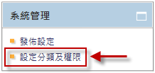

    系統管理 區塊

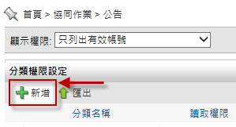

    公告列表

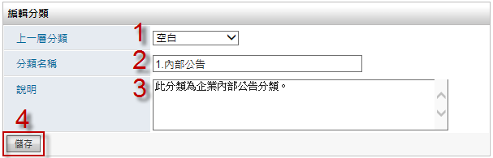

    新增分類 頁面

發佈設定
^^^^^^^^^^^^^^^^^^^^^^^^

#. 管理者可在跑馬燈頁面左方有系統管理區塊，點選 ``發佈設定`` 進行設定。
#. 在設定的頁面中，把資料選入相對應欄位，設定完成後點選 ``儲存``。

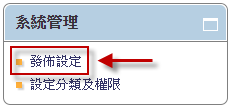

    系統管理

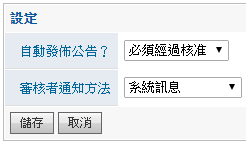

    發佈設定

使用說明
------------------------

一般使用
^^^^^^^^^^^^^^^^^^^^^^^^

公告主要可以分為兩種使用方式，公告的瀏覽及建立。公告的瀏覽可以使用分類瀏覽、選定發佈狀態或搜尋公告來瀏覽文章。公告的建立，前提為使用者需擁有該分類的新增權限，新增一個公告必須包含題目、內文、附加檔案、設定發文通知方式或發佈日期及發佈狀態。

新增公告
^^^^^^^^^^^^^^^^^^^^^^^^

使用者可以利用新增公告，註明主題，並選擇所屬分類及輸入內文，或附加檔案供人下載，然後利用電子郵件或系統訊息去通知該分類可讀取權限者。

#. 點選 ``新增`` 按鈕來產生新的公告
#. 公告首頁點選 ``新增`` 按鈕，開啟新增公告頁面。
#. 在新增公告頁面中，輸入主題、內容 並選擇 類別、使用狀態、發出通知方式後，即可儲存送出。

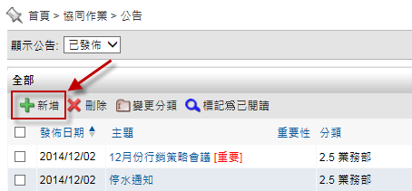

    公告首頁

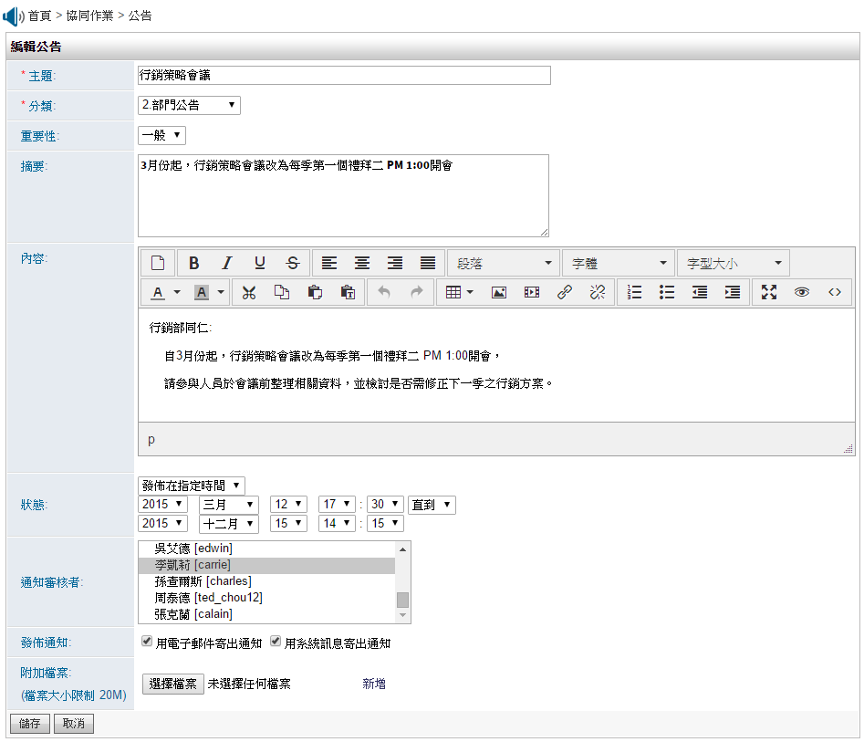

    新增公告 頁面

設定發佈日期
^^^^^^^^^^^^^^^^^^^^^^^^

在新增公告時若選擇使用狀態為發佈在指定時間，該公告則會處於待發佈狀態直到發佈，但不會主動下架，除非管理者再去編輯該公告狀態為已下架。 若設定發佈時間時點選拉動式表格的直到並且設定結束時間，該公告若過結束時間狀態則會直接放入已下架。

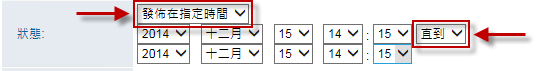

    新增公告 頁面

瀏覽公告
^^^^^^^^^^^^^^^^^^^^^^^^

透過公告首頁的公告區塊選擇瀏覽，分為四種瀏覽方式：

* 近七日公告：近七天的公告皆為呈現在此分類。
* 草稿：自己建立的公告並且存成草稿。
* 未核准：若有開啟審核核准機制，此分類才會提醒使用者有幾個公告需要進行核准動作。
* 待發佈：已送出的公告，但尚未發佈。

使用者瀏覽公告時，可針對公告主題點選，即可瀏覽公告內文。新的公告產生，會在公告主題後面顯示 ``最新公告`` 的圖示，當使用者瀏覽過公告後 ``最新公告`` 的圖示就會消失。

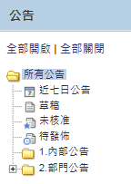

    樹狀圖分類

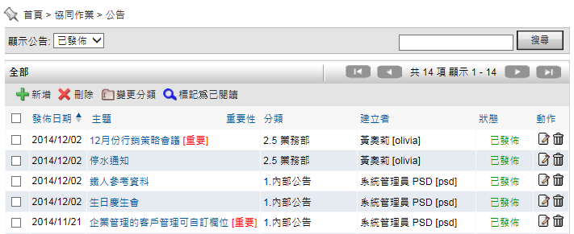

    公告首頁

公告下架
^^^^^^^^^^^^^^^^^^^^^^^^

因為某些情況需要將公告暫停並下架時，我們可以在公告首頁直接操作：

#. 勾選需要下架的公告。
#. 點擊 ``新增`` 按鈕，即可完成下架作業。

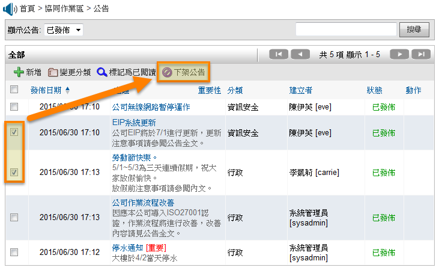

    公告下架頁面

3. 個人化設定
------------------------

使用者可在個人化設定中，將公告的最新資料顯示在首頁列表中：

#. 點選首頁右上角的 ``個人化設定``。
#. 點選公告中的 ``個人化設定``。
#. 依實際需求選擇欲顯示的最大筆數，並 ``儲存`` 即可。

註：若回到 EIP Plus 首頁無法看到設定好的公告資料，請至個人化設定中的首頁設定，檢查是否有將該區塊加入首頁中。

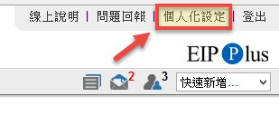

    首頁的個人化設定

    公告的個人化設定

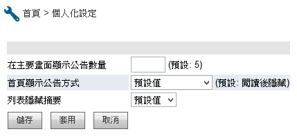

    公告首頁設定

* 在主要畫面顯示公告數量：可自訂在首頁的公告區塊，公告顯示的最大數目。
* 首頁顯示公告方式：顯示方式包含閱讀後隱藏、閱讀後依然顯示。
* 列表隱藏摘要：設定摘要欄位是否要在公告首頁列表中顯示或隱藏。

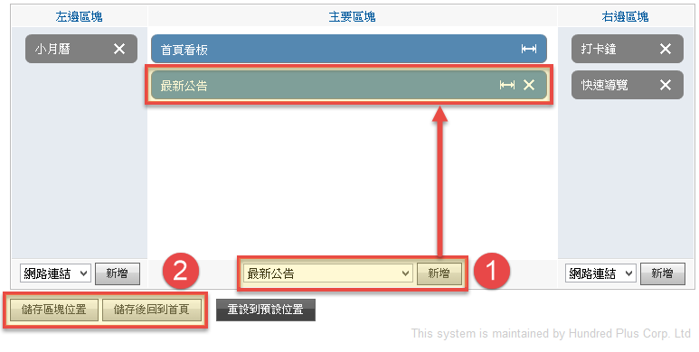

    首頁區塊設定

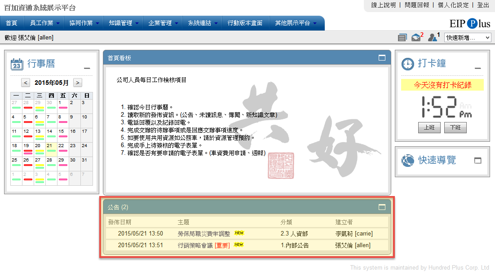

    首頁公告區塊示例