行事曆
========================

規格說明
------------------------
 
* 提供日曆、週曆、月曆的方式來檢視行事曆。（還有其他不同的檢視方式）
* 快速選擇分類類別檢視行事曆（分類可自訂名稱、顏色）。
* 可快速新增一個事件，事件名稱、日期、起迄時間、重要性、事件的分享對象、事件的重覆設定及提醒功能。
* 可與其他模組做關聯。
* 可進行假日管理。
* 可匯出PDF檔。
* 可分享給特定對象或群組，讓同步工作的成員們能得知大家的最新行程。
* 可以與手機內建行事曆同步整合，手機作業系統包含iOS及Android。

系統設定
------------------------

【使用者管理】或【群組管理】使用權限開放
^^^^^^^^^^^^^^^^^^^^^^^^

開放使用權限
^^^^^^^^^^^^^^^^^^^^^^^^

如要開放行事曆模組給使用者，必須先至系統管理內 ``使用者管理`` 或 ``群組管理``，編輯某使用者或群組之權限控管，勾選 ``行事曆`` 才可開放使用，此功能只有系統管理員可設定。（注意：首頁為必選項目）

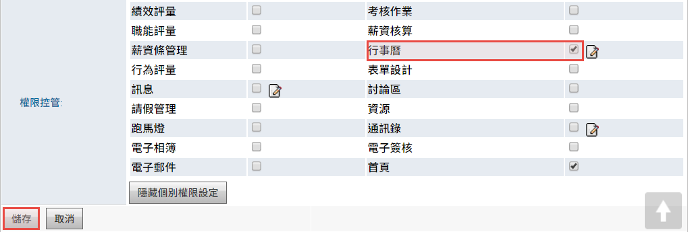

    行事曆模組開放使用設定畫面

設定存取權限
^^^^^^^^^^^^^^^^^^^^^^^^

因行事曆模組為分享式行事曆，系統管理員可直接針對 ``使用者`` 或 ``群組`` 設定存取權限。如主管需查閱部屬的行事曆，可由系統管理者強制開放。

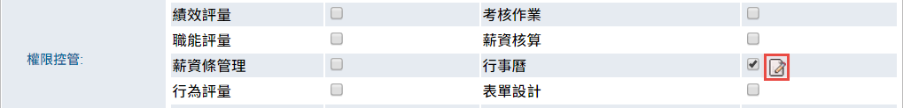

    存取權限設定進入畫面

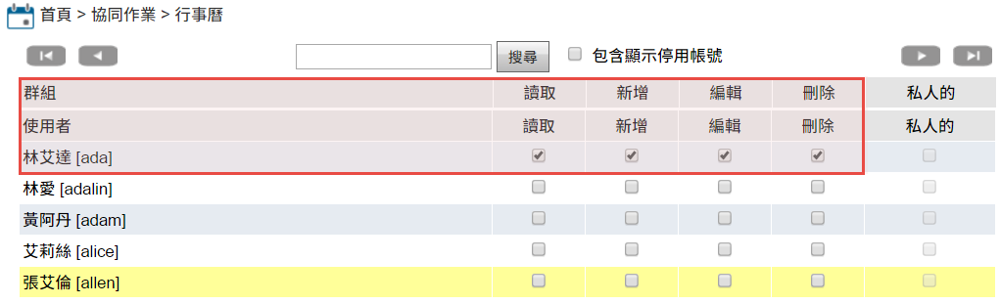

    存取權限設定畫面

* 讀取：依此為例，此 ``使用者`` 或 ``群組`` 之行事曆可開放 ``查閱`` 權限給林艾達，開啟對方行事曆時，擁有 ``複製`` 鈕。
* 新增：依此為例，此 ``使用者`` 或 ``群組`` 之行事曆可開放 ``查閱`` 及 ``新增`` 權限給林艾達。開啟對方行事曆時，擁有 ``複製`` 鈕。
* 編輯：依此為例，此 ``使用者`` 或 ``群組`` 之行事曆可開放 ``查閱``、 ``新增``、``儲存後編輯`` 權限給林艾達。開啟對方行事曆時，擁有 ``編輯``、``複製`` 鈕。
* 刪除：依此為例，此 ``使用者`` 或 ``群組`` 之行事曆可開放 ``查閱``、 ``新增``、``儲存後編輯`` 及 ``刪除`` 權限給林艾達。開啟對方行事曆時，擁有 ``編輯``、``複製`` 及 ``刪除`` 鈕。
* 私人的：此設定只能由使用者本人決定是否開放其他人查閱，系統管理者（模組管理者）無法設定將此 ``使用者`` 或 ``群組`` 私人的事件作開放。

個人化設定預設偏好設定
^^^^^^^^^^^^^^^^^^^^^^^^

從個人化設定進入，只有系統管理員才可查閱及編輯 ``預設偏好設定`` 頁籤，可預設所有使用者在使用行事曆的查閱模式，``個人偏好設定`` 頁籤為使用者可針對個人需求再自行變更。

.. figure:: images/image5.png
    :scale: 100%
    :alt: 系統登入首頁

    系統登入首頁

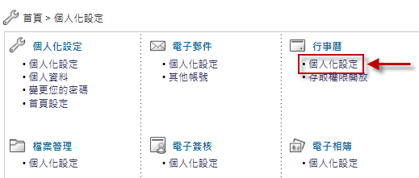

    個人化設定頁面

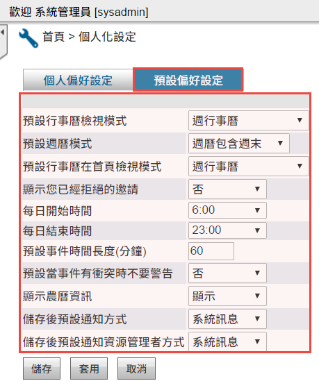

    預設偏好設定畫面

* 預設行事曆檢視模式：此設定的檢視模式，都會套用到行事曆模組首頁的顯示方式。
* 預設行事曆在首頁檢視模式：此設定的檢視模式，都會套用在登入系統之首頁行事曆上；首頁設定須開放行事曆區塊。
* 顯示您已經拒絕的邀請：本人已拒絕的事件否需顯示在行事曆上。如預設 ``是``，則已拒絕的事件還是會顯示在行事曆上。
* 每日開始時間：可預設行事曆顯示的開始時間。
* 每日結束時間：可預設行事曆顯示的結束時間。
* 預設會議時間長度（分鐘）：如設定為60分鐘，當使用者在建立新的事件時（非以拖曳方式新增），預設的期間爲60分鐘。
* 預設當事件有衝突時不要警告：決定新增事件時是否已勾取 ``當事件有衝突時不要警告`` 選項。如預設 ``是``，則新增事件時此項目已勾取。
* 顯示農曆資訊：可設定行事曆上農曆日期是否要顯示。
* 儲存後預設通知方式：新增事件時，預設使用 ``系統訊息`` 或 ``電子郵件`` 或 ``全部`` 的方式執行通知參與者。如預設 ``系統訊息``，則新增事件時此項目已勾取。
* 儲存後預設通知資源管理者方式：新增事件時，預設使用 ``系統訊息`` 或 ``電子郵件`` 或 ``全部`` 的方式執行通知資源管理者。如預設 ``系統訊息``，則新增事件時此項目已勾取。

全區分類
^^^^^^^^^^^^^^^^^^^^^^^^

系統管理者（包含模組管理員）可在模組中的系統管理區塊，點選 ``全區分類`` 進行設定。

#. 系統會將已設定完成的分類名稱及所代表的顏色列表出來，點選 ``新增``  來產生一個新的類別。
#. 在新增分類的頁面中，把資料填入相對應欄位，點選 ``顏色代碼產生器`` 的圖示來選擇一個顏色，設定完成後點選 ``儲存``。

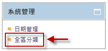

    系統管理區塊

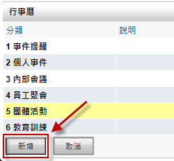

    系統管理方塊

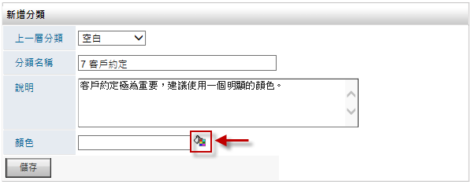

    顏色代碼產生器按鈕

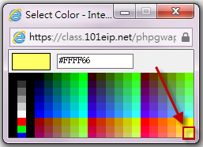

    多種顏色供選擇

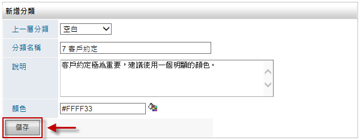

    顏色代碼可使用右邊的代碼產生器來產生

日期管理
^^^^^^^^^^^^^^^^^^^^^^^^

系統管理者（模組管理員）可在模組中的系統管理區塊，點選 ``日期管理`` 設定假日行事曆。

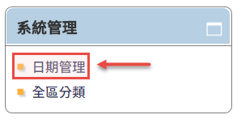

    日期管理方塊

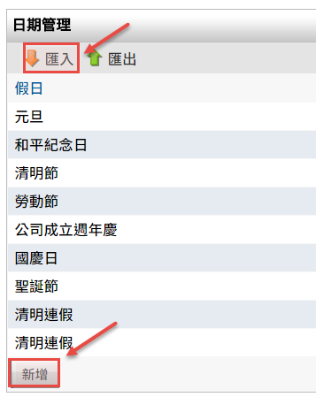

    假日設定畫面

使用【新增】
^^^^^^^^^^^^^^^^^^^^^^^^

此新增為單筆新增事件

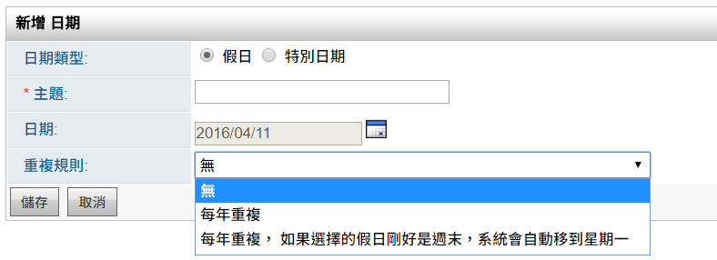

    單筆新增假日設定畫面

* 日期類型：分為 ``假日``、``特別日期``，假日日期為一般國定假日日期，特別日期可解釋為非國定假日的特別日期；如公司每年的運動會、公司成立周年慶。
* 主題：此日期的名稱。如：元旦。
* 日期：為哪一天。
* 重複規則：分為 ``無``、``每年重複``、``每年重複，如果選擇的假日剛好是周末，系統會自動移到星期一``。

使用【匯入】
^^^^^^^^^^^^^^^^^^^^^^^^

建議可以先將日期資料 ``匯出``，再利用此匯出檔案進行修改後儲存，再 ``匯入``。

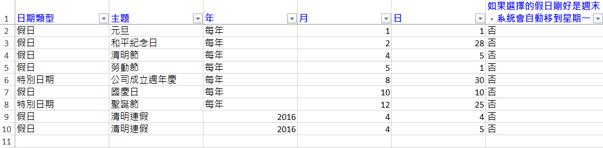

    匯入的表格格式

* 日期類型：填寫 ``假日`` 或 ``特別日期``，假日日期為一般國定假日日期，特別日期可解釋為非國定假日的特別日期；如公司每年的運動會、公司成立周年慶。
* 主題：此日期的名稱。
* 年：可填寫 ``每年`` 或 ``西元年``，如2016。
* 月/日：可填寫 ``數字``。如1~12月、1~31日
* 重複規則：可填寫為 ``無``、``每年重複``、``每年重複，如果選擇的假日剛好是周末，系統會自動移到星期一``。
* 匯入檔案：如匯入檔案格式為MS Excel，檔案字元編碼請選擇 ``Big5``，其他檔案格式請選擇 ``UTF-8``。

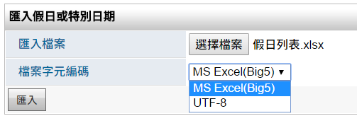

    匯入的表格格式

使用【匯出】
^^^^^^^^^^^^^^^^^^^^^^^^

依照系統管理 > 系統環境設定 >  ``預設資料匯出格式`` 而決定所匯出的格式為何。

使用說明
------------------------

使用者會在行事曆上輸入自己每天將要進行的事件，如客戶見面的日期、開會時間和地點、辦理事項等。也能讓使用者邀約其它的使用者參與同一事件，例如會議發起人需要邀約其它人參加會議。

針對這一類的群組功能，行事曆提供時間空檔查詢、約會衝突警示、開放權限給其它使用者瀏覽自己的行事曆等，是個能符合個人和群組需要的行事曆模組。

一般使用
^^^^^^^^^^^^^^^^^^^^^^^^

行事曆首頁
^^^^^^^^^^^^^^^^^^^^^^^^

行事曆首頁分為兩塊，篩選區塊： ``行事曆類別``、``自己或其他使用者行事曆``、``行事曆顯示格式``、``查閱自己或其他使用者行事曆``、``搜尋行事曆`` 及 ``匯出成PDF``。另一區塊為行事曆檢視。

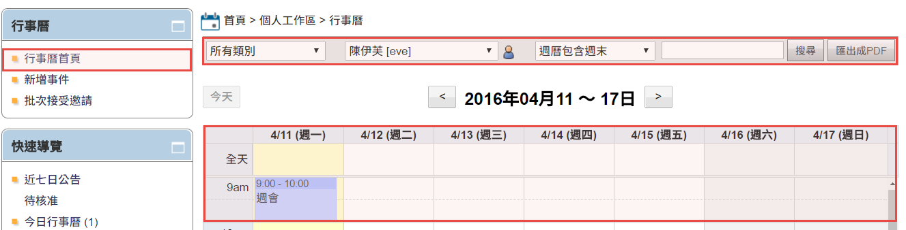

    行事曆首頁畫面

篩選事件類別
^^^^^^^^^^^^^^^^^^^^^^^^

所有類別為管理者所設定之類別，使用下拉式欄位可切換不同的行事曆顯示方式。

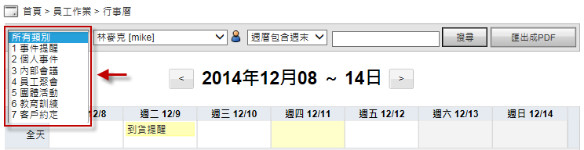

    選擇行事曆所要顯示的事件類別

切換不同使用者的行事曆
^^^^^^^^^^^^^^^^^^^^^^^^

行事曆模組有功能強大的多人互動機制；如果您擁有讀取特定使用者行事曆的權限，那麼您可以很快速的去查閱特定使用者的行事曆事件；如擁有其他特定使用者行事曆之新增、編輯或刪除權限時，您更可直接操作、編輯特定使用者的行事曆事件；如老闆授權自己的秘書來管理行事曆。

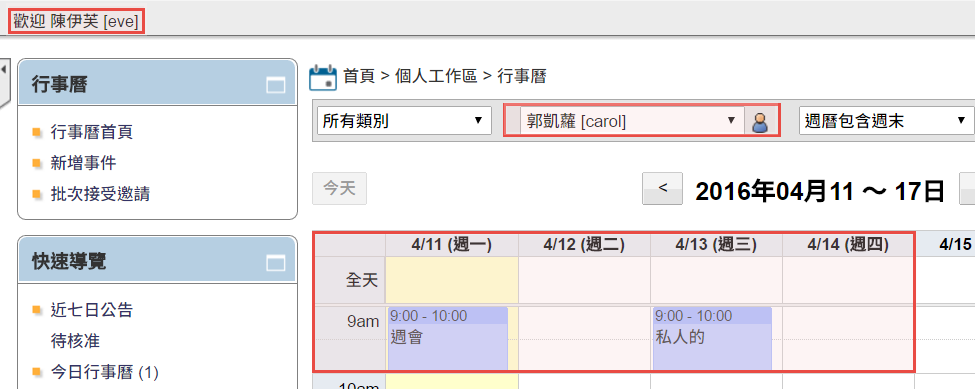

    單選查閱其他使用者行事曆

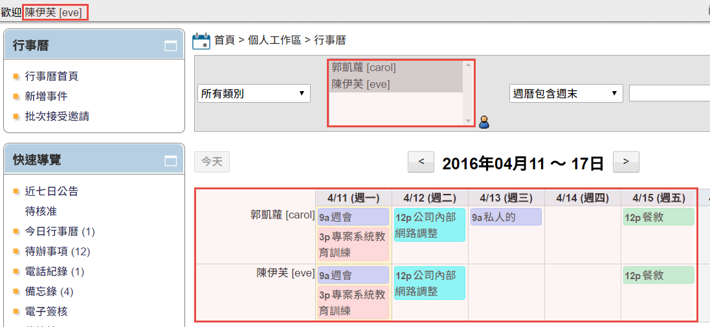

    多選查閱其他使用者行事曆

行事曆檢視模式
^^^^^^^^^^^^^^^^^^^^^^^^

行事曆可分別以 ``日行事曆``、``近二天檢視``、``近四天檢視``、``週曆包含週末``、``週曆不包含週末``、``月行事曆``、``檢視清單`` 七種不同的顯示方式供使用者瀏覽。

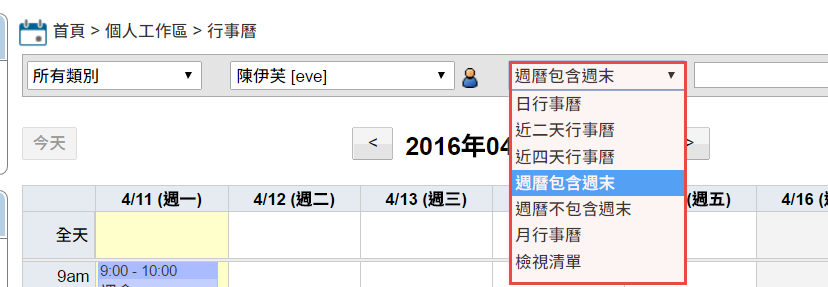

    日行事曆首頁畫面

日行事曆檢視模式
^^^^^^^^^^^^^^^^^^^^^^^^

顯示當天日期。

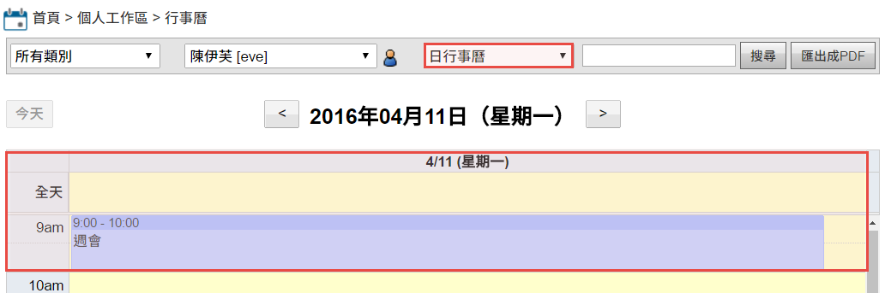

    日行事曆首頁畫面

近二天行事曆檢視模式
^^^^^^^^^^^^^^^^^^^^^^^^

顯示今天與明天的日期。

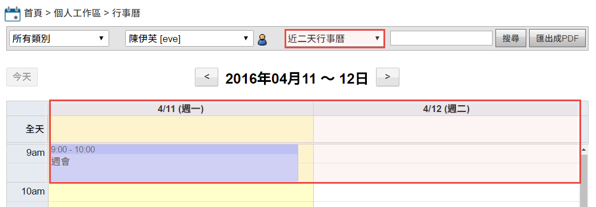

    近二天行事曆首頁畫面

近四天行事曆檢視模式
^^^^^^^^^^^^^^^^^^^^^^^^

顯示今天、明天、後天、大後天的日期。

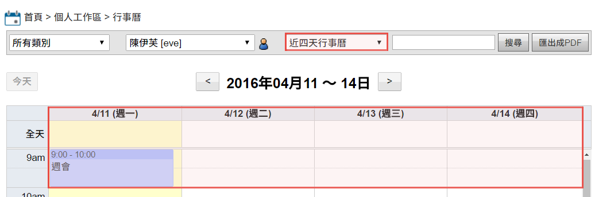

    近四天行事曆首頁畫面

週曆包含周末行事曆檢視模式
^^^^^^^^^^^^^^^^^^^^^^^^

顯示當週週一到週日的日期。

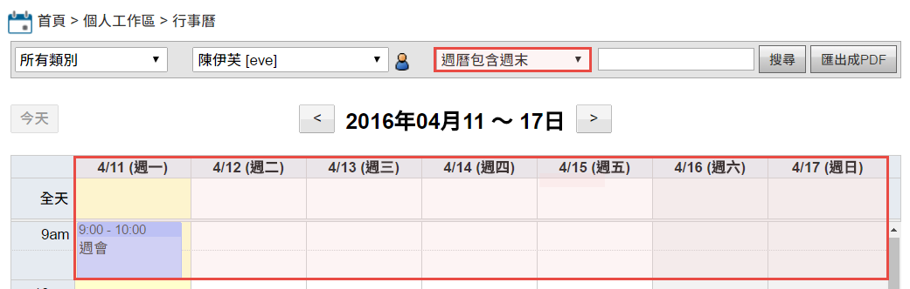

    週曆包含周末行事曆首頁畫面

週曆包含周末行事曆檢視模式
^^^^^^^^^^^^^^^^^^^^^^^^

顯示當週週一到週五的日期。

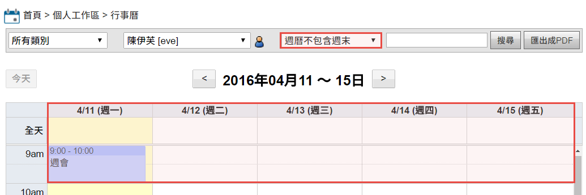

    週曆不包含周末行事曆首頁畫面

月行事曆檢視模式
^^^^^^^^^^^^^^^^^^^^^^^^

顯示當月份所有的日期。

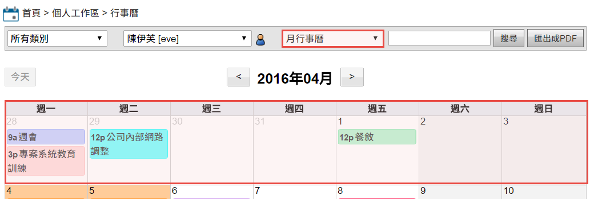

    月行事曆首頁畫面

檢視清單
^^^^^^^^^^^^^^^^^^^^^^^^

以清單方式呈現事件，並可在此執行 ``批次接受邀請``。

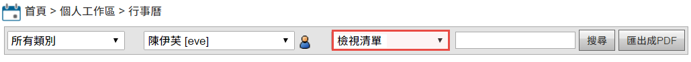

    進入檢視清單方式一

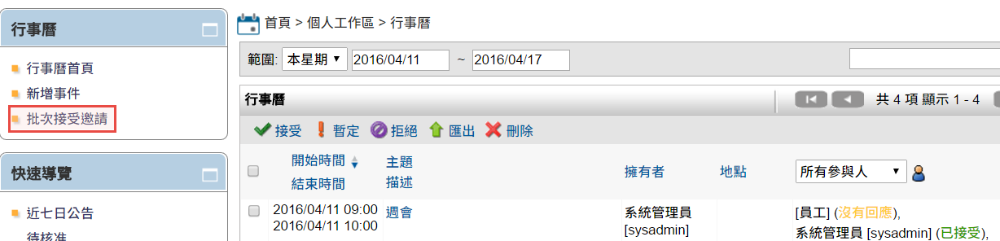

    進入檢視清單方式二

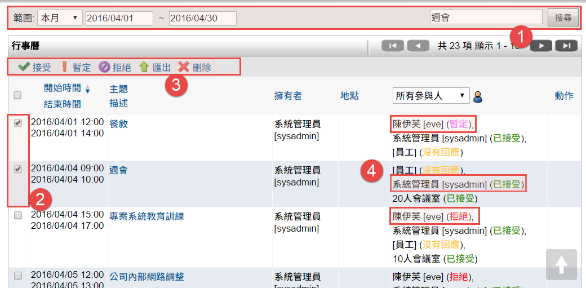

    批次接受邀請方式

#. 範圍：欲查閱的事件，可以用日期範圍及文字搜尋的方式先篩選出來。
#. 勾選：將欲變更狀態的事件勾選出來，可多選。
#. 接受：參與此事件，變更完成後會顯示 ``已接受``。
#. 暫定：不知道是否可參與此事件，暫時先將狀態修改為 ``暫定``，變更完成後會顯示 ``暫定``，如確定是否參與，再將其事件變更為 ``已接受`` 或  ``拒絕``。
#. 拒絕：無法參與此事件，確認拒絕時需要填寫拒絕原因，變更完成後會顯示 ``拒絕``。
#. 匯出：自己擁有的事件才可匯出檔案。
#. 刪除：自己擁有的事件才可將事件刪除。

【新增】【編輯】【刪除】事件
^^^^^^^^^^^^^^^^^^^^^^^^

新增個人行事曆的事件非常容易，我們除了可以在系統右上角的 ``快速新增`` 連結或直接選取 ``新增行事曆`` 來新增事件外，我們還可以直接在行事曆圖表中，直接拖曳一段時間進行新增事件動作。

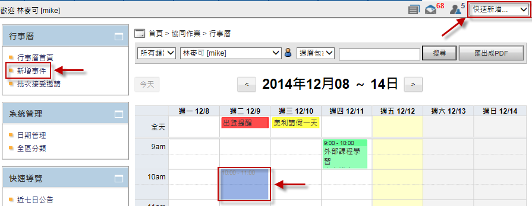

    新增行事曆方式

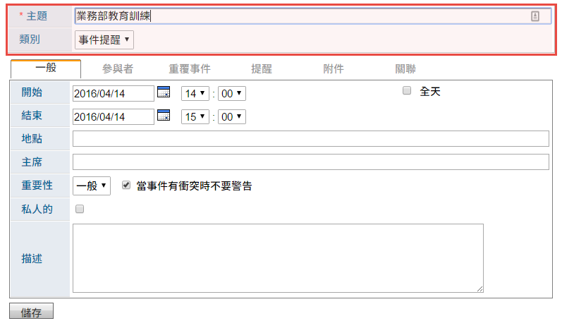

    新增行事曆，先填寫主題及選擇類別

一般頁籤
^^^^^^^^^^^^^^^^^^^^^^^^

新增一個事件，針對這個事件的主要項目在此說明。

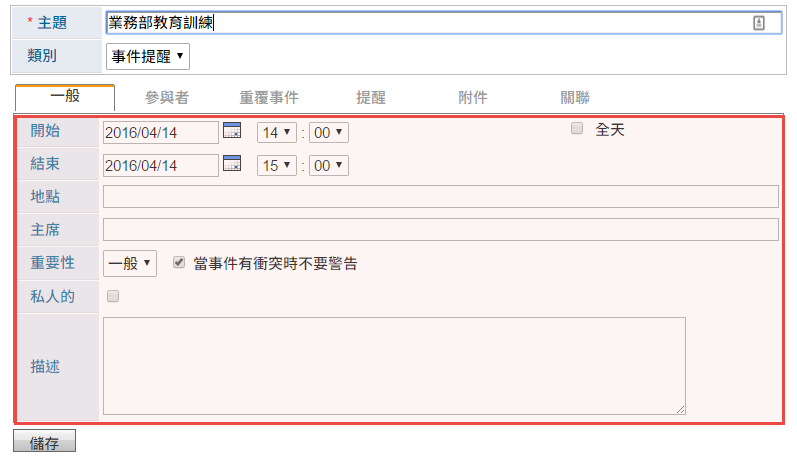

    一般頁籤圖示

* 開始及結束：一個事件的起始結束時間。系統會自動把日期設定為當日。
* 地點及主席：文字的註記。如有登打資料可在行事曆首頁事件預覽視窗中顯示。
* 重要性：文字的註記，固定為 ``空白``、``低``、``一般``、``高``。
* 當事件有衝突時不要警告：勾選這一個項目時，則若新的約會與這一個事件有時間上的衝突時，不會顯示衝突警告。未勾選則會跳出與此事件時間衝突的事件列表。
* 私人的：若將一個事件設定為私人事件時，則該事件將不會被有閱讀您行事曆權限的使用者看到，除非有開放私人的權限。
* 描述：可針對此事件詳加說明。

參與者頁籤
^^^^^^^^^^^^^^^^^^^^^^^^

舉例來說，我們在行事曆上新增一個事件，且邀約其它使用者來參與這個事件，並在新增行事曆時編輯 ``參與者`` 區塊。

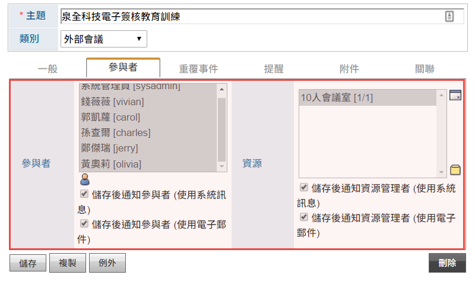

    參與者頁籤圖示

* 加入參與者：參與者必須包含自己才可查閱此行事曆，點選圖中小人物圖件 ``搜尋使用者`` 可選擇參與的使用者。
* 通知方式：設定通知方式可分為系統訊息及電子郵件方式，且通知方式可重複勾選或者不去選擇。
* 資源：此事件如需運用到資源，可在此作預約。

重複事件頁籤
^^^^^^^^^^^^^^^^^^^^^^^^

有些事件是有重複性的，如週會、支薪動作、結案動作等。這些重複性動作的設定在行事曆模組中都有提供。

在新增一個事件時，點選 ``重複事件`` 頁籤即可開始設定規則，各種規則的設定時會在圖片下方做介紹。

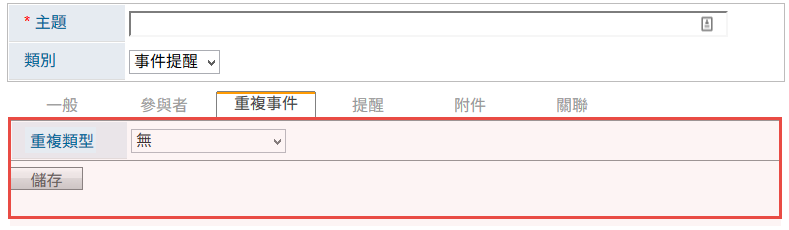

    重複規則設定畫面

重複類型（每日）：
^^^^^^^^^^^^^^^^^^^^^^^^

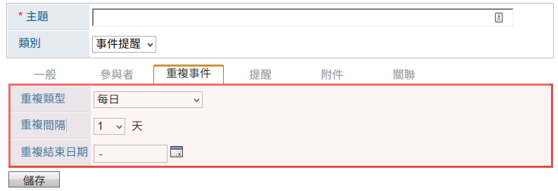

    重複類型（每日）設定畫面

* 重複間格：可設定1~30天。如：設定 ``1``，則每日都會產生一筆事件；設定 ``2``，則每2天產生一筆事件。
* 重複結束日期：直到哪一天為止（以下設定皆同）。

重複類型（每週）：
^^^^^^^^^^^^^^^^^^^^^^^^

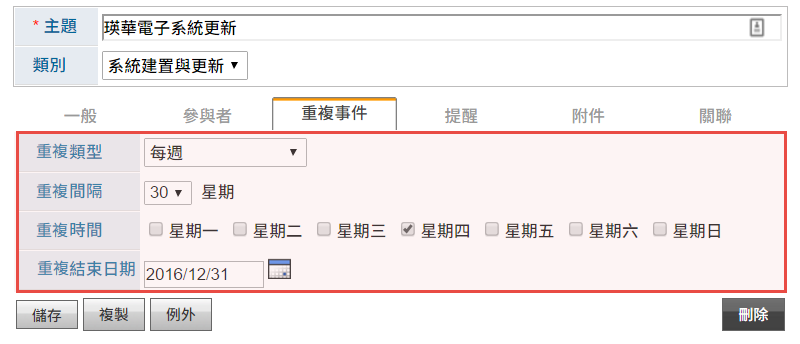

    重複類型（每週）設定畫面

* 重複間格：可設定1~30星期。如：設定 ``1``，則每週都會產生一筆事件。設定 ``2``，則每2周產生一筆事件。
* 重複時間：可設定 ``星期一`` 到 ``星期日``，可多選。如：對應重複間格設定 ``1``，重複時間設定 ``星期一`` 則每週的星期一都會產生一筆事件；重複間格設定 ``2``，重複時間設定 ``星期一`` 則每2週的星期一都會產生一筆事件。

重複類型（每月（以天數計））：
^^^^^^^^^^^^^^^^^^^^^^^^

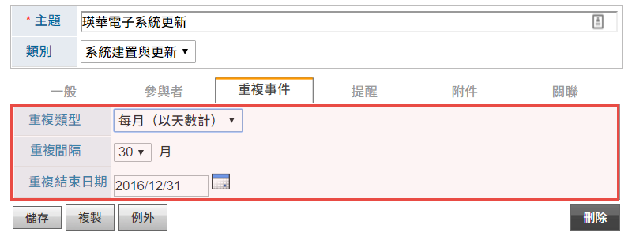

    複類型（每月（已天數計））設定畫面

* 重複間格：可設定1~30月。如：此事件日期為2016/04/12，設定 ``1``，則每月的12日都會產生一筆事件。設定 ``2``，則每兩個月的12日產生一筆事件，所以下次的事件產生日期為2016/06/12。

重複類型（每月（以日期計））：
^^^^^^^^^^^^^^^^^^^^^^^^

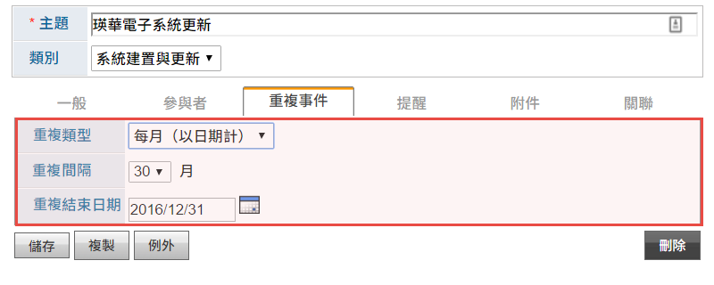

    重複類型（每月（以日期計））設定畫面

* 重複間格：可設定1~30月，但是會與此重複事件開始日期是星期幾有關。如：此事件日期為2016/04/12（星期二），為四月份的第二個星期二（四月份的第一個星期二為2016/04/05），設定 ``1``，系統會判斷下一個月份的第二個星期二是哪一天，所以下次的事件日期為2016/05/10（星期二）、（五月份的第一個星期二為2016/05/03）。

重複類型（每年）：
^^^^^^^^^^^^^^^^^^^^^^^^

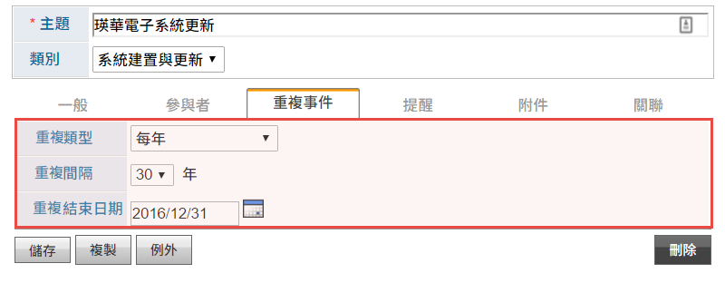

    重複類型（每年）設定畫面

* 重複間格：可設定1~30月。如：此事件為2016/04/12，設定 ``1``，則每年的04/12都會產生一筆事件。設定 ``2``，則每兩年的04/12日產生一筆事件，所以下次的事件日期為2018/04/12。

提醒頁籤
^^^^^^^^^^^^^^^^^^^^^^^^

行事曆模組可針對單一事件發出電子郵件或系統訊息的提前通知。在新增一個事件時，點選 ``提醒`` 頁籤即可開始設定通知時間。

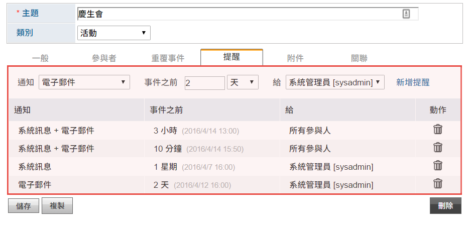

    提醒設定畫面

* 通知：三種型式：``電子郵件``、``系統訊息``、``系統訊息+電子郵件``。
* 事件之前：指在事件開始之前的提醒，時間單位可設定： ``天``、``星期``、``小時``、``分鐘``。
* 通知給：可設定為新增事件者或所有參與人。
* 新增提醒：可設定多組提醒時間。

附件頁籤
^^^^^^^^^^^^^^^^^^^^^^^^

可將與此事件相關的檔案附加在此頁籤中。

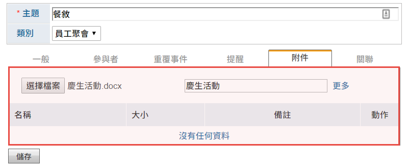

    附加檔案畫面

關聯頁籤
^^^^^^^^^^^^^^^^^^^^^^^^

行事曆事件可與其他模組 ``行事曆``、``通訊錄``、``待辦事項``、``電話紀錄``、``備忘錄``、``資源``、``專案``、``客戶``、``供應商``、``會議`` 做關聯。

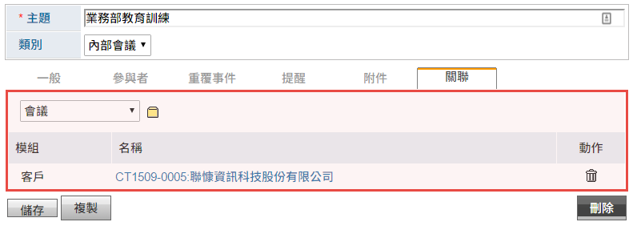

    關聯設定畫面

【儲存】【編輯】【複製】【刪除】【例外】按鈕
^^^^^^^^^^^^^^^^^^^^^^^^

【儲存】按鈕：
^^^^^^^^^^^^^^^^^^^^^^^^

新增事件，登打完成後按 ``儲存`` 完成事件存檔。

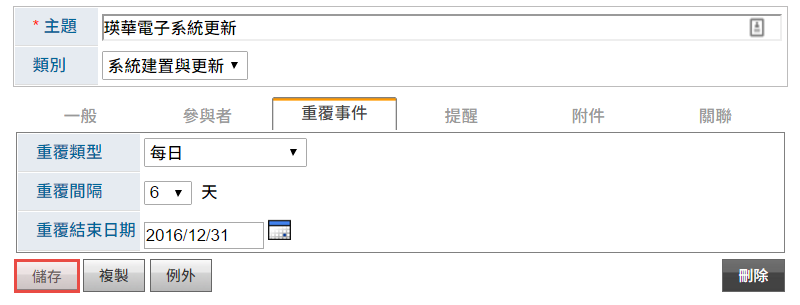

    新增事件後按儲存

【編輯】按鈕：
^^^^^^^^^^^^^^^^^^^^^^^^

已儲存的事件，如要修改內容請按 ``編輯``，待修改完成按 ``儲存`` 完成事件存檔。

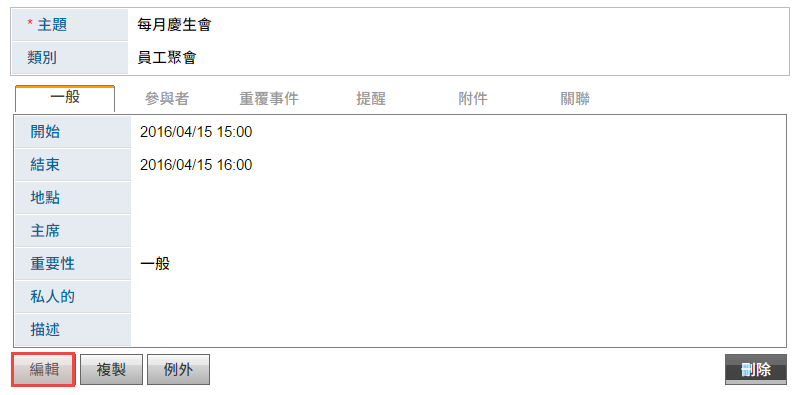

    已產生的事件如需修改請按編輯

【複製】按鈕：
^^^^^^^^^^^^^^^^^^^^^^^^

如想要新增一筆事件，可以利用 ``複製`` 新產生一筆事件，將其內容修改按 ``儲存`` 完成事件存檔。

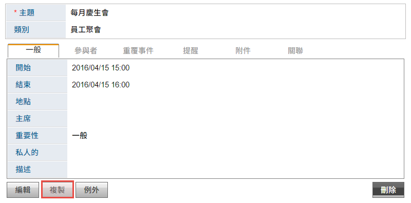

    可複製一筆事件來新增一筆新事件

【例外】按鈕：
^^^^^^^^^^^^^^^^^^^^^^^^

如已設定此事件為重複事件，即為有規律性的例行事件，但有時會有某天的重複事件臨時無法在此規律時間執行，這時可利用 ``例外``，將此事件排除在重複事件外。

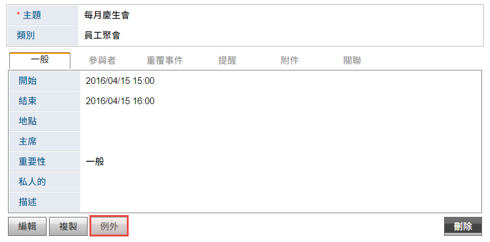

    重複例外事件設定畫面

【刪除】按鈕：
^^^^^^^^^^^^^^^^^^^^^^^^

欲將自己建立的事件刪除，可按 ``刪除`` 鈕。按 ``刪除`` 鈕後，無論是否設定通知其他參與者，系統皆會發出刪除事件通知。

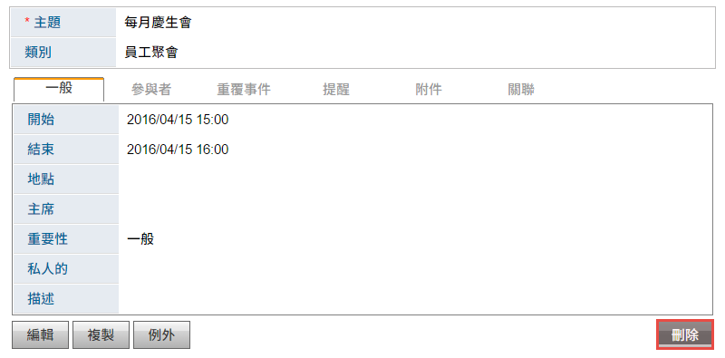

    刪除事件設定畫面

受邀參與者回覆事件
^^^^^^^^^^^^^^^^^^^^^^^^

參與者在收到通知事件後，此事件狀態為 ``沒有回應``，可選擇  ``已接受``、``拒絕``、``暫定``、三種方式回應事件建立者。
選擇 ``已接受``，點選完成後，會將顯示資料已經更新，並且顯示參與者已接受 訊息。

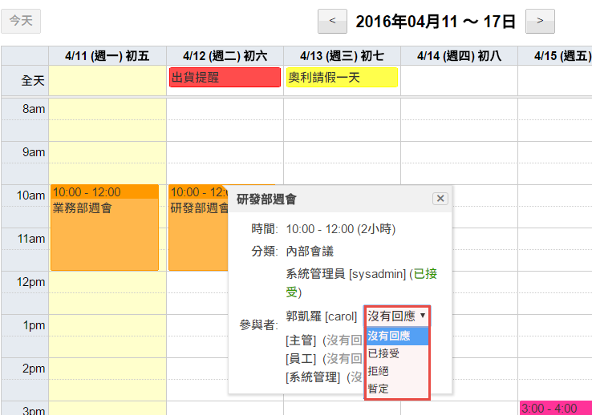

    與者回覆設定畫面

搜尋事件
^^^^^^^^^^^^^^^^^^^^^^^^

要搜索關鍵字，只需要在行事曆頁面上方工具列輸入欲查找的文字後，點選 ``搜尋`` 即可，行事曆模組的搜尋器會針對事件的主題、說明、及事件的約會地點做搜尋。

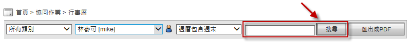

    行事曆搜尋功能

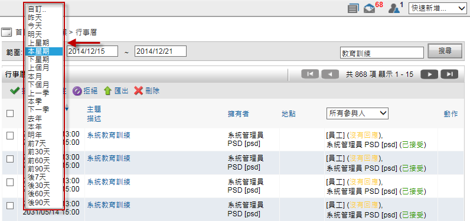

    搜尋結果列表

行事曆匯出成PDF
^^^^^^^^^^^^^^^^^^^^^^^^

行事曆模組 ``匯出成PDF`` 功能，透過分類、檢視各種條件的篩選後，可以將圖表匯出成PDF格式檔案，以便人員列印使用。點選 ``匯出成PDF`` 即可完成匯出動作。（電腦需有安裝PDF系統）

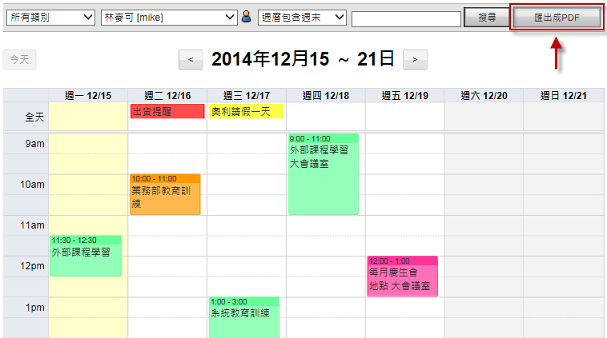

    行事曆匯出成PDF功能

個人化設定
------------------------

行事曆提供了很完善的個人化設定功能，使用者可依個人喜歡去設定顯示的模式，顯示的位置，甚至是行事曆顯示的時間範圍。

#. 請在登入首頁後，點選右上角 ``個人化設定`` 連結，進入個人化設定頁面。
#. 系統會帶出個人化設定頁面，請點選行事曆所屬的 ``個人化設定`` ，個人化設定畫面提供了多種設定，使用者可依個人喜好自由調整。

.. figure:: images/image5.png
    :scale: 100%
    :alt: 系統登入首頁

    系統登入首頁

    個人化設定頁面

個人化設定
^^^^^^^^^^^^^^^^^^^^^^^^

此設定方式與系統管理之 ``個人化設定預設偏好設定`` 相同。

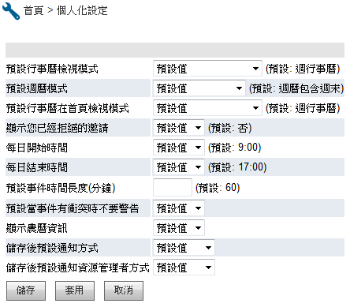

    行事曆個人化設定頁面

存取權限開放
^^^^^^^^^^^^^^^^^^^^^^^^

此設定方式與系統管理之 ``設定存取權限`` 相同。

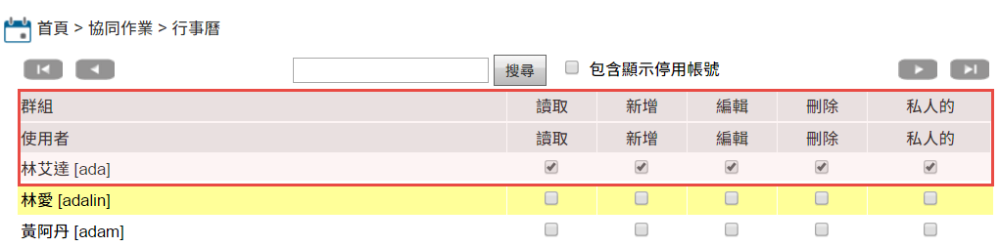

    個人開放行事曆存取權限設定畫面

* 私人的：依此為例，此 ``使用者`` 之 ``私人的`` 行事曆可開放查閱權限給林艾達， ``查閱``、``新增``、``儲存後編輯`` 及 ``刪除`` 權限依照前面的權限做設定。