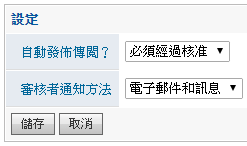
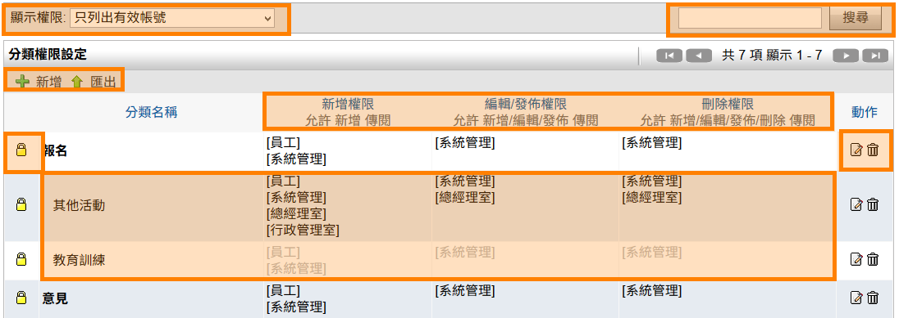
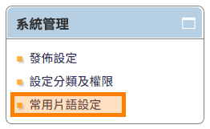
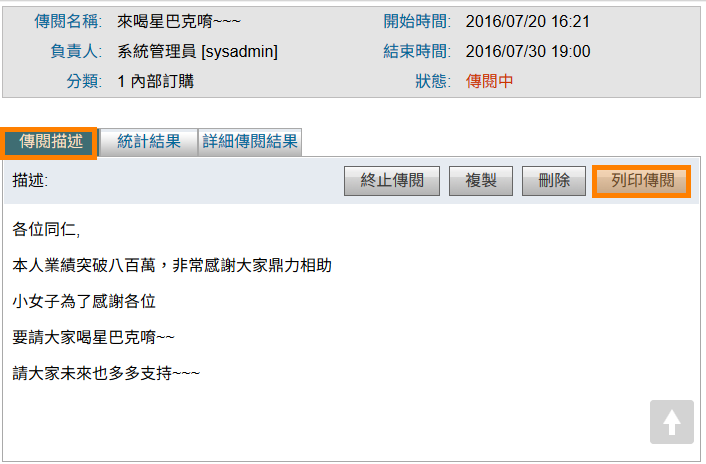

傳閱
========================

規格說明
------------------------
 
* 提供樹狀圖進行分類與權限管理。
* 提供訊息的交流與傳達，可運用於會議紀錄、團購、訂便當等。
* 可將這份傳閱傳送給特定使用者，使用者可給予回應或投票。當傳閱結束，可以快速的確認回應結果。
* 啓動或下架可以指定某一特定時間。
* 回應的內容可設置常用片語。
* 通知方式可以利用電子郵件或是系統訊息寄出。
* 可以依內容決定，結果在結束前或結束後呈現。

系統設定
------------------------

【使用者管理】或【群組管理】使用權限開放
^^^^^^^^^^^^^^^^^^^^^^^^

如要開放此模組給使用者，必須先至系統管理內 ``使用者管理`` 或 ``群組管理`` ，編輯某使用者或群組之權限控管，勾選 ``傳閱`` 才可開放使用，此功能只有系統管理員可設定。（注意：首頁為必選項目）

    傳閱模組開放使用設定畫面

模組管理者設定
^^^^^^^^^^^^^^^^^^^^^^^^

針對此模組如需要再另外增加系統管理者，可至模組管理者設定進行設定，即可擁有此模組系統管理權限。

#. 點選 ``系統管理``，再點選 ``模組管理者設定``。
#. 在傳閱中，點選 ``搜尋使用者``，設定使用者後按 ``送出``。
#. 最後再回到模組管理設定中點選 ``送出更新資料`` 完成設定。
#. 模組管理員即擁有系統管理區塊權限。

.. figure:: images/image4.png
    :scale: 100%
    :alt: 系統管理 區塊

    系統管理 區塊

    全區分類頁面

    新增分類

系統管理
^^^^^^^^^^^^^^^^^^^^^^^^

系統管理者及模組管理者可設定傳閱的權限及發佈設定。

發佈設定
^^^^^^^^^^^^^^^^^^^^^^^^

可設定發佈傳閱是否需經過核准及通知方式。

#. 管理者可在系統管理區塊，點選 ``發佈設定`` 進行設定。
#. 在設定的頁面中，把資料選入相對應欄位，設定完成後點選 ``儲存``。

    系統管理

    發佈設定

* 自動發佈傳閱：新增傳閱者是否可自動發佈傳閱，或需要擁有 ``編輯／發佈`` 或 ``刪除`` 權限者審核。
* 審核者通知方法：透過電子郵件、系統訊息或兩者皆須發出通知。

設定分類及權限
^^^^^^^^^^^^^^^^^^^^^^^^

系統管理者及模組管理者可在系統管理區塊，點選 ``設定分類及權限`` 進行設定。

新增分類
^^^^^^^^^^^^^^^^^^^^^^^^

#. 點選 ``新增`` 來增加一個分類。
#. 在新增分類的頁面中，把資料填入相對應欄位，設定完成後點選 ``儲存``。
#. 管理者可點選 ``鎖頭圖示`` 針對分類做 ``新增``、``編輯／發佈``、``刪除`` 的動作權限進行設置。設定完成後點選 ``儲存``。

.. figure:: images/image10.png
    :scale: 100%
    :alt: 系統管理

    系統管理

.. figure:: images/image11.png
    :scale: 100%
    :alt: 分類權限頁面

    分類權限頁面

    新增分類

設定權限
^^^^^^^^^^^^^^^^^^^^^^^^

系統管理者及模組管理者新增分類完成後，可對每一個分類進行權限設定。

#. 新增分類完成後，進入系統管理區塊的 ``設定分類及權限``。
#. 針對欲設定的分類，點選 ``權限``鎖頭圖示。
#. 可針對群組或個人設定 ``新增``、``編輯／發佈``、``刪除``，設定完成後請點選 ``儲存`` 設定完成。

    系統管理

    設定權限

* 群組：可依照系統的組織架構來篩選部門人員資料。
* 包含顯示停用帳號：預設不包含，被停用的帳號不顯示。
* 搜尋：可輸入使用者名稱、帳號或群組名稱來搜尋人員。
* 新增權限：可 ``新增`` 傳閱及 ``終止``、``複製``、``列印`` 自己新增的傳閱資料。 
* 編輯／發佈權限：可 ``新增`` 傳閱及 ``終止``、``複製``、``列印`` 自己及其他使用者新增的傳閱資料。
* 刪除權限：可使用上述功能以外，還可批次 ``刪除`` 此分類的表單。

.. figure:: images/image16.png
    :scale: 100%
    :alt: 權限設定之相關運用請參考圖

    權限設定之相關運用請參考圖

完成設定分類權限
^^^^^^^^^^^^^^^^^^^^^^^^

系統管理者及模組管理者可查看權限設定。

#. 進入系統管理的 ``設定分類及權限`` 可查看設定權限。

    設定分類及權限

* 顯示權限：可執行 ``只列出有效帳號`` 或 ``列出所有帳號(包含已停用帳號)``。
* 搜尋：針對 ``分類名稱`` 欄位進行文字搜尋。
* 灰色子分類：如新增子分類，其權限會依照母分類權限帶入，顏色顯示灰色。
* 黑色子分類：特定子分類須設定與母分類不同權限規則，編輯完成後，顏色顯示為黑色。
* 新增：新增分類。
* 匯出：將設定權限匯出。
* 權限：設定此分類的權限。
* 編輯：編輯分類資料。
* 刪除：刪除此分類資料。（請先清空此分類底下的資料後再進行刪除動作）

常用片語設定
^^^^^^^^^^^^^^^^^^^^^^^^

如有設定常用片語，在閱讀者回覆傳閱時可直接點選常用片語做說明。

#. 管理者可在系統管理區塊，點選 ``常用片語設定`` 進行設定。
#. 在設定的頁面中，把常用片語填入相對應欄位，設定完成後點選 ``儲存``。

    系統管理

.. figure:: images/image19.png
    :scale: 100%
    :alt: 常用片語設定

    常用片語設定

.. figure:: images/image20.png
    :scale: 100%
    :alt: 閱讀傳閱可加入片語

    閱讀傳閱可加入片語

個人化設定預設偏好設定
^^^^^^^^^^^^^^^^^^^^^^^^

從個人化設定進入，只有系統管理員才可查閱及編輯 ``預設偏好設定`` 頁籤，可預設所有使用者在使用此模組的查閱模式。``個人偏好設定`` 頁籤為使用者可針對個人需求再自行變更。

#. 點選 ``個人化設定``，再點選傳閱的 ``個人化設定``。
#. 進行 ``預設偏好設定`` 設定，再按 ``儲存`` 完成設定。

.. figure:: images/image21.png
    :scale: 100%
    :alt: 個人化設定

    個人化設定

.. figure:: images/image22.png
    :scale: 100%
    :alt: 傳閱個人化設定

    傳閱個人化設定

.. figure:: images/image23.png
    :scale: 100%
    :alt: 預設偏好設定

    預設偏好設定

* 列表隱藏摘要：設定傳閱列表是否顯示摘要。

    設定列表是否顯示摘要

使用說明
------------------------

一般使用
^^^^^^^^^^^^^^^^^^^^^^^^

傳閱模組提供使用者傳遞文字訊息給其它指定的使用者，當收到傳閱的使用者檢視傳閱內容時，系統會自動紀錄開啟時間，讓傳閱發起者檢視各使用者是否已檢視內容，十分適合把公司會議整理後的紀錄傳閱給相關使用者。傳閱發起者可以增加投票或訂購單項目，讓收到傳閱的使用者進行投票或訂購，再將傳閱結果列印給相關人員做參考。

瀏覽傳閱首頁
^^^^^^^^^^^^^^^^^^^^^^^^

透過樹狀圖，可查詢已查看或未查看的傳閱資料。

.. figure:: images/image25.png
    :scale: 100%
    :alt: 傳閱首頁

    傳閱首頁

* 草稿：自己建立的傳閱尚未發佈可存成草稿。
* 未核准：如果發佈設定為需要核准，如已送出待核准的傳閱會在此分類中，需要擁有 ``編輯／發佈``、``刪除`` 權限者才可進行發佈。
* 待處理：已發佈之傳閱，已查看但尚未回覆之傳閱。
* 已處理：使用者已回覆，但尚未到結束時間的傳閱，。
* 我的傳閱：負責人為本人，自己建立過的所有傳閱。
* 所有分類資料夾：此分類所有傳閱或過往的傳閱在此分類查看。
* 進度：可顯示此傳閱已回覆之百分比。
* 搜尋：可針對傳閱名稱欄位進行搜尋。
* 狀態：分為未核准、未發佈、傳閱中、已完成。

新增傳閱者
^^^^^^^^^^^^^^^^^^^^^^^^

擁有 ``新增``、``編輯／發佈``、``刪除`` 權限者可新增傳閱。主要有四種設定方式：無選項、單選／複選、訂購單。

新增傳閱
^^^^^^^^^^^^^^^^^^^^^^^^

傳閱主要有三種方式投票設定方式：

#. 無選項：指可在描述欄位做文字說明，收到傳閱的使用者只能填寫備註。
#. 單選／複選：則可用來做記名投票。
#. 訂購單：可用在公司進行如訂購午餐或團購之用途，會自動做數字統計。

在傳閱首頁點選 ``新增傳閱``，並把新增頁面分為上下兩部份來操作。

    新增傳閱

在新增傳閱頁面的上半部，輸入傳閱名稱，選擇 ``分類`` 及 ``選單`` 方式。

#. 如使用無選項方式，點選新增只會顯示描述欄位。
#. 如使用單選方式，點選新增可以增加投票選項，並且在選項名稱欄位輸入名稱即可。閱讀傳閱者只能單選一項目。
#. 如使用複選方式，點選新增可以增加投票選項，並且在選項名稱欄位輸入名稱即可。閱讀傳閱者可以選擇一個或多個投票項目。
#. 如使用訂購單，可以用來團購物品，並記錄每個人購買的內容及數量，並自動統計金額。

    新增傳閱頁面(無選項)

    新增傳閱頁面(單選)

    新增傳閱頁面(複選)

    新增傳閱頁面(訂購單)

在新增傳閱頁面的下半部，選擇 ``傳閱名單``、``使用狀態``、``知會``，並依照傳閱發起者需求，勾選是否 ``開放詳細結果``、``開放傳閱統計`` 或是否需要 ``附加檔案``，儲存後即可依據開始時間發佈傳閱或等待核准。

    新增傳閱頁面下半部

* 傳閱名單：需要被告知的名單。
* 狀態：選擇暫時儲存成草稿或發佈。
* 開始時間：發佈時間。
* 結束時間：發佈結束時間。
* 通知審核者：如發佈設定為必須經過核准，此欄位才會顯示。
* 發佈通知：選擇發佈方式。
* 開放傳閱統計：傳閱發佈，狀態為傳閱中，統計結果頁籤在傳閱結束前或結束後開放給閱讀者查看。
* 開放詳細結果：傳閱發佈，狀態為傳閱中，詳細傳閱結果頁籤在傳閱結束前或結束後開放給閱讀者查看。
* 附加檔案：可新增附加檔案，檔案上傳大小限制依系統管理之系統環境設定而定。目前IE10（含IE10、Edge）以上可支援拖曳檔案的方式附加檔案。

查看傳閱
^^^^^^^^^^^^^^^^^^^^^^^^

新增傳閱者針對已發佈的傳閱，可隨時查詢傳閱狀況。

#. 點選傳閱中的傳閱資料，可查詢三個頁籤：傳閱描述、統計結果、詳細傳閱結果。
#. 可隨時點入查看傳閱狀況。

傳閱描述頁籤：顯示新增描述時的描述欄位。

    傳閱描述頁籤

統計結果頁籤：根據新增傳閱時所選擇的選單（無選項、單選、複選、訂購單）顯示不同的畫面。

    選單為無選項的顯示畫面

    選單為單選的顯示畫面

    選單為複選的顯示畫面(差別在於票數)

    選單為訂購單的顯示畫面

詳細傳閱結果頁籤：可查詢需要閱讀者目前傳閱狀況。根據新增傳閱時所選擇的選單（無選項、單選、複選、訂購單）顯示不同的畫面。

    單為無選項的顯示畫面

* 顯示全部結果：傳閱名單可顯示為顯示全部結果、只顯示未閱讀、只顯示未回覆、只顯示已回覆。
* 使用者：為閱讀者。
* 備註：閱讀者填寫備註的內容
* 瀏覽時間：閱讀者第一次開啟此傳閱的時間。
* 回覆時間：閱讀者回覆此傳閱的時間。
* 增加傳閱名單：狀態為傳閱中之傳閱，可再增加傳閱名單。
* 寄出通知：批次勾選傳閱名單寄出傳閱提醒通知。
* 列印：可列印成紙本或轉成PDF檔。
* 匯出成檔案：依據系統管理設定檔案格式匯出檔案。

    單為無選項的顯示畫面

    選單為訂購單的顯示畫面

終止傳閱
^^^^^^^^^^^^^^^^^^^^^^^^

傳閱發起人對於傳閱中的內文可隨時終止傳閱。

#. 點選傳閱中的傳閱描述，點選 ``終止傳閱``。
#. 出現提醒小視窗，說明是否要確定終止此傳閱。
#. 點選確定後出現提醒說明已終止傳閱。
#. 也可於列表中批次終止傳閱，選取欲終止之傳閱中傳閱，點選 ``終止``，即可完成終止。

    傳閱描述頁籤點選終止傳閱

    點選確定後終止傳閱完成

    執行批次終止傳閱

列印傳閱
^^^^^^^^^^^^^^^^^^^^^^^^

傳閱未截止前，發起人就可以列印傳閱，或等到傳閱終止後再利用結果列印。
範例中，傳閱結果列印的清單如下，在訂購單統計結果可以列出總共價格。

#. 點選傳閱中的傳閱描述頁籤，點選 ``列印傳閱``。
#. 產生預覽列印結果，列印格式可選擇列印全部資訊、隱藏傳閱描述、隱藏統計結果與傳閱描述。
#. 選好格式可選擇直接列印或產生PDF檔。

    傳閱描述中點選列印傳閱

    傳閱結果列印

核准傳閱者
^^^^^^^^^^^^^^^^^^^^^^^^

擁有 ``編輯／發佈``、``刪除`` 權限者才可進行核准發佈傳閱。

#. 點選未核准分類。
#. 點選欲核准的特定傳閱名稱。
#. 查看內容後可決定是否要修改編輯此傳閱，發佈此傳閱，或直接刪除此傳閱。

    核准傳閱資料

* 編輯：可再針對發起者所發起的傳閱進行內文修正。
* 發佈：點選後直接發佈傳閱，但須以新增傳閱的開始時間為發佈時間。
* 刪除：直接刪除此傳閱文件。

傳閱回覆者
^^^^^^^^^^^^^^^^^^^^^^^^

接收傳閱的使用者可以檢視並回應傳閱。 檢視統計結果頁籤及詳細傳閱結果頁籤，是依照發起人設定，決定是否能觀看傳閱中狀態的統計結果。

送出回應
^^^^^^^^^^^^^^^^^^^^^^^^

#. 點選樹狀圖 ``待處理`` 分類，可以開啟需要進行回應的傳閱列表。
#. 點選特定傳閱資料，點選傳閱描述頁籤，選擇動作及輸入備註，即可送出。並提醒傳閱已儲存。
#. 統計結果與詳細傳閱結果頁籤顯示取決於新增傳閱者設定於傳閱結束前或結束後開放給閱讀者查看。

.. figure:: images/image46.png
    :scale: 100%
    :alt: 選單為無選項的顯示畫面

    選單為無選項的顯示畫面

    選單為單選的顯示畫面

    選單為複選的顯示畫面

    選單為訂購單的顯示畫面

瀏覽傳閱結果
^^^^^^^^^^^^^^^^^^^^^^^^

傳閱已回覆完成或終止後，可點特定傳閱所屬分類，查閱傳閱資料。

#. 以內部訂購為例，可查詢內部訂購分類使用者經手過的傳閱目前的狀態及進度，動作如有 ``完成`` 圖示，表示您已完成回覆。
#. 統計結果與詳細傳閱結果頁籤顯示取決於新增傳閱者設定於傳閱結束前或結束後開放給閱讀者查看。

    傳閱首頁