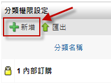
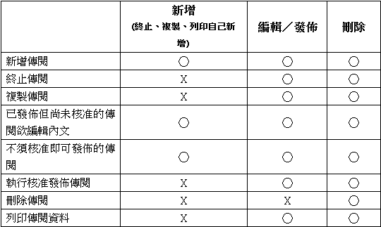
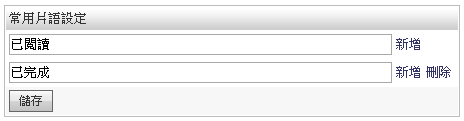

傳閱
========================

規格說明
------------------------
 
* 提供樹狀圖進行分類與權限管理。
* 提供訊息的交流與傳達，可運用於會議紀錄、團購、訂便當等。
* 可將這份傳閱傳送給每名使用者，使用者可給予回應或投票。當傳閱結束，可以很快的知道回應結果。
* 啓動或下架可以指定某一特定時間。
* 回應的內容可設置常用片語。
* 通知方式可以利用電子郵件或是系統訊息寄出。
* 傳閱完的文件可以轉成電子簽核。
* 可以依內容決定，結果在結束前或結束後呈現。

系統設定
------------------------

分類設定
^^^^^^^^^^^^^^^^^^^^^^^^

#. 管理者可在系統管理區塊，點選 ``設定分類及權限`` 進行設定。
#. 點選 ``新增`` 來增加一個分類。
#. 在新增分類的頁面中，把資料填入相對應欄位，設定完成後點選 ``儲存``。
#. 管理者可點選 ``鎖頭圖示`` 針對分類做新增、編輯/發佈、刪除的動作權限進行設置。設定完成後點選 ``儲存``。

.. figure:: images/image1.png
    :scale: 100%
    :alt: 系統管理 區塊

    系統管理 區塊

.. figure:: images/image2.png
    :scale: 100%
    :alt: 全區分類頁面

    全區分類頁面

.. figure:: images/image3.png
    :scale: 100%
    :alt: 新增分類

    新增分類

發佈設定
^^^^^^^^^^^^^^^^^^^^^^^^

#. 管理者可在跑馬燈頁面左方有系統管理區塊，點選 ``發佈設定`` 進行設定。
#. 在設定的頁面中，把資料選入相對應欄位，設定完成後點選 ``儲存``。

.. figure:: images/image4.png
    :scale: 100%
    :alt: 系統管理

    系統管理

.. figure:: images/image5.png
    :scale: 100%
    :alt: 發佈設定

    發佈設定

常用片語設定
^^^^^^^^^^^^^^^^^^^^^^^^

#. 管理者可在系統管理區塊，點選 ``常用片語設定`` 進行設定。
#. 在設定的頁面中，把常用片語填入相對應欄位，設定完成後點選 ``儲存``。

.. figure:: images/image6.png
    :scale: 100%
    :alt: 常用片語設定

    常用片語設定

使用說明
------------------------

一般使用
^^^^^^^^^^^^^^^^^^^^^^^^

傳閱模組提供系統使用者傳遞文字訊息給其它指定的使用者，當收到傳閱的使用者檢視傳閱內容時，系統會自動紀錄開啟時間，讓傳閱發起者檢視各使用者是否已檢視內容，十分適合把公司會議整理後的紀錄傳閱給相關使用者。 傳閱發起者可以增加投票或訂購單項目，讓收到傳閱的使用者進行投票或訂購，再將傳閱結果列印給相關人員做參考。另外，如果擁有電子簽核模組，則傳閱結束後，可將傳閱結果轉換成簽核(需要搭配另購的電子簽核模組)，把傳閱的內容和投票結果傳送給相關主管進行審核查閱。

新增傳閱
^^^^^^^^^^^^^^^^^^^^^^^^

傳閱主要有三種方式投票設定方式：

#. 無選項：指不啟動傳閱投票，收到傳閱的使用者只能填寫備註。
#. 單選/複選：則可用來做記名投票。
#. 訂購單：可用在公司進行如訂購午餐或團購之用途。

在傳閱首頁點選 ``新增傳閱``，並把新增頁面分為上下兩部份來操作。

.. figure:: images/image7.png
    :scale: 100%
    :alt: 新增傳閱

    新增傳閱

在新增傳閱頁面的上半部，輸入傳閱名稱，選擇 ``分類`` 及 ``選單`` 方式。 範例中使用單選方式，點選新增可以增加投票選項，並且在選項名稱欄位輸入名稱即可。

#. 如果使用複選方式，使用者可以選擇一個或多個投票項目。
#. 如果選取訂購單，可以用來團購物品，並記錄每個人購買的內容及數量。

.. figure:: images/image8.png
    :scale: 100%
    :alt: 新增傳閱頁面(單選)

    新增傳閱頁面(單選)

.. figure:: images/image9.png
    :scale: 100%
    :alt: 新增傳閱頁面(複選)

    新增傳閱頁面(複選)

.. figure:: images/image10.png
    :scale: 100%
    :alt: 新增傳閱頁面(訂購單)

    新增傳閱頁面(訂購單)

在新增傳閱頁面的下半部，選擇 ``傳閱名單``、 ``使用狀態``、 ``知會``，並依照傳閱發起者需求，勾選是否 ``開放詳細結果``、 ``開放傳閱統計`` 或 ``附加檔案``，儲存後即可發出。

    新增傳閱頁面下半部

新增傳閱
^^^^^^^^^^^^^^^^^^^^^^^^

接收傳閱的使用者可以檢視並回應傳閱。 檢視統計結果，是依照發起人設定，決定是否能觀看傳閱中狀態的統計結果。

送出回應
^^^^^^^^^^^^^^^^^^^^^^^^

#. 點選樹狀圖 ``待處理`` 分類，可以開啟需要進行回應的傳閱列表。
#. 點選 ``傳閱描述``，選擇動作及輸入備註，即可送出。

瀏覽傳閱結果
^^^^^^^^^^^^^^^^^^^^^^^^

* 傳閱終止後，可點選樹狀圖 ``我的傳閱``，顯示已回應的傳閱清單。
* 檢視傳閱並點選 ``傳閱描述``，顯示我的選擇。
* 點選 ``統計結果``，顯示出各選項的數量。
* 點選 ``詳細傳閱結果``，顯示出各使用者的選擇及瀏覽/回覆時間。

.. figure:: images/image12.png
    :scale: 100%
    :alt: 傳閱首頁

    傳閱首頁

.. figure:: images/image13.png
    :scale: 100%
    :alt: 送出回應

    送出回應

.. figure:: images/image14.png
    :scale: 100%
    :alt: 選擇 已完成 傳閱

    選擇 已完成 傳閱

.. figure:: images/image15.png
    :scale: 100%
    :alt: 傳閱結果

    傳閱結果

    統計結果

.. figure:: images/image17.png
    :scale: 100%
    :alt: 詳細傳閱結果

    詳細傳閱結果

傳閱發起人
^^^^^^^^^^^^^^^^^^^^^^^^

傳閱成功啟動後，發起傳閱的使用者可以檢視各使用者是否已瀏覽傳閱，或檢視投票/訂單的結果，並擁有終止/列印傳閱的權限。

瀏覽目前狀態
^^^^^^^^^^^^^^^^^^^^^^^^

瀏覽方式是透過 ``傳閱首頁`` 的傳閱區塊選擇瀏覽，分為四種瀏覽方式。

.. figure:: images/image18.png
    :scale: 100%
    :alt: 傳閱區塊

    傳閱區塊

* 草稿：自己建立的傳閱並且存成草稿。
* 待處理：使用者尚未處理的傳閱。
* 已處理：使用者已回覆的傳閱。
* 我的傳閱：自己建立過的所有傳閱。

關閉傳閱
^^^^^^^^^^^^^^^^^^^^^^^^

關閉傳閱除了等到日期截止外，還可以直接終止傳閱，傳閱終止後就無法再編輯，所以傳閱發起人須慎重使用。

    終止傳閱

傳閱結果列印
^^^^^^^^^^^^^^^^^^^^^^^^

傳閱未截止前，發起人就可以列印傳閱，或等到傳閱終止後再利用結果列印。
範例中，傳閱結果列印的清單如下，在訂購單統計結果可以列出總共價格。

    傳閱結果列印

個人化設定
------------------------

使用者可在個人化設定中，將傳閱的最新資料顯示在首頁列表中：

#. 點選首頁右上角的 ``個人化設定``。
#. 點選傳閱中的 ``個人化設定``。
#. 依實際需求選擇欲顯示的最大筆數，並 ``儲存`` 即可。

註：若回到EIP Plus首頁無法看到設定好的傳閱資料，請至個人化設定中的首頁設定，檢查是否有將該區塊加入首頁中。

    首頁的個人化設定

    傳閱的個人化設定

    傳閱首頁設定

* 列表隱藏摘要：設定摘要欄位是否要在公告首頁列表中顯示或隱藏。

.. figure:: images/image24.png
    :scale: 100%
    :alt: 首頁區塊設定

    首頁區塊設定

    首頁傳閱區塊示例