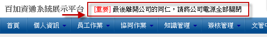

跑馬燈
========================

規格說明
------------------------
 
* 可以依部門設立各部門的跑馬燈。
* 可以有彈性權限的控管。
* 可以在平台上方建立臨時性的跑馬燈，使用者可以使用 HTML 語法改變字體的顏色字型。

系統設定
------------------------

設定分類
^^^^^^^^^^^^^^^^^^^^^^^^

#. 管理者可在系統管理區塊，點選 ``設定分類及權限`` 進行設定。
#. 點選 ``新增`` 來增加一個分類。
#. 在新增分類的頁面中，把資料填入相對應欄位，設定完成後點選 ``儲存``。
#. 管理者可點選 ``鎖頭圖示`` 針對分類做讀取、新增、編輯/發佈、刪除的動作權限進行設置。
#. 設定完成後點選 ``儲存``。

    跑馬燈管理首頁

.. figure:: images/image2.png
    :scale: 100%
    :alt: 新增分類 頁面

    新增分類 頁面

    跑馬燈列表

發佈設定
^^^^^^^^^^^^^^^^^^^^^^^^

#. 管理者可在跑馬燈頁面左方有系統管理區塊，點選 ``發佈設定`` 進行設定。
#. 在設定的頁面中，把資料選入相對應欄位，設定完成後點選 ``儲存``。

    系統管理

    發佈設定

使用說明
------------------------

新增新的跑馬燈
^^^^^^^^^^^^^^^^^^^^^^^^

#. 點選分類和重要性，填寫跑馬燈內容，也可以放置相關聯結。
#. 通知審核者決定發佈狀況，設立審核通知方式，提醒審核者審核跑馬燈。
#. 點選儲存完成跑馬燈。
#. 審核者發佈跑馬燈。

    跑馬燈首頁

    新增跑馬燈

    刪除跑馬燈