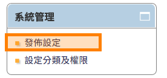
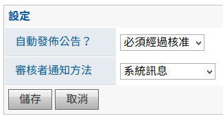
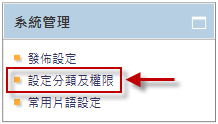
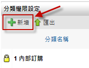
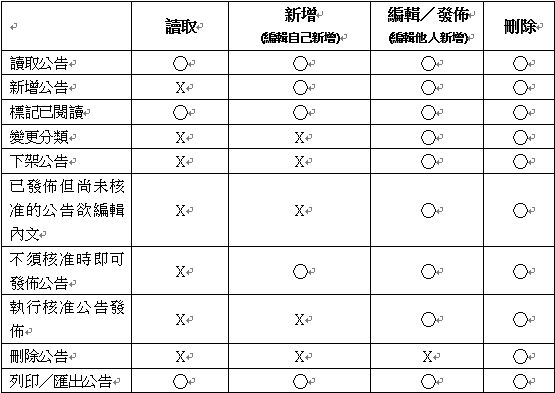
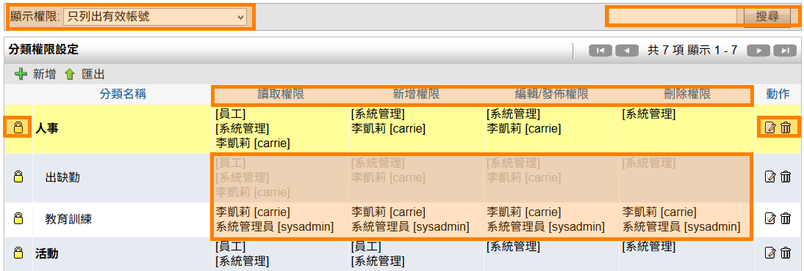
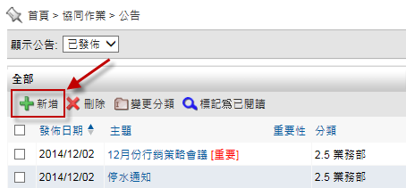
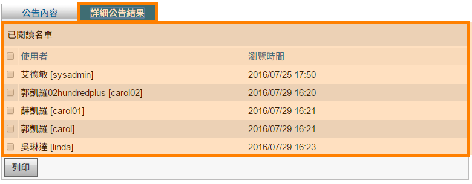

公告
========================

規格說明
------------------------
 
* 提供樹狀圖進行分類與權限管理。
* 可針對組織內部全部人員發公告。
* 針對特定的受文對象來做特定部門的公告發表。
* 提供公告定期下架機制，當下架時間一到，公告將自動變為過期公告。
* 通知方式可以利用電子郵件或是系統訊息寄出。
* 可以設定公告發佈必須經過核准才可以發佈。
* 審核者核准方式也可以選擇訊息、電子郵件或者兩者做通知。

系統設定
------------------------

【使用者管理】或【群組管理】使用權限開放
^^^^^^^^^^^^^^^^^^^^^^^^

如要開放此模組給使用者，必須先至系統管理內 ``使用者管理`` 或 ``群組管理``，編輯某使用者或群組之權限控管，勾選 ``公告`` 才可開放使用，此功能只有系統管理員可設定。（注意：首頁為必選項目）

    公告模組開放使用設定畫面

模組管理者設定
^^^^^^^^^^^^^^^^^^^^^^^^

針對此模組如需要再另外增加系統管理者，可至模組管理者設定進行設定，即可擁有此模組系統管理權限。

#. 點選 ``系統管理``，再點選 ``模組管理者設定``。
#. 在公告中，點選 ``搜尋使用者``，設定使用者後按 ``送出``。
#. 最後再回到模組管理設定中點選 ``送出更新資料`` 完成設定。
#. 模組管理員即擁有系統管理區塊權限。

.. figure:: images/image4.png
    :scale: 100%
    :alt: 模組管理者設定

    模組管理者設定

    .. figure:: images/image5.png
    :scale: 100%
    :alt: 模組管理設定

    模組管理設定

    設定完成

系統管理
^^^^^^^^^^^^^^^^^^^^^^^^

系統管理者及模組管理者可設定公告的權限及發佈設定。

系統管理
^^^^^^^^^^^^^^^^^^^^^^^^

可設定發佈公告是否需經過核准及通知方式。

#. 管理者可在系統管理區塊，點選 ``發佈設定`` 進行設定。
#. 在設定的頁面中，把資料選入相對應欄位，設定完成後點選 ``儲存``。

    系統管理

    發佈設定

* 自動發佈公告：新增公告者是否可自動發佈公告，需要擁有 ``編輯／發佈`` 或 ``刪除`` 權限者審核。
* 審核者通知方法：透過電子郵件、系統訊息或兩者皆須發出通知。

設定分類及權限
^^^^^^^^^^^^^^^^^^^^^^^^

系統管理者及模組管理者可在系統管理區塊，點選 ``設定分類及權限`` 進行設定。

新增分類
^^^^^^^^^^^^^^^^^^^^^^^^

#. 點選 ``新增`` 來增加一個分類。
#. 在新增分類的頁面中，把資料填入相對應欄位，設定完成後點選 ``儲存``。
#. 管理者可點選 ``鎖頭圖示`` 針對分類做新增、編輯/發佈、刪除的動作權限進行設置。設定完成後點選 ``儲存``。

    系統管理

    分類權限頁面

.. figure:: images/image11.png
    :scale: 100%
    :alt: 新增分類

    新增分類

設定權限
^^^^^^^^^^^^^^^^^^^^^^^^

系統管理者及模組管理者新增分類完成後，可對每一個分類進行權限設定。

#. 新增分類完成後，進入系統管理區塊的 ``設定分類及權限``。
#. 針對欲設定的分類，點選 ``權限`` 鎖頭圖示。
#. 可針對群組或個人設定 ``讀取``、``新增``、``編輯／發佈``、``刪除``，設定完成後請點選 ``儲存`` 設定完成。

    系統管理

.. figure:: images/image14.png
    :scale: 100%
    :alt: 設定權限

    設定權限

* 群組：可依照系統的組織架構來篩選部門人員資料。
* 包含顯示停用帳號：預設不包含，被停用的帳號不顯示。
* 搜尋：可輸入使用者名稱、帳號或群組名稱來搜尋人員。
* 讀取權限：可 ``讀取`` 此分類的公告資料。
* 新增權限：可 ``新增`` 及 ``編輯`` 自己新增的公告資料，如公告不需經過核准，可直接 ``發佈`` 公告。 
* 編輯／發佈權限：可 ``新增`` 公告及 ``編輯``、``發佈`` 自己及其他使用者新增的公告資料。
* 刪除權限：可使用上述功能以外，還可個別或批次 ``刪除`` 此分類的表單。

    權限設定之相關運用請參考圖

完成設定分類權限
^^^^^^^^^^^^^^^^^^^^^^^^

系統管理者及模組管理者可查看權限設定。

#. 進入系統管理的 ``設定分類及權限`` 可查看設定權限。

    設定分類及權限

* 顯示權限：可執行 ``只列出有效帳號`` 或 ``列出所有帳號(包含已停用帳號)``。
* 搜尋：針對 ``分類名稱`` 欄位進行文字搜尋。
* 灰色子分類：如新增子分類，其權限會依照母分類權限帶入，顏色顯示灰色。
* 黑色子分類：特定子分類須設定與母分類不同權限規則，編輯完成後，顏色顯示為黑色。
* 新增：新增分類。
* 匯出：將設定權限匯出。
* 權限：設定此分類的權限。
* 編輯：編輯分類資料。
* 刪除：刪除此分類資料。（請先清空此分類底下的資料後再進行刪除動作）

個人化設定預設偏好設定
^^^^^^^^^^^^^^^^^^^^^^^^

從個人化設定進入，只有系統管理員才可查閱及編輯 ``預設偏好設定`` 頁籤，可預設所有使用者在使用此模組的查閱模式。``個人偏好設定`` 頁籤為使用者可針對個人需求再自行變更。

#. 點選 ``個人化設定``，再點選公告的 ``個人化設定``。
#. 進行 ``預設偏好設定`` 設定，再按 ``儲存`` 完成設定。

.. figure:: images/image18.png
    :scale: 100%
    :alt: 個人化設定

    個人化設定

.. figure:: images/image19.png
    :scale: 100%
    :alt: 公告個人化設定

    公告個人化設定

    預設偏好設定

* 在主要畫面顯示公告數量：首頁公告區塊會顯示近七日公告，可再設定顯示筆數。
* 首頁顯示公告方式：首頁公告區塊公告列表的顯示方式可設定閱讀後依然顯示或閱讀後隱藏。
* 列表隱藏摘要：如新增公告時有填寫摘要內容，在瀏覽公告列表時可設定是否要顯示或隱藏摘要內容。

使用說明
------------------------

一般使用
^^^^^^^^^^^^^^^^^^^^^^^^

公告主要可以分為兩種使用方式，公告的瀏覽及建立。公告的瀏覽可以使用分類瀏覽、選定發佈狀態或搜尋公告來瀏覽文章。公告的建立，前提為使用者需擁有該分類的新增權限，新增一個公告必須包含題目、內文、附加檔案、設定發文通知方式或發佈日期及發佈狀態。

瀏覽公告首頁
^^^^^^^^^^^^^^^^^^^^^^^^

透過樹狀圖，可查詢已查看或未查看的公告資料。

    公告首頁

* 所有公告：此使用者可查看的所有公告。
* 近七日公告：近七日所發布的公告。
* 草稿：自己建立的公告尚未發佈可存成草稿。
* 未核准：如果發佈設定為需要核准，如已送出待核准的公告會在此分類中，需要擁有 ``編輯／發佈``、``刪除`` 權限者才可進行發佈。
* 待發佈：如有設定發佈時間，未到發佈時間的公告接放置於此。
* 所有分類資料夾：此分類所有公告或過往的公告在此查看。
* 顯示公告：可篩選查看全部、已發佈、已下架的公告。
* 搜尋：可依據主題及內文進行關鍵字查詢。
* 新增：擁有 ``新增`` 權限者可新增公告。
* 刪除：擁有 ``刪除`` 權限者可新增公告。
* 變更分類：擁有 ``新增`` 權限者可將公告變更分類到其它擁有 ``新增``權限公告之分類。
* 標記為已閱讀：已批次標記為已閱讀公告。
* 下架公告：擁有 ``編輯／發佈``、``刪除``權限者可將公告批次下架。
* 狀態：可分為未核准、待發佈、已發佈、已下架。
* 最新公告：新發佈且尚未查閱的的公告會顯示 ``最新公告``，讀取後消失。
* 編輯：擁有 ``新增`` 權限者只能編輯自己新增的公告，擁有 ``編輯／發佈``、``刪除`` 權限者可編輯自己及其他使用者新增的公告。
* 刪除：擁有 ``刪除`` 權限者才可刪除公告。

新增公告者
^^^^^^^^^^^^^^^^^^^^^^^^

新增公告
^^^^^^^^^^^^^^^^^^^^^^^^

擁有 ``新增``、``編輯／發佈``、``刪除`` 權限者可新增公告。使用者可以利用新增公告，註明主題，並選擇所屬分類及輸入內文，或附加檔案供人下載，然後利用電子郵件或系統訊息去通知該分類可讀取權限者。

#. 公告首頁點選 ``新增`` 按鈕，開啟新增公告頁面。
#. 在新增公告頁面中，輸入主題、內容 並選擇 類別、使用狀態、發出通知 方式後，即可儲存送出。

    公告首頁

    新增公告

* 主題：此公告的標題。
* 分類：可選擇此新增的公告屬於哪一個分類。
* 重要性：分為一般、重要、緊急，如有設定重要或緊急，會在主題後面說明其重要性。
* 摘要：可對此公告標示簡單的說明。
* 內容：此公告的內容
* 狀態：可分為草稿、立即發佈、已下架、發佈在指定時間，草稿狀態只有自己看的到此公告，立即發佈之狀態，如有設定需經過核准，必須經過核准才可發佈此公告，已下架之狀態，如有個別或批次執行下架公告，狀態為已下架，發佈在指定時間狀態，可以設定此公告於何時發佈，於何時自動下架，如有設定需經過核准，必須經過核准才可發佈此公告。
* 通知審核者：如有設定需經過核准，才會顯示此欄位，審核者為擁有 ``編輯／發佈``、``刪除`` 權限者。需指定一位或多位審核者，再依據系統管理區塊發佈設定之審核者通知方法通知被指定審核者，核准後才可發佈公告。
* 發佈通知：設定此公告發佈給讀取者的通知方式。
* 附加檔案：可新增附加檔案，檔案上傳大小限制依系統管理之系統環境設定而定。*註：目前IE10（含IE10、Edge）以上可支援拖曳檔案的方式附加檔案。

編輯公告
^^^^^^^^^^^^^^^^^^^^^^^^

已新增的公告為 ``草稿`` 狀態，可再編輯此公告，確認無誤後再發佈此公告。

#. 在草稿分類中，選擇特定公告後點選 ``編輯``，即可修改表單。
#. 確認無誤後，狀態修改為立即發佈，按 ``儲存``。
#. 再依據是否需要核准決定發佈時機。

    點選編輯修改公告

查看已發佈公告
^^^^^^^^^^^^^^^^^^^^^^^^

擁有 ``新增`` 權限者針對自己新增且已發佈公告，除了可查閱公告內容外，還可查閱閱讀名單。``編輯／發佈``、``刪除`` 權限者針對自己及其他使用者新增且已發佈公告，除了可查閱公告內容外，還可查閱閱讀名單。

#. 已發佈公告會顯示在近七日公告及所屬分類中。
#. 進入查閱列表，點選特定公告。
#. 可查閱公告內容以外還可查詢詳細公告結果。
#. 另批次勾選閱讀者點選 ``列印`` 可列印出閱讀名單。

    詳細公告結果

    列印公告資料

核准公告者
^^^^^^^^^^^^^^^^^^^^^^^^

核准公告
^^^^^^^^^^^^^^^^^^^^^^^^

擁有 ``編輯／發佈``、``刪除`` 權限者可直接發佈公告也可發佈其他使用者提出核准需求的公告。

#. 進入未核准分類。
#. 進入查閱列表，點選特定公告。
#. 查閱公告內容後可選擇 ``編輯`` 或 ``發佈`` ，點選 ``發佈`` 後，再依據是否設定發佈時間執行發佈。
#. ``刪除`` 鈕只有擁有刪除權限者才可使用。

    發佈公告

核准後待發佈公告
^^^^^^^^^^^^^^^^^^^^^^^^

擁有 ``編輯／發佈``、``刪除`` 權限者可直接發佈公告也可發佈其他使用者提出核准需求的公告。如發佈時間未到，則會將此公告分類到待發佈分類中。

#. 進入未核准分類。
#. 進入查閱列表，點選特定公告。
#. 查閱公告內容後可選擇 ``編輯`` 或 ``發佈``，點選 ``發佈`` 後，再依據是否設定發佈時間執行發佈。
#. 如有設定發佈時間，但是發佈時間未到，此公告將被分類到待發佈分類中等待發佈時間到達後發佈。
#. ``刪除`` 鈕只有擁有刪除權限者才可使用。

    待發佈公告

下架公告
^^^^^^^^^^^^^^^^^^^^^^^^

如此公告已上架多時，擁有 ``編輯／發佈``、``刪除`` 權限者可下架公告。

#. 進入擁有 ``編輯／發佈``、``刪除`` 之分類。
#. 批次勾選公告，點選 ``下架公告`` 。
#. 顯示所選取的公告已經下架成功。

    下架公告

閱讀已發佈公告
^^^^^^^^^^^^^^^^^^^^^^^^

擁有 ``讀取``、``新增``、``編輯／發佈``、``刪除`` 皆可讀取已發佈的公告。

#. 已發佈的公告會顯示在近七日公告分類中。
#. 新發佈而未查閱過的公告主題右邊會顯示 ``最新公告``，待點選查閱內文後，此 ``最新公告`` 圖示將移除。
#. 也可執行批次閱讀公告，批次勾選特定顯示 ``最新公告`` 之公告。再點選 ``標記為已閱讀``，``最新公告`` 圖示即可移除。
#. 也可透過此公告所屬分類做查看。

    看已發佈公告

刪除公告
^^^^^^^^^^^^^^^^^^^^^^^^

如有擁有 ``刪除`` 皆可刪除所有的公告。

1. 進入擁有 ``刪除`` 之分類。
2. 可批次勾選公告，點選 ``刪除``。
3. 顯示公告已被刪除成功。
4. 也可單筆刪除，勾選欲刪除的公告，點選 ``刪除`` 即可將此公告刪除。

    刪除公告