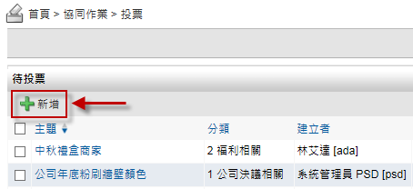
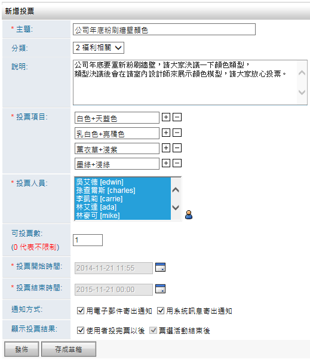

投票
========================

規格說明
------------------------
 
* 提供樹狀圖進行分類與權限管理。
* 針對所有的企業員工，可以透過投票區來簡單設計各種意見收集。
* 通知方式可以利用電子郵件或是系統訊息寄出。
* 啓動或下架可以指定某一特定時間。
* 可以依內容決定，結果在結束前或結束後呈現。

系統設定
------------------------

設定分類
^^^^^^^^^^^^^^^^^^^^^^^^

#. 管理者可在系統管理區塊，點選 ``設定分類及權限`` 進行設定。
#. 點選 ``新增`` 來增加一個分類。
#. 在新增分類的頁面中，把資料填入相對應欄位，設定完成後點選 ``儲存``。
#. 管理者可點選 ``鎖頭圖示`` 針對分類做新增、編輯、刪除的權限進行設置。
#. 設定完成後點選 ``儲存``。

    系統管理 區塊

    全區分類頁面

    新增分類

使用說明
------------------------

一般使用
^^^^^^^^^^^^^^^^^^^^^^^^

投票可由分類權限設定，提供使用者可新增投票議題的權限，並由發起者選擇指定的使用者或群組，來進行單選或複選的不計名投票活動。

新增投票
^^^^^^^^^^^^^^^^^^^^^^^^

#. 在投票首頁點選 ``新增`` 按鈕，開啟新增投票頁面。
#. 輸入主題並依序填入其他資訊，發起投票人可以自由新增投票選項的項次，或進一步限制可投票數及投票人員、時間、通知方式、顯示投票結果。

    新增投票 頁面

    新增投票 頁面

進行投票
^^^^^^^^^^^^^^^^^^^^^^^^

投票有兩種方式，分別可在首頁投票 ，或在投票模組進行一般投票。個人首頁只會顯示最新尚未投票的議題或已完成的議題；若想瀏覽更多投票議題，則需進入投票模組首頁來檢閱所有議題。

#. 首頁投票：可透過首頁資訊輔助區塊中的投票進行快速回應。
#. 一般投票：可點投票模組首頁，並開啟相關投票議題來進行投票。
#. 選擇投票選項來後送出投票即可。

    首頁的投票區塊

    投票列表

    投票內容

瀏覽投票
^^^^^^^^^^^^^^^^^^^^^^^^

透過投票首頁的投票區塊選擇瀏覽，分為四種瀏覽方式。

* 草稿：自己建立的投票並且存成草稿。
* 待處理：使用者尚未處理的投票。
* 已處理：使用者已回覆的投票。
* 我的投票：自己建立過的所有投票。

#. 點選樹狀圖分類已處理，並點選相關投票活動主題。
#. 瀏覽投票活動內容，前提必須擁有權限檢視投票結果。

    投票樹狀圖

    投票列表

    投票內容