通訊錄
========================

規格說明
------------------------
 
* 提供樹狀圖進行分類與權限管理。
* 管理客戶或朋友的聯絡資料，資料可以匯入方式快速建立，也可以匯出。
* 如有聯絡人照片，列表也能呈現。
* 通訊錄資料可以搭配電子郵件快速存取聯絡人的電子郵件。
* 搭配簡訊模組(選購)，發出手機的簡訊。(限台灣地區，需要申請手機簡訊門號)

系統管理
------------------------

設定分類
^^^^^^^^^^^^^^^^^^^^^^^^

#. 管理者可在系統管理區塊，點選 ``設定分類`` 進行設定。
#. 點選 ``新增`` 按鈕，產生新的分類。
#. 在新增分類的頁面中，把資料填入相對應欄位，設定完成後點選 ``儲存``。

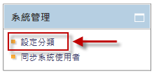

    通訊錄首頁

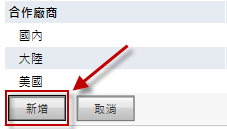

    以建立子分類作為範例

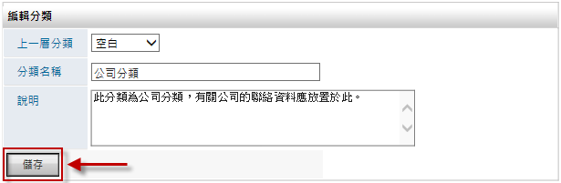

    新增分類頁面

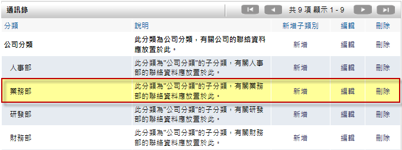

    通訊錄全區分類頁面

同步系統使用者
^^^^^^^^^^^^^^^^^^^^^^^^

#. 管理者可在系統管理區塊，點選 ``同步系統使用者`` 進行設定。
#. 勾選需要同步的人員資料，選取類別後，按下 ``同步到通訊錄`` 按鈕。
#. 點選 ``確認`` 按鈕後，完成同步。

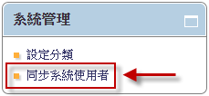

    同步系統使用者

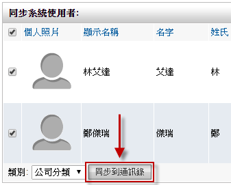

    同步通訊錄

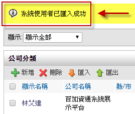

    完成同步

使用說明
------------------------

通訊錄是用來儲存聯絡人資料(如姓名、電子郵件、電話號碼和地址等)，方便日後搜尋或分類方式查詢資料。透過權限分享，使用者可以選擇性的分享自己擁有的聯絡人資料。另外，通訊錄還提供聯絡人匯入及匯出的功能，方便使用者新增大量聯絡人資訊，或是跟 Outlook、Thunderbird 等工具作資料交換。

新增聯絡人
^^^^^^^^^^^^^^^^^^^^^^^^

#. 點選 ``新增`` 聯絡人，開啟新增頁面。
#. 依序於各欄位填入聯絡人資料，勾選分類類別後儲存。

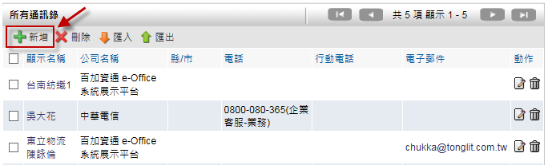

    通訊錄頁面

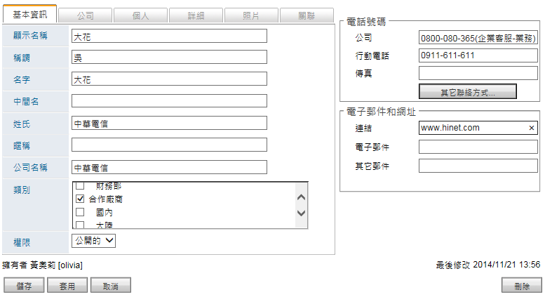

    新增聯絡人頁面

大量新增聯絡人
^^^^^^^^^^^^^^^^^^^^^^^^

#. 點選 ``匯入`` 聯絡人。
#. 選擇匯入檔案的路徑、格式、分類後，點選 ``匯入`` 即可完成。
#. 為了強化新增聯絡人的效能，使用者也可採用從Outlook、Thunderbird 或CSV/Excel匯入大量聯絡人資訊。

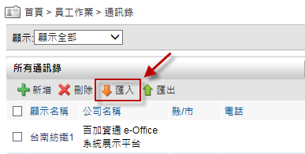

    通訊錄列表

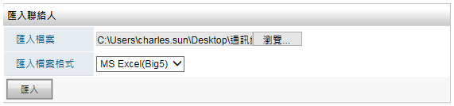

    匯入頁面

聯絡人搜尋
^^^^^^^^^^^^^^^^^^^^^^^^

利用搜尋可以快速的找到自己所想要的資訊，然而聯絡人的搜尋方式，主要使用的是關鍵字搜尋法，另外使用者也可以定義搜尋的 ``類別`` 及 ``顯示模式`` 去瀏覽通訊錄。舉例說明，輸入預搜尋的關鍵字，然後選擇類別及顯示，即可查詢關鍵字相符的聯絡人。

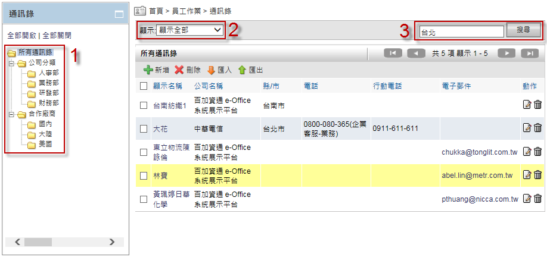

    搜尋結果

聯絡人匯出
^^^^^^^^^^^^^^^^^^^^^^^^

聯絡人匯出只需要點選 ``匯出聯絡人`` ，然後選擇轉換格式及分類後即可。

設定權限公開
^^^^^^^^^^^^^^^^^^^^^^^^

系統管理者可以指定聯絡人資料為公開權限，而不需要透過分享設定，一般使用者即可快速在個人的通訊錄檢視此筆聯絡人資料。

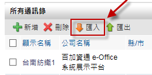

    匯出聯絡人

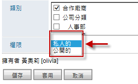

    聯絡人私人的權限選單

個人化設定
------------------------

通訊錄中的個人化設定提供多種選項，讓進階使用者使用。預設列表欄位可修改聯絡人清單所顯示的欄位、存取權限開放可以把自己的聯絡人資料開放給其它系統使用者、個人分類可以用來製作屬於自己的分類。

預設列表欄位
^^^^^^^^^^^^^^^^^^^^^^^^

#. 點選 ``個人化設定`` ，然後在通訊錄裡選擇個人化設定。
#. 在範例中，使用預設列表欄位，因此勾選的項目不做變更。

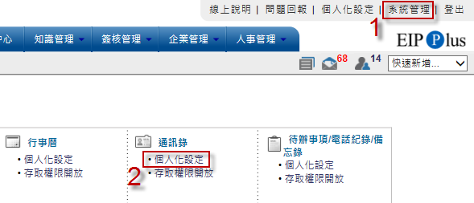

    個人化設定頁面

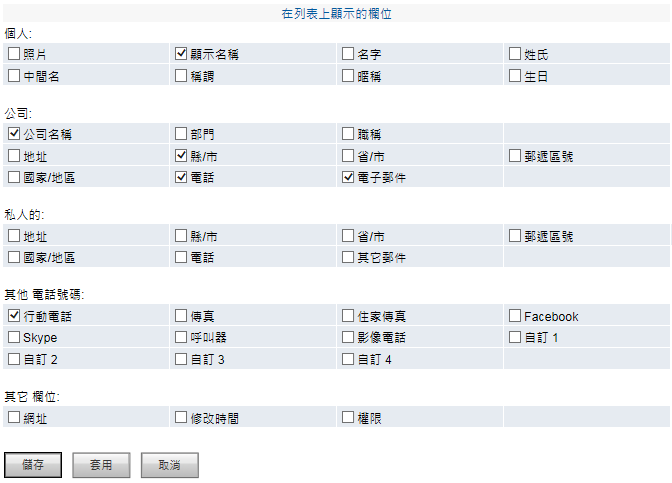

    預設列表欄位頁面

存取權限開放
^^^^^^^^^^^^^^^^^^^^^^^^

選擇存取權限的開放，可以分享個人通訊錄，並開放給其它使用者讀取/編輯/刪除的權限。

#. 點選 ``個人化設定`` ，再選取 ``存取權限開放``。
#. 可依群組或單一個人來設定權限。

範例中，我們使用群組設定權限後直接儲存即可使用。

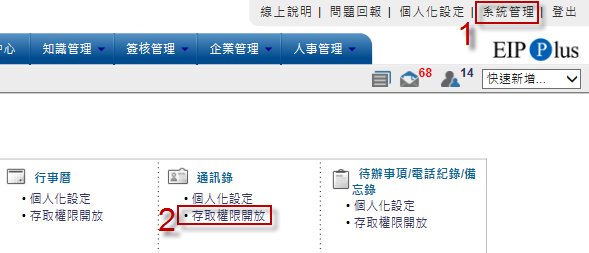

    個人化設定頁面

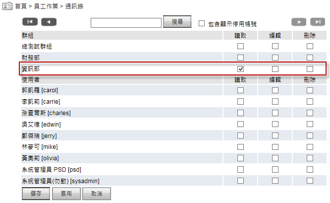

    以開放部門讀取權限為範例