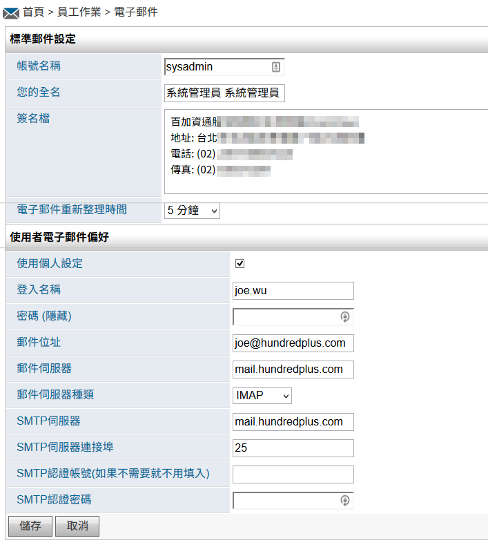
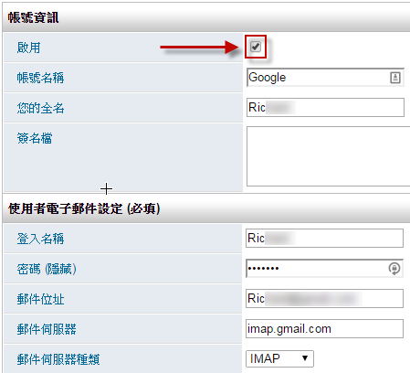

電子郵件
========================

規格說明
------------------------
 
* 支援 IMAP POP3及各家電子郵件伺服器。
* 支援多國語言，並提供所見即所得編輯器撰寫文字格式豐富的電子郵件。
* 可同時收發多個電子郵件帳號。
* 可設定資料夾分類做郵件管理。
* 每一個電子郵件帳號都可個別設定不同的簽名檔。

設定權限
------------------------

【使用者管理】或【群組管理】使用權限開放
^^^^^^^^^^^^^^^^^^^^^^^^

如要開放行事曆模組給使用者，必須先至系統管理內 ``使用者管理`` 或 ``群組管理``，編輯某使用者或群組之權限控管，勾選 ``電子郵件`` 才可開放使用，此功能只有系統管理員可設定。（注意：首頁為必選項目）

    電子郵件模組開放使用設定畫面

設定模組管理者
^^^^^^^^^^^^^^^^^^^^^^^^

如在系統管理者外增加電子郵件模組管理員，可在此進行設定。

#. 點選系統管理中的 ``模組管理者設定``。
#. 至電子郵件模組，點選 ``搜尋使用者`` 選擇使用者。
#. 選擇完成後再按 ``送出更新資料`` 完成設定。

    設定模組管理者

個人化設定預設偏好設定
^^^^^^^^^^^^^^^^^^^^^^^^

從個人化設定進入，只有系統管理員才可查閱及編輯 ``預設偏好設定`` 頁籤，可預設所有使用者在使用此模組的預設模式，``個人偏好設定`` 頁籤為使用者可針對個人需求再自行變更。

.. figure:: images/image5.png
    :scale: 100%
    :alt: 系統登入首頁

    系統登入首頁

    個人化設定頁面

個人化設定（標準郵件設定）
^^^^^^^^^^^^^^^^^^^^^^^^

可設定公司使用的個人郵件資訊，如寄件者名稱、簽名檔等資料。

#. 點選系統右上角的 ``個人化設定``。
#. 至電子郵件模組，點選 ``個人化設定``。
#. 設定完成後再按 ``儲存`` 完成設定。

    公司個人郵件設定

* 帳號名稱：電子郵件系統支援多帳號管理的功能，所以每一組郵件帳號必須有獨立名稱，您可以為這一個帳號設定一個名稱方便管理。如：公司郵件帳號代表公司的信箱。
* 您的全名：這個欄位所填寫的名字會出現在您未來發送信件的寄件者欄位上，一般輸入您的名字便可。
* 簽名檔：簽名檔內的文字將會顯示在您發送信件的結尾。
* 電子郵件重新整理時間：當使用者停留在電子郵件頁面的時候，系統會依照這裡所設定時間來自動收信。
* 使用個人設定：如有勾選，以下資訊會展開提供填寫。
* 登入名稱：請填寫郵件伺服器的登入帳號。(如有問題，請跟您的郵件服務提供者聯繫)
* 密碼：請填寫郵件伺服器的帳號密碼。 (如有問題，請跟您的郵件服務提供者聯繫)
* 郵件位址：請填寫電子郵件信箱位址，如 eason@hundredplus.com。(如有問題，請跟您的郵件服務提供者聯繫)
* 郵件伺服器：請填寫郵件伺服器所在位址 (收件)，如 mail.hundredplus.com。(如有問題，請跟您的郵件服務提供者聯繫)
* 郵件伺服器種類：請選取郵件伺服器的收信方式，目前可以選擇 IMAP (建議)、IMAP-S 或 POP3、POP3-S 四兩種。(如有問題，請跟您的郵件服務提供者聯繫)
* SMTP伺服器：請輸入郵件伺服器所在位址 (寄件)，如 mail.hundredplus.com。(如有問題，請跟您的郵件服務提供者聯繫)
* SMTP 伺服器連接埠：SMTP 預設的 port 為 25，除非有特別的設定，請不要變動這個設定。
* SMTP 認證帳號：如果 SMTP 伺服器需要有帳號和密碼才能寄件，請填寫寄件時所需的帳號名稱。
* SMTP 認證密碼：如果 SMTP 伺服器需要有帳號和密碼才能寄件，請填寫寄件時所需的帳號名稱。註：當郵件伺服器設定正確，再次開啟電子郵件首頁時，才會正常顯示以下的收件匣畫面。

其他帳號（多組郵件信箱設定）
^^^^^^^^^^^^^^^^^^^^^^^^

部份使用者可能擁有不只一組電子郵件信箱帳號。 電子郵件系統特別針對這一個需求設計了信箱切換的功能；使用者可在同一個電子郵件模組中收發不同信箱的電子郵件。

#. 請在個人化設定之電子郵件方塊中點選 ``其他帳號``。
#. 在多帳號管理清單的畫面點選 ``新帳號``，開始設定。
#. 在點選 ``新帳號`` 後即會出現如下圖的設定畫面，其欄位同標準郵件設定，請參照標準設定章節來完成設定；設定完成後點選 ``儲存`` 即可。

.. figure:: images/image8.png
    :scale: 100%
    :alt: 電子郵件個人化設定

    電子郵件個人化設定

    多帳號管理清單

    電子郵件系統提供多組信箱帳號整合的功能

* 啟用：必須勾選才可使用。
* 帳號名稱：為此組電子郵件命名，方便判斷您目前需要使用哪一組電子郵件。
* 您的全名：這個欄位所填寫的名字會出現在您未來發送信件的寄件者欄位上，一般輸入您的名字便可。
* 簽名檔：簽名檔內的文字將會顯示在您發送信件的結尾。
* 登入名稱：登打各家個人註冊郵件的帳號名稱。
* 密碼：登打各家個人註冊的郵件密碼。
* 郵件位址：各家個人註冊的郵件位址。
* 郵件伺服器：各家郵件伺服器位址。
* 郵件伺服器種類：各家郵件伺服器種類。

系統管理（電子郵件設定）
------------------------

電子郵件模組提供網頁介面，讓系統上的使用者收發自己的電子郵件。本功能必須搭配一台IMAP/POP3郵件伺服器。如果使用者的登入名稱和密碼與郵件伺服器上的帳號相同，可以在系統管理頁面中的電子郵件下的網站設定提供預設的連線資訊。這樣當的使用者開啟電子郵件模組時，系統會自動把使用者的帳號和密碼傳送到預設的郵件伺服器。如果帳號、密碼沒有跟郵件伺服器同步，請參考標準郵件設定部份來作個人連線設定。（使用對象：系統管理員、模組管理員）

#. 至電子郵件模組，之 ``系統管理`` 區塊。
#. 點選 ``電子郵件設定``，開始設定。
#. 設定完成後點選 ``儲存`` 即可。

    電子郵件設定

    系統管理者可預先為所有使用者設定伺服器連線資料

* 預設的POP伺服器/IMAP郵件主機位址：公司的郵件主機位址。
* 選取郵件伺服器種類：公司的郵件伺服器種類。
* 輸入預設SMTP伺服器主機位址：公司SMTP伺服器位址。
* 輸入預設SMTP伺服器連接埠：SMTP伺服器連接埠號碼。
* SMTP認證帳號(如果不需要就不用填入)：SMTP認證帳號。
* SMTP認證密碼：SMTP認證密碼。

使用說明
------------------------

設定公司個人郵件
^^^^^^^^^^^^^^^^^^^^^^^^

如果開啟電子郵件首頁後，出現以下訊息。

#. 點選 ``電子郵件`` 選單。
#. 請點選 ``標準郵件設定`` 連結來輸入您的郵件伺服器連線資料。
#. 填入所需資訊，注意要勾選使用個人設定才能填寫郵件伺服器相關資料。

    電子郵件系統未設定前畫面

    電子郵件帳號設定畫面

* 帳號名稱：電子郵件系統支援多帳號管理的功能，所以每一組郵件帳號必須有獨立名稱，您可以為這一個帳號設定一個名稱方便管理。如：公司郵件帳號代表公司的信箱。
* 您的全名：這個欄位所填寫的名字會出現在您未來發送信件的寄件者欄位上，一般輸入您的名字便可。
* 簽名檔：簽名檔內的文字將會顯示在您發送信件的結尾。
* 電子郵件重新整理時間：當使用者停留在電子郵件頁面的時候，系統會依照這裡所設定時間來自動收信。
* 使用個人設定：如有勾選，以下資訊會展開提供填寫。
* 登入名稱：請填寫郵件伺服器的登入帳號。(如有問題，請跟您的郵件服務提供者聯繫)
* 密碼：請填寫郵件伺服器的帳號密碼。 (如有問題，請跟您的郵件服務提供者聯繫)
* 郵件位址：請填寫電子郵件信箱位址，如 eason@hundredplus.com。(如有問題，請跟您的郵件服務提供者聯繫)
* 郵件伺服器：請填寫郵件伺服器所在位址 (收件)，如 mail.hundredplus.com。(如有問題，請跟您的郵件服務提供者聯繫)
* 郵件伺服器種類：請選取郵件伺服器的收信方式，目前可以選擇 IMAP (建議)、IMAP-S 或 POP3、POP3-S 四兩種。(如有問題，請跟您的郵件服務提供者聯繫)
* SMTP伺服器：請輸入郵件伺服器所在位址 (寄件)，如 mail.hundredplus.com。(如有問題，請跟您的郵件服務提供者聯繫)
* SMTP 伺服器連接埠：SMTP 預設的 port 為 25，除非有特別的設定，請不要變動這個設定。
* SMTP 認證帳號：如果 SMTP 伺服器需要有帳號和密碼才能寄件，請填寫寄件時所需的帳號名稱。
* SMTP 認證密碼：如果 SMTP 伺服器需要有帳號和密碼才能寄件，請填寫寄件時所需的帳號名稱。註：當郵件伺服器設定正確，再次開啟電子郵件首頁時，才會正常顯示以下的收件匣畫面。

操作介面說明
^^^^^^^^^^^^^^^^^^^^^^^^

電子郵件模組提供直覺化的操作介面。電子郵件方塊提供了一般常用的功能如：新增電子郵件、郵件搜尋、及資料夾設定、帳號設定等功能。電子郵件資料夾方塊方便使用者做信件的分類、瀏覽跟管理。

    直覺化設計的顯示方式

電子郵件系統中有兩個特殊的資料夾，分別是系統寄件備份及系統刪除備份。

* 系統寄件備份：主要存放的是您寄送出去的信件，系統會自動將您寄出的信件複製一份存在這個資料夾。使用者可以到系統寄件備份這個資料夾中尋找自己曾經寄送過的信件。
* 系統刪除備份：主要存放的是您刪除過的信件，系統會將您刪除的信件移動到這一個資料夾；跟資源回收筒類似，提供使用者再次確認的機會。

建立資料夾
^^^^^^^^^^^^^^^^^^^^^^^^

如果您的郵件伺服器為 IMAP類型，那麼電子郵件系統還可提供方便的目錄管理功能；這個功能可方便使用者將各種類型的信件分門別類的放置在自訂資料夾中，方便管理。

#. 使用者可在電子郵件頁面上方有新增動作列，點選 ``資料夾`` 進行設定。
#. 填入資料夾名稱後 ``儲存`` 即可完成。
#. (``新增`` 或 ``刪除`` 圖示可新增或移除資料夾，``子分類`` 圖示則可設定為子資料夾。)

    點選資料夾

    建立資料夾

    建立完成

把郵件搬移到不同的資料夾
^^^^^^^^^^^^^^^^^^^^^^^^

要將信件搬移到不同的資料夾步驟非常容易；只需要先將信件勾選起來，然後選取目標資料夾即可。

批次移動
^^^^^^^^^^^^^^^^^^^^^^^^

#. 批次勾選欲移動的郵件。
#. 點選 ``移動``。
#. 選擇要移到哪一個資料夾。
#. 按 ``移動`` 完成移動。

.. figure:: images/image22.png
    :scale: 100%
    :alt: 郵件移動到別的資料夾

    郵件移動到別的資料夾

單一郵件移動
^^^^^^^^^^^^^^^^^^^^^^^^

#. 進入某一特定郵件。
#. 移至郵件最下方，點選資料夾下拉式選單。
#. 選擇要移到哪一個資料夾，即可完成移動。

    特定郵件移動

檢視／新增郵件
^^^^^^^^^^^^^^^^^^^^^^^^

要檢視郵件內容，只需在郵件列表中點選欲查看的主題即可。

* 回覆：當您收到一封需要給予回應的信件時，可於瀏覽畫面點選 ``回覆`` 做回信給寄件者的動作。
* 全部回覆：當您收到一封需要給予回應的信件時，可於瀏覽畫面點選 ``回覆`` 做回信給所有寄件者的動作。
* 轉寄：當您想要將一封信件的內容分享給別人，或是信件內容必須要讓他人知道時，就可使用轉寄功能，如原始郵件有附件也會附上。
* 列印／匯出：可執行直接列印、產生PDF檔案、匯出EML檔案。
* 刪除：當您將一封信閱讀完畢，並不想保留這個信件時就可以選擇刪除它。使用者除了可以在閱讀完信件後，一次一封的方式來刪除郵件，更可以一次選擇多封信件做刪除的動作。
* 新增郵件：電子郵件系統提供方便易用的所見即所得編輯器，只需要在電子郵件方塊中點選 ``新增電子郵件`` ，即可開始做編輯的動作。

    跟大部份的 webmail 系統一樣，點選主題即可看到信件內容

    信件內容瀏覽畫面

    常用功都位於上方工具列中，回信時原信件內容會自動加載於下方

    轉寄功能可以將信件內容完整的讓另一個人看到

    使用者可在閱讀完信件後順手將之刪除

    可一次刪除多封信件

    新增電子郵件的功能就顯示在電子郵件工具方塊中

    簡單易用的發信介面

* 附加檔案：可新增附加檔案，檔案上傳大小限制依系統管理之系統環境設定而定。註：目前IE10（含IE10、Edge）以上可支援拖曳檔案的方式附加檔案。

.. figure:: images/image32.png
    :scale: 100%
    :alt: 附加檔案

    附加檔案

搜尋郵件
^^^^^^^^^^^^^^^^^^^^^^^^

郵件電子化最大的好處除了讓資訊傳遞的更快速，更方便管理外；電子郵件系統還提供功能強大的搜尋功能。 從數百封甚至是數千封信件中找到所需的資料非難事。

* 快速搜尋：在電子郵件系統上方的工具列就有提供一個快速搜尋器，該搜尋器只會針對信件主題做搜尋。在輸入欲查找的字句後點選 ``搜尋`` 即可。
* 進階搜尋：電子郵件系統還提供更強大的搜尋功能，除了可針對主題、寄件者、信件內容等做搜尋，更可指定時間範圍。在電子郵件功能中點選 ``郵件搜尋`` 後，系統會帶出進階搜尋介面。填入搜尋條件後點選 ``搜尋`` 即可。

    快速搜尋僅針對信件主題做尋找的動作

    功能強大的進階搜尋功能