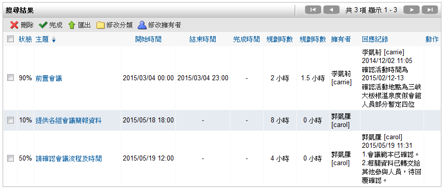
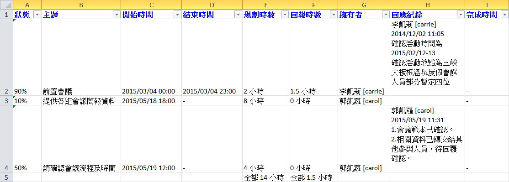

待辦事項
========================

規格說明
------------------------
 
* 提供樹狀圖進行分類與權限管理。
* 可當作企業內部的工作交辦追蹤使用。
* 每一個事項皆可設定指派人，系統會自動告知該指派人。
* 每一個事項皆可設定是否公開，設為公開，則公司的相關成員皆可看到該事項，或者設定為私人事項，否則除了自己，任何人皆無法看到私人事項的內容。
* 執行人員可針對所被分派的工作進行回應並記錄所花費之工時，管理者可以輕易瞭解工作進度。
* 可以批次匯入多筆工作進行指派。
* 如果有相關的檔案，也可以附加一個或多個檔案。

系統管理
------------------------

設定分類
^^^^^^^^^^^^^^^^^^^^^^^^

#. 管理者可在系統管理區塊，點選 ``設定分類`` 進行設定。
#. 以待辦事項作為範例，點選 ``新增`` ，產生新的分類。
#. 在新增分類頁面中，把資料填入相對應欄位，設定完成後點選 ``儲存``。

    系統管理 區塊

    分類設定畫面

    分類設定畫面

    完善的設定功能

進階設定
^^^^^^^^^^^^^^^^^^^^^^^^

#. 管理者可在系統管理區塊，點選 ``進階設定`` 進行設定。
#. 把資料選入相對應欄位，設定完成後點選 ``儲存``。

使用說明
------------------------

不論是待辦事項、電話紀錄或備忘錄 (統稱爲工作事項)，在使用過程中一般分爲三個階段，分別是新增、執行、和執行完成階段。 以下會以待辦事項爲例，介紹這三個階段所會使用到的功能及操作的方法。

新增待辦事項
^^^^^^^^^^^^^^^^^^^^^^^^

#. 要新增加一個待辦事項，請在待辦事項首頁的待辦事項方塊中，點選 ``新增待辦事項``。
#. 系統會開啟編輯視窗如下圖，依需要填寫各個欄位後點選 ``儲存``。

* 種類：工作事項有三種事件種類設定，待辦事項、電話記錄、及備忘錄。在此以待辦事項做為範例。
* 類別：一開始由系統管理者所設定的分類項目。
* 主題：請設定一個明瞭易懂的主題給這一個事件，以方便查閱。
* 優先權：工作事項提供四個等級，緊急、高、一般、及低優先權的設定。

若使用者選擇緊急的，則該事項在工作事項列表會特別有紅色閃爍文字提醒使用者這個事件的急迫性；高優先權，則會有不閃爍的紅色文字做提醒；一般優先權，不會特別做提醒；而低優先權，會以灰色文字告知使用者這一個事件並不急迫。

    待辦事項首頁

    新增工作事項視窗

增加附加檔案或連結
^^^^^^^^^^^^^^^^^^^^^^^^

如果要爲待辦事項附加一個檔案，請點選 ``連結`` 分頁，選取要上傳的檔案後再點選 ``附加`` 完成。

    檔案附加步驟

設定執行人員
^^^^^^^^^^^^^^^^^^^^^^^^

#. 有些事件可能需要一個或多個人來執行，這時候必須點選 ``執行人員`` 分頁，接著再點選圖中小圖示來指定執行人員。
#. 系統會開啟人員選擇視窗供使用者選取。請點選藍色箭頭圖示來新增人員，設定完成後點選 ``送出`` 即完成設定。

    可設定一個或多個執行人員

    使用者選擇器

設定通知
^^^^^^^^^^^^^^^^^^^^^^^^

#. 工作事項可以對每一個事件做出系統訊息或電子郵件通知的動作。 通知的對象可設定為執行者或擁有者。
#. 儲存後發出通知：儲存事件後，執行者就會收到系統通知或郵件通知。
#. 當有回應時通知：當執行者對該事件做出回應時，擁有者就會收到通知。
#. 超過結束日期發出通知：在結束日期前未完成當該事件，則會自動發出通知給執行者與擁有者。

    通知設定選取欄位

執行待辦事項
^^^^^^^^^^^^^^^^^^^^^^^^

當一個事件建立完畢後，接下來就是要去執行它。從待辦事項清單中可以看到您的待辦事項清單，要瀏覽一個事件的內容，只需點選該事件主題名稱即可。

    待辦事項清單

送出進度回報
^^^^^^^^^^^^^^^^^^^^^^^^

要對一個待辦事項做出進度回報，請在瀏覽畫面中點選 ``回報`` 分頁；並選定狀態、使用時間、或備註後，點選 ``新增`` 即可完成回應的動作。在必要時也可在回應的地方附加檔案，提供額外的資料。

    回應時也可附加檔案

完成待辦事項
^^^^^^^^^^^^^^^^^^^^^^^^

當一個待辦事項的事件完成時，我們可以在回應的地方將狀態設定為完成即代表這個事件的完結。

    回應記錄有完整的執行過程

進階搜尋
^^^^^^^^^^^^^^^^^^^^^^^^

工作事項模組有很完善的資料搜尋功能，除了可自行設定搜尋結果要顯示的欄位，還可以將搜尋結果匯出成 CSV 檔案，方便資料的轉移或備份。

#. 以待辦事項作為範例，可以在待辦事項的左上區塊點選 ``進階搜尋``。
#. 在填寫好搜尋條件後，點選 ``搜尋`` 即可。值得一提的是，在搜尋功能下方的選單可讓使用者任意的勾選，被勾選起來的欄位才會顯示在搜尋結果中。
#. 搜尋結果畫面只會顯示使用者所勾選的項目。

    進階搜尋可指定顯示的攔位

    進階搜尋欄位相當直覺

    搜尋結果清單

匯出成Excel可使用格式
^^^^^^^^^^^^^^^^^^^^^^^^

當使用者完成一個進階搜尋的動作後，還可以將搜尋結果匯出，方便使用者做資料的轉移或統計。(系統預設可支援 csv/xls/xlsx 三種格式，請參考系統進階設定)
點選 ``匯出`` 即可將搜尋結果匯出成檔案，使用者可以透過 Excel 等工具開啟檢視。

    系統會將搜尋結果匯出成檔案

    檔案開啟畫面

批次修改
^^^^^^^^^^^^^^^^^^^^^^^^

在待辦事項模組中可批次修改分類與擁有者：

#. 勾選需要修改的待辦事項。
#. 點擊 ``修改分類`` 或 ``修改擁有者`` 即可完成作業。

    在待辦事項首頁中勾選欲修改之清單

    在進階搜尋結果中勾選欲修改之清單

個人化設定
------------------------

工作事項模組有提供個人化設定，讓使用者依喜歡變更顯示或功能上的設定。

#. 要變更工作事項模組的個人化設定，請點選右上角 ``個人化設定`` 分頁，在工作事項導覽類別中點選 ``個人化設定``。
#. 依個人喜好設定完成後，點選 ``儲存`` 即可。

    個人化設定入口頁面

    工作事項個人化設定畫面

* 首頁顯示未完成的事件：(待辦事項/電話紀錄/備忘錄)若將這個選項設定為是時，若您有未完成的事件，系統會將您未完成的事件顯示在您的首頁；若選擇否則不顯示。
* 首頁顯示資料筆數上限：您可以自訂要在首頁顯示未完成事件的筆數。
* 每天工作時數：您可以設定一天工作時數的長度；工作事項模組會依您所設定的時數來計算時間。 若您設定為8小時，則當您在設定工作時數大於8個小時時，系統會自動以一天來計算。
* 預設過濾方式：可用的選項有全部顯示、顯示已完成項目、及顯示未完成項目。這一部份的設定會影響到列表清單中，顯示的項目。
* 在清單中顯示：這個設定供使用者自行設定在清單中事件顯示資料的完整度。若設定為詳細資料，在清單中將會顯示每一個事件的描述文字。 若設定為基本資料時，則不顯示。

存取權限開放
^^^^^^^^^^^^^^^^^^^^^^^^

工作事項模組提供個人的存取權限開放功能，使用者可依需求將自己的工作事項分享給別的使用者，供別人讀取、編輯、甚至是刪除的動作；使用者是針對群組或是個人來設定分享。

#. 要設定個人的存取權限，請點選右上角 ``個人化設定`` 分頁，在工作事項導覽類別中點選 ``存取權限開放``。
#. 使用者在新增事件時，如果將該事件設定為私人的事件時，任何人將無法讀取、編輯、或是刪除這筆資料；除非您在個人存取權限設定的地方將私人的權限分享出來。設定完成後點選 ``儲存`` 即完成設定。

    存取權限設定入口

    權限設定畫面