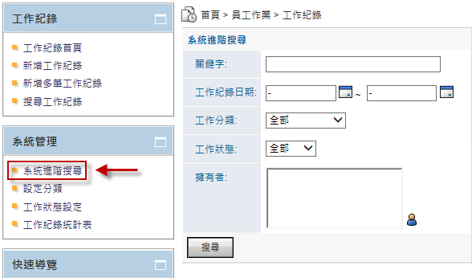

工作紀錄
========================

規格說明
------------------------
 
* 提供組織內部員工將每日工作紀錄。
* 支援權限管控，對應之主管或人員可以看到部屬或相關人員之工作紀錄。
* 工作紀錄可以上傳檔案。
* 可以紀錄工時並作統整。
* 可以篩選工作紀錄，並將資料匯出。
* 提供高階管理人以月的方式快速檢視部門或人員工作回報紀錄。

系統設定
------------------------

設定分類
^^^^^^^^^^^^^^^^^^^^^^^^

#. 管理者可在系統管理區塊，點選 ``設定分類`` 進行設定。
#. 點選 ``新增``，產生新的分類。 
#. 在新增分類頁面中，把資料填入相對應欄位，設定完成後點選 ``儲存``。

    工作紀錄首頁

    以建立分類作為範例

    新增分類頁面

    工作紀錄全區分類頁面

系統進階搜尋
^^^^^^^^^^^^^^^^^^^^^^^^

#. 管理者可在系統管理區塊，點選 ``系統進階搜尋`` 進行設定。
#. 再搜尋頁面中，把資料填入相對應欄位，設定完成後點選 ``搜尋``。

    系統進階搜尋系統畫面

工作狀態設定
^^^^^^^^^^^^^^^^^^^^^^^^

1. 管理者可在系統管理區塊，點選 ``工作狀態設定`` 進行設定。
1. 在設定頁面中，把資料填入相對應欄位，設定完成後點選 ``儲存``。
( 或  圖示可新增或移除資料夾。)

    系統設定

    工作狀態設定

工作紀錄統計表
^^^^^^^^^^^^^^^^^^^^^^^^

1. 管理者可在系統管理區塊，點選 ``工作紀錄統計表`` 進行設定。
1. 點選 ``日期範圍`` 、 ``群組`` 後，按下 ``搜尋`` 按鈕。
1. 點選要查看的日期，查看工作紀錄資料。

    工作紀錄統計表系統畫面

    點選工作紀錄進行查看

使用說明
------------------------

以往寫在紙本或口頭紀錄的工作狀況，若不特定去追蹤查詢，主管也難以了解員工的工作進度。透過「工作紀錄」功能可紀錄每日或每星期的相關工作進度回報，提升員工作業效率，主管也可以針對特定案件做協助。

### 新增工作紀錄

#. 點選 ``新增工作紀錄`` 填入需要紀錄的資訊。
#. 可選擇是否需要新增附加檔案，點選 ``瀏覽`` 來選擇欲上傳之資料。
#. 確認內容後按 ``儲存`` 即可完成新增。

    新增工作紀錄系統畫面

### 新增多筆工作紀錄

使用者若有多筆工作紀錄也能點選【新增多筆工作紀錄】進行大量資料建置，可透過點選加號、減號進行筆數的增減，確認內容後按【儲存】即可完成多筆工作記錄的新增。

    新增多筆工作紀錄系統畫面

系統進階搜尋
^^^^^^^^^^^^^^^^^^^^^^^^

使用者可以利用關鍵字，搜尋想要找尋的工作紀錄，也能指定工作紀錄日期，或點選工作分類或工作狀態，進行範圍式搜尋。

    系統進階搜尋系統畫面

    系統進階搜尋工作分類畫面

    系統進階搜尋工作狀態畫面

個人化設定
------------------------

設定檢視列表
^^^^^^^^^^^^^^^^^^^^^^^^

可到個人化設定來設定檢視狀態，有多種檢視狀態可供選擇(全部、昨天、上一季、前60天…等)，系統一開始提供預設值，可根據使用者習慣進行更改。

    預設檢視日期項目系統畫面

設定存取權限開放
^^^^^^^^^^^^^^^^^^^^^^^^

使用者可以設定存取權限開放，開放權限給上一階或需要的主管查看工作紀錄，方便管理階層進行管理。

    存取權限開放

    存取權限系統畫面
