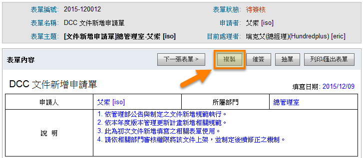
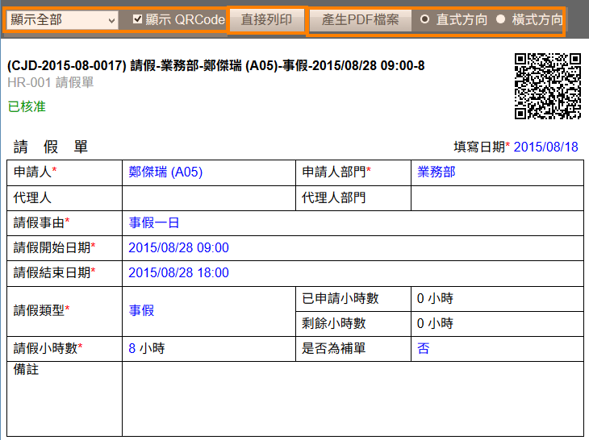

電子簽核
========================

規格說明
------------------------
 
* 用樹狀結構顯示簽核狀態，如草稿、待簽核、簽核中、完成待存檔、知會、經手表單、已存檔。
* 提供簽核、會簽、知會、交辦、加會簽、傕簽、駁回、抽單等功能。
* 支援動態加會簽功能。
* 提供子母表單功能給簽核者彈性運用。
* 可設定代理簽核，顯示代理簽核及被代理簽核。
* 可選擇引用過往的簽文。
* 可附加檔案 (不限形式)。
* 管理者可設定簽核常用片語設定。
* 提供管理者統計圖表查閱各類型表單處理狀況。

系統管理
------------------------

使用者管理或群組管理使用權限開放
^^^^^^^^^^^^^^^^^^^^^^^^

如要開放此模組給使用者，必須先至系統管理內 ``使用者管理`` 或 ``群組管理``，編輯某使用者或群組之權限控管，勾選 ``電子簽核`` 才可開放使用，此功能只有系統管理員可設定。（注意：首頁為必選項目）

    電子簽核模組開放使用設定畫面

模組管理者設定
^^^^^^^^^^^^^^^^^^^^^^^^

針對此模組如需要再另外增加系統管理者，可至模組管理者設定進行設定，即可擁有此模組系統管理權限。

#. 點選 ``系統管理``，再點選 ``模組管理者設定``。
#. 在電子簽核中，點選 ``搜尋使用者``，設定使用者後按 ``送出``。
#. 最後再回到模組管理設定中點選 ``送出更新資料`` 完成設定。
#. 模組管理員即擁有統計圖表區塊及系統管理區塊權限。

    模組管理者設定

    模組管理設定

    設定完成

管理所有表單
^^^^^^^^^^^^^^^^^^^^^^^^

系統管理者（包含模組管理員）可在模組中的系統管理區塊，點選 ``管理所有表單`` 進行設定。

除了閱讀所有表單外，必要時還可以輔助流程做跳關的動作。

    系統管理區塊

    管理所有表單顯示畫面

查詢表單
^^^^^^^^^^^^^^^^^^^^^^^^

系統管理者（包含模組管理員）如要查詢簽核表單，可從此功能做查詢。

使用分類及表單查詢
^^^^^^^^^^^^^^^^^^^^^^^^

點選分類後，再選擇欲查詢的表單名稱，即可將此名稱的所有表單帶出。也可再運用文字搜尋功能篩選欲查詢的表單編號或主題的資料。

    管理所有表單顯示畫面

使用文字搜尋
^^^^^^^^^^^^^^^^^^^^^^^^

利用文字搜尋的方式，篩選出表單編號或主題欄位的資料。

    使用搜尋後顯示畫面

使用文字搜尋
^^^^^^^^^^^^^^^^^^^^^^^^

系統管理者（包含模組管理員），可以使用此功能進行多欄位篩選表單。

1. 點選 ``進階搜尋``。
2. 將條件填入相對應欄位，設定完成後點選 ``搜尋`` 即可完成操作。

    點選進階搜尋

    進階搜尋頁面

* 表單分類：選擇表單分類資料夾名稱 (可包含子分類) 來進行搜尋。
* 表單名稱：選擇指定的表單來進行搜尋。
* 重要性：選擇表單的重要性來進行搜尋。
* 表單編號：直接輸入表單編號來進行搜尋。
* 主題：直接輸入表單主題來進行搜尋。
* 表單狀態：可多選各項表單狀態來做為搜尋條件。
* 申請者：可多選表單申請者來做為搜尋條件。
* 申請者主要群組：選擇申請者的主要群組來做為搜尋條件。
* 目前處理者：可多選表單的目前處理人員來做為搜尋條件。
* 申請時間：篩選表單的申請時間。（第一關送出申請時間）
* 結束時間：篩選表單流程結束時間。（最後一關簽核完成時間）

變更簽核流程
^^^^^^^^^^^^^^^^^^^^^^^^

當簽核過程中，目前簽核者可能因故無法執行簽核動作，但該表單又因時效問題必須執行簽核。此時，系統管理者就可以對此流程執行 ``設定代理簽核`` 或 ``修改流程到此關卡`` 動作。

設定代理簽核者
^^^^^^^^^^^^^^^^^^^^^^^^

#. 選擇要修改表單。
#. 點選表單最下方的 ``簽核流程`` 頁籤。
#. 點選 ``設定代理簽核者``，選擇可代理簽核人員後，按 ``設定代理人`` 完成後代理簽核人員即可簽核。

    原顯示流程

    設定代理人員

.. figure:: images/image15.png
    :scale: 100%
    :alt: 完成後目前處理者增加可代理人員

    完成後目前處理者增加可代理人員

修改流程到此關卡
^^^^^^^^^^^^^^^^^^^^^^^^

#. 選擇要修改表單。
#. 點選表單最下方的 ``簽核流程`` 頁籤。
#. 點選 ``修改流程到此關卡`` 後，直接跳下一簽核關卡。

    修改流程到此關卡

    完成跳簽到下一關卡

刪除表單
^^^^^^^^^^^^^^^^^^^^^^^^

當所有表單的狀態為已核准(已存檔)，系統管理者即可刪除此表單。

    已存檔的表單可執行刪除表單

管理者進階搜尋
^^^^^^^^^^^^^^^^^^^^^^^^

系統管理者（包含模組管理員）可在模組中的系統管理區塊，點選 ``管理者進階搜尋`` 進行設定。

可以使用此功能進行多欄位篩選表單。使用方式與查詢表單中進階搜尋相同。

    管理者進階搜尋

設定存取權限
^^^^^^^^^^^^^^^^^^^^^^^^

系統管理者（包含模組管理員）必須在電子簽核模組中，針對表單設計所分類的資料夾，做各資料夾權限的新增權限，否則相關人員無法申請該類型的表單。
系統管理者（包含模組管理員）可在模組中的系統管理區塊，點選 ``設定存取權限`` 進行設定。

    設定存取權限

#. 此分類名稱依據 ``表單設計`` 分類名稱之設定而顯示。
#. 在系統管理區塊，點選 ``設定存取權限``。
#. 點選 ``設定權限`` 圖示進行權限設定，再點選 ``儲存`` 已完成設定。

    分類權限設定

* 設定權限：點選該圖示以進行權限設定。
* 新增權限：在該權限的使用者或部門，擁有新增該分類表單的權限。
* 讀取已結束簽核權限：在該權限的使用者或部門，擁有讀取該分類所有已存檔簽核的表單資料。

    分類權限設定頁面

* 群組：可篩選群組的顯示人員。
* 搜尋：輸入 ``群組名稱``、 ``使用者名稱``、``使用者帳號`` 關鍵字可直接搜尋並篩選該關鍵字資料。

常用片語設定
^^^^^^^^^^^^^^^^^^^^^^^^

系統管理者（包含模組管理員）可在模組中的系統管理區塊，點選 ``常用片語設定`` 進行設定。

管理者可以設定在簽核流程中，能快速加入的片語。

    常用片語設定

#. 在系統管理區塊，點選 ``常用片語設定``。
#. 在設定頁面中，填入欲新增的片語，設定完成後點選 ``儲存``。

    常用片語設定頁面

* 新增：點選該鈕以新增一組待編輯的片語。
* 刪除：點選該鈕以直接刪除該片語。

    使用常用片語

* 加入片語：審核者請先在下拉式選單選好預設的常用片語，再點擊此功能鈕。

管理所有代理人
^^^^^^^^^^^^^^^^^^^^^^^^

系統管理者（包含模組管理員）可在模組中的系統管理區塊，點選 ``管理所有代理人員`` 進行設定。

可協助其他使用者來設定代理簽核的人員。

    管理所有代理人員

#. 在系統管理區塊，點選 ``管理所有代理人員``。
#. 點選 ``編輯`` 按鈕，針對需要代理人員進行設定。
#. 設定的頁面中把資料填入相對應欄位，完成後點選 ``啟用`` 或 ``停用``。

    代理人設定頁面

* 代理狀態下拉選單：可切換幾種代理狀態包含 ``全部``、``未設定``、``有效`` 及 ``已失效``。
* 搜尋：請輸入使用者名稱的關鍵字搜尋該資料。
* 代理狀態：顯示該代理的狀態是否為有效。
* 編輯：點選該鈕以進行代理人員的設定。

    代理人設定頁面

* 選擇代理人：請選擇該使用者的代理人員。
* 代理開始、結束日期：選擇代理期間的開始、結束日期及時間點。
* 發送通知：選擇設定完成後是否要發送通知的方式。

統計圖表
^^^^^^^^^^^^^^^^^^^^^^^^

系統管理者（包含模組管理員）可透過系統提供的統計圖表，來瀏覽使用者或各類表單的處理狀態，並可直接點選圖表中的表單篩選狀態，自動帶出相關的表單。

各類表單使用狀況
^^^^^^^^^^^^^^^^^^^^^^^^

    統計圖表區塊

    各類表單使用狀況

* 範圍：依據表單的新增日期篩選，並可自訂範圍。
* 選擇群組：可選擇該統計圖表的篩選指定群組。
* 更新：篩選條件選擇好後，請點選該鈕進行更新。
* 顏色區塊：依據此表單簽核狀態列出簽核狀態，請點顏色區塊後產生該狀態的表單列表。
* 匯出：點選該鈕已將該統計圖表匯出檔案。匯出格式，依照系統管理 > 系統環境設定 > ``預設資料匯出格式`` 而決定。

未處理表單的使用者
^^^^^^^^^^^^^^^^^^^^^^^^

    統計圖表區塊

    未處理表單的使用者

* 選擇群組：可選擇該統計圖表的篩選指定群組。
* 包含未存檔的電子簽核：勾選該選項，可將未存檔的電子簽核也顯示出來。
* 搜尋：篩選條件選擇好後，請點選該鈕進行更新。
* 顏色區塊：依據此表單簽核狀態列出簽核狀態，請點顏色區塊後產生該狀態的表單列表。
* 匯出：點選該鈕已將該統計圖表匯出檔案。匯出格式，依照系統管理 > 系統環境設定 > ``預設資料匯出格式`` 而決定。

逾期未處理的使用者
^^^^^^^^^^^^^^^^^^^^^^^^

    統計圖表

    逾期未處理使用者

* 逾期日期判斷：設計表單時，如有設定簽核完成期限，超過此期限，即顯示成 ``已逾期``。

.. figure:: images/image37.png
    :scale: 100%
    :alt: 表單設計簽核完成期限設定

    表單設計簽核完成期限設定

* 選擇群組：可選擇該統計圖表的篩選指定群組。
* 顏色區塊：依據此表單簽核狀態列出簽核狀態，請點顏色區塊後產生該狀態的表單列表。
* 匯出：點選該鈕已將該統計圖表匯出檔案。匯出格式，依照系統管理 > 系統環境設定 > ``預設資料匯出格式`` 而決定。

個人化設定預設偏好設定
^^^^^^^^^^^^^^^^^^^^^^^^

從個人化設定進入，只有系統管理員才可查閱及編輯 ``預設偏好設定`` 頁籤，可預設所有使用者在使用此模組的查閱模式，``個人偏好設定`` 頁籤為使用者可針對個人需求再自行變更。

.. figure:: images/image38.png
    :scale: 100%
    :alt: 個人化設定

    個人化設定

    電子簽核個人化設定

    預設偏好設定

* 電子簽核自動存檔：如設定為 ``否``，需要至已核准表單，查閱內容後再執行簽核存檔動作，如設定 ``是``，已核准表單系統會自動存檔。

    設定為否，已核准表單須執行簽核存檔動作

    設定為是，已核准表單系統會自動存檔

* 電子簽核篩選：個人化設定 > 首頁設定，如有設定顯示電子簽核區塊，系統首頁之電子簽核區塊所顯示的表單列表，可依據此設定做篩選。

使用說明
------------------------

電子簽核首頁說明
^^^^^^^^^^^^^^^^^^^^^^^^

當我們進到電子簽核的首頁時，可以依照表單的簽核狀態、表單名稱等不同篩選條件，來查看我們目前執行或所需要簽核的表單。

依據簽核狀態顯示
^^^^^^^^^^^^^^^^^^^^^^^^

.. figure:: images/image43.png
    :scale: 100%
    :alt: 依據簽核狀態

    依據簽核狀態

樹狀圖區
^^^^^^^^^^^^^^^^^^^^^^^^

* 依據簽核狀態：電子簽核預設的主頁面，可依據表單的「簽核狀態」來查閱、新增表單。
* 所有簽核表單：依權限將目前所有的簽核表單顯示出來。
* 草稿：自己新增的簽核表單，已儲存為草稿狀態的電子表單。狀態為草稿的表單只有自己才看的到。
* 待簽核：將目前需要被簽核的表單條列出來。如本身為目前處理者，需要查看此分類進行審核。
* 已逾期：顯示已逾期表單。（依據表單設計簽核完成期限設定）
* 緊急：重要性為緊急。（依據新增電子簽核 ``重要性`` 設定）
* 重要：重要性為重要。（依據新增電子簽核 ``重要性`` 設定）
* 簽核中：若自己為表單發起人，流程尚未結束的表單都會歸類在此分類。
* 待回簽：本身為目前處理者，已請其他使用者進行加簽、加交辦等動作，待其他被加簽、加交辦者將表單簽回。此狀態的表單歸類在此分類。
* 完成待存檔：在該分類的表單，表示簽核已完成但是尚未存檔。。 
* 被知會：簽核表單流程中，被知會人員可在此分類中查詢被告知的表單。
* 經手表單：本身有經手任何流程的電子表單，包括申請人、簽核人員、被加簽人員、被加交辦人員，皆會在此分類顯示。
* 已存檔：系統會將所有已簽核存檔後的電子表單歸類在此分類。
* 代理簽核管理：若設定代理簽核機制，系統會歸類在此兩類型的資料夾中。

  * 代理簽核：如：A員工需要簽核的表單，開放給B員工執行代理簽核，B員工則會在此分類查看需要代理簽核的表單。（查看者為B員工）
  * 被代理簽核：同上例，B員工已經代理簽核完成的表單，A員工則可在此分類查詢原本自己應簽核，但代理人已簽核完成的表單。（查看者為A員工）

查詢區
^^^^^^^^^^^^^^^^^^^^^^^^

* 分類：若表單過多，可選擇表單分類將該分類的表單篩選出來。
* 表單：若表單過多，可選擇並篩選指定電子表單。
* 搜尋、進階搜尋：提供表單編號欄位或主題欄位關鍵字搜尋、進階搜尋表單。

新增表單區
^^^^^^^^^^^^^^^^^^^^^^^^

* 新增：點選該鈕以新增一份電子簽核。
* 設定代理人：點選該鈕設定自己的簽核代理人員。

依據分類權限顯示
^^^^^^^^^^^^^^^^^^^^^^^^

    依據表單名稱

樹狀圖區
^^^^^^^^^^^^^^^^^^^^^^^^

* 依據表單名稱：點選該鈕以切換至依據 ``分類權限`` 顯示電子簽核的相關頁面。
* 所有表單：使用者如有此分類的新增權限，即可查閱及新增此分類表單。

查詢區
^^^^^^^^^^^^^^^^^^^^^^^^

* 狀態：切換不同的狀態來查看表單，提供常用狀態篩選所有狀態、待簽核、待交辦及已核准，如需查詢其他狀態，請至進階搜尋執行。
* 搜尋、進階搜尋：提供關鍵字來搜尋、進階條件搜尋表單。

新增表單區
^^^^^^^^^^^^^^^^^^^^^^^^

* 新增：點選該鈕以新增一份電子簽核。
* 設定代理人：點選該鈕設定自己的簽核代理人員。

簽核流程－表單發起人
^^^^^^^^^^^^^^^^^^^^^^^^

一般的簽核流程會有幾個重要步驟需要確認：

#. 「表單發起人」為誰。
#. 選擇適用的「電子表單」。
#. 選擇申請的「流程」。
#. 下一關的「簽核者」為誰。
#. 簽核流程審核「通過」或被「駁回」。

而不論該表單的處理結果為何，表單最終流程都會回到原表單發起人。

.. figure:: images/image50.png
    :scale: 100%
    :alt: 一般簽核流程圖

    一般簽核流程圖

所以，以下就幾個重點電子簽核申請流程來做說明。

表單發起人
^^^^^^^^^^^^^^^^^^^^^^^^

申請電子表單時，所謂的「表單發起人」就是指第一位填申請表單的人員。

註：表單在簽核完畢，或被駁回時，該表單都會回到表單發起人。

選擇適用表單 (範本)
^^^^^^^^^^^^^^^^^^^^^^^^

#. 在電子簽核模組，點選 ``新增`` 來增加一個簽核流程。
#. 選擇適用的表單項目後，點選 ``下一步``。
#. 依照表單各欄位來填入資料，填寫完畢後點選 ``下一步``，即可完成選擇適用表單的動作。

    選擇新增

    選擇表單

    填寫表單

* 表單主題：可由使用者自由輸入，或設定由系統自動帶出表單主題。
* 重要性：可選擇該表單的重要性。
* 表單申請者：若管理者有啟用該表單的代理申請人員功能，則可選擇其他表單申請者執行代理申請，如無啟用此功能，此欄位不會顯示。
* 表單內容：每份表單的內容有或多或少的不同，請依實際狀況來填寫。
* 附加檔案：可新增附加檔案，檔案上傳大小限制依系統管理之系統環境設定而定。

  * 目前IE10（含IE10、Edge）以上可支援拖曳檔案的方式附加檔案。

    附加檔案

* 引用簽文：可選擇曾經手過的表單作為引用的簽文資料。

.. figure:: images/image55.png
    :scale: 100%
    :alt: 引用簽文選擇畫面

    引用簽文選擇畫面

* 引用簽文：請勾選（可多選）欲引用之表單後，並點選該鈕即可完成引用簽文操作。
* 搜尋：可輸入表單編號欄位或主題欄位關鍵字來篩選欲引用的表單。
* 其他引用簽文欄位：依據所經手的表單內容顯示。

  * 註：被引用之簽文內容、歷史紀錄，都可以流程中的簽核人員來查閱。

    已選擇引用簽文

選擇流程及新增關卡說明
^^^^^^^^^^^^^^^^^^^^^^^^

設計表單時，表單設計者可決定是否開放多種流程供申請簽核者使用。電子簽核可以選擇的流程有這幾種方式：

#. 預設流程。
#. 指定方式。
#. 自由方式。

選擇流程－預設流程
^^^^^^^^^^^^^^^^^^^^^^^^

#. 該表單的簽核流程，僅能依照在表單設計時，所預設的關卡順序來執行。
#. 一張表單可擁有多種流程，系統會依據表單填寫內容選擇執行何種預設流程。相關設定方式請參考 ``Form Plus`` 表單設計使用手冊。

    預設流程-金額小於一萬

    預設流程-金額包含一萬元以上

選擇流程－指定方式
^^^^^^^^^^^^^^^^^^^^^^^^

#. 表單發起者將可以自訂此張表單所有的關卡流程。
#. 選擇指定方式會出現流程編輯畫面，自訂好流程後即可送出該表單。

    指定方式可自由新增關卡

* 指定方式：請選擇「指定方式」以自由設定關卡內容。新增關卡說明會於下一項目說明。
* 新增：點選該鈕以新增流程之關卡。
* 刪除：點選該鈕以移除流程之關卡。
* 往上移動：點選關卡流程再點擊該鈕，可將該關卡往上移。
* 往下移動：點選關卡流程再點擊該鈕，可將該關卡往下移。

選擇流程－自由方式
^^^^^^^^^^^^^^^^^^^^^^^^

該流程可讓每一位簽核者自由指定下一關的簽核人員及簽核類型。

.. figure:: images/image64.png
    :scale: 100%
    :alt: 自由方式簽核流程頁面

    自由方式簽核流程頁面

* 簽核方式：請選擇「自由方式」以自由設定下一關內容。
* 簽核：指簽核給相關主管或成員，具有核准與駁回的權限。
* 交辦：指交辦給下屬的流程動作，僅有交辦完成的權限。
* 結束：選擇該選項則表示簽核流程結束完成，並將該表單送回申請者。

指定方式－新增關卡說明
^^^^^^^^^^^^^^^^^^^^^^^^

當我們點選新增關卡時，系統會提供一個新增關卡的視窗，包含：選擇動作、選擇簽核者、選擇通知方式等，以下就這些相關步驟進行說明。

    新增關卡頁面

步驟一：選擇動作
^^^^^^^^^^^^^^^^^^^^^^^^

代表選擇每一個關卡的系統主要動作，目前包含以下動作可供選擇：

    步驟一

* 簽核：指簽核給相關主管或成員，該員具有 ``核准`` 與 ``駁回`` 的權限。
* 交辦：指交辦給成員的流程動作，該員僅有 ``交辦完成`` 的回覆動作。
* 並簽：指由多人並行簽核的動作，所有並簽都完成時，才能繼續下一關。
* 並交辦：指由多人並行交辦的動作，所有交辦都完成時，才能繼續下一關。
* 知會：該步驟會以指定方式通知被知會者後，簽核則會再往下一關進行。

步驟二：選擇簽核者
^^^^^^^^^^^^^^^^^^^^^^^^

可依據不同的篩選角色、條件，來指定簽核人員。該步驟可選擇指定的使用者，或是由系統自動判別的選項，如「申請者的主管」等。

    選擇簽核者

* 依據使用者：選取一位使用者。
* 依據部門主管：指定特定群組、申請者的主管或前一位申請者的主管來進行簽核。
* 依據簽核角色：依據表單設計〉系統管理〉簽核角色設定，所設定的簽核角色，指定其簽核者執行簽核。

步驟三：選擇通知方式
^^^^^^^^^^^^^^^^^^^^^^^^

可設定每一次關卡的通知方式，包含 ``系統通知``、``電子郵件``。

    通知方式

送出表單
^^^^^^^^^^^^^^^^^^^^^^^^

當我們將表單內容填妥，甚至是關卡設計完成後，點選 ``送出表單`` 即可開始該表單的正式簽核流程了。

.. figure:: images/image69.png
    :scale: 100%
    :alt: 確認申請簽核並送出表單

    確認申請簽核並送出表單

    成功送出並產生列表

查詢簽核中表單
^^^^^^^^^^^^^^^^^^^^^^^^

當我們將表單送出後，表單發起人可以在「簽核中」資料夾來追蹤已送出的相關表單，目前處理者及表單狀況。

    點選簽核中資料夾查詢簽核中表單

複製、重新簽核表單
^^^^^^^^^^^^^^^^^^^^^^^^

為了避免填寫相同表單內容的繁複作業，表單發起人可以複製「簽核中」表單，或重新簽核「完成待存檔」或「已存檔」表單：

#. 進到「簽核中」資料夾點選欲 ``複製`` 的表單；或進到「完成待存檔」或「已存檔」的表單點選 ``重新簽核``。
#. 系統會自動複製好相同的表單及內容，填妥後再點選 ``下一步`` 並送出表單即可完成該動作。

* 註：只能複製自己發起的表單，不可複製他人的表單內容。

    進到欲複製的表單中並點選複製

    進到欲重新簽核的表單中並點選重新簽核

    點選重新簽核所提示引用簽文訊息

催簽
^^^^^^^^^^^^^^^^^^^^^^^^

當表單有時效性，或有其他原因造成經手人無法如期的處理您的表單時，即可視情況做催簽的動作。而被催簽的人員，則會收到一封系統訊息通知，提醒該人員對您的表單優先處理。

#. 進到簽核中且欲催簽的表單，再點選 ``催簽``。
#. 系統會自動產生催簽的系統訊息，編輯完畢後再點選 ``馬上寄出`` 即可完成催簽的動作。

    使用催簽鈕

    產生一筆系統訊息

* 收件者：系統會預設帶出該關卡簽核者，亦可點選 ``搜尋使用者`` 圖示進行編輯。
* 副本、密件副本：可自由新增副本、密件副本接收催簽人員。
* 主題：系統會自動帶出預設主題，亦可自由進行編輯。
* 重要性：可選擇該系統訊息的重要性。
* 附加傳送：若系統中有搭配電子郵件、IM即時通功能(選購)，則可勾選並附加傳送。
* 系統訊息：系統會自動帶出預設催簽的系統訊息，亦可自由進行編輯。
* 附加檔案：可新增、上傳多個附加檔案。
* 馬上寄送：點選該鈕以傳送催簽之系統訊息。
* 儲存成草稿：點選該鈕以將該催簽內容儲存成草稿，暫不傳送此催簽內容。

    簽核者收到催簽訊息

* 訊息寄件者：顯示訊息的主要寄件人員。
* 訊息收件者：顯示訊息的主要收件人員。
* 訊息日期：顯示訊息的寄件日期。
* 訊息主題：顯示訊息的寄件主旨、主題。
* 系統訊息：顯示訊息的相關內容。
* 表單主題：顯示該催簽的電子簽核表單主題。
* 申請者：顯示該電子簽核的表單申請人員。
* 申請日期：顯示該表單申請簽核的日期。
* 表單狀態：顯示該表單的申請狀態。
* 表單連結：提供該表單的申請連結，點選該連結則會自動導向該表單。

抽單
^^^^^^^^^^^^^^^^^^^^^^^^

當表單發起人因故想終止一張表單的簽核動作時，可直接使用抽單功能，將該表單直接抽回原申請者身上，則被抽單之簽核流程會立刻結束至已存檔區。

#. 進到簽核中且欲抽單的表單，再點選 ``抽單``。
#. 系統會出現抽單的提示訊息，並可選擇性的輸入抽單原因。
#. 抽單完成，該張表單會回到表單發起人的完成待存檔區中，並可在簽核紀錄欄位來查看該抽單的備註。

    執行抽單動作

    填寫抽單原因

    簽核紀錄抽單紀錄顯示

完成待存檔
^^^^^^^^^^^^^^^^^^^^^^^^

當簽核流程已完成且個人化設定未啟動自動存檔功能，表單就會回到申請人的「完成待存檔」資料夾，我們可以查閱已完成的表單來作簽核存檔。

#. 點選「完成待存檔」資料夾，若直接查看已完成的電子簽核，且設定為自動存檔，系統會直接作自動存檔的動作。
#. 或是勾選多份已完成表單後，再點選 ``簽核存檔``，則可快速存檔作業。
#. 則所有簽核存檔後的表單，都會歸類到「已存檔」資料夾中。

    自動存檔

    批次存檔

已存檔
^^^^^^^^^^^^^^^^^^^^^^^^

所有已存檔表單皆會存在此區。

    已存檔區

刪除表單
^^^^^^^^^^^^^^^^^^^^^^^^

自己申請的表單且已存檔，可進行刪除動作。

    刪除表單

簽核流程－表單簽核者
^^^^^^^^^^^^^^^^^^^^^^^^

處理待簽核表單
^^^^^^^^^^^^^^^^^^^^^^^^

表單發起人將表單送出後，簽核者可以在「待簽核」資料夾處理已收到的相關表單，包含顯示已逾期、緊急及重要之表單：

#. 先進到「待簽核」區，再點選欲處理的表單編號或主題。
#. 進入該表單，可查閱表單內容並點選相關的「處理動作」。系統會依簽核者所選擇的簽核動作，記錄在該表單的「簽核紀錄」與「簽核流程」。
#. 最後一關無論是核准完成或駁回表單，該表單都會回到表單發起人身上，簽核者若欲察看歷史紀錄，則可至「經手表單」資料夾來查閱。

進入樹狀圖待簽核區
^^^^^^^^^^^^^^^^^^^^^^^^

    待簽核表單列表

查閱表單內容
^^^^^^^^^^^^^^^^^^^^^^^^

    查閱待簽表單內容及簽核表單

* 表單內容區：將標單的格式及內容顯示在此區塊。
* 列印 / 匯出表單：可點選該鈕將該表單列印或匯出 (PDF格式)。

處理動作
^^^^^^^^^^^^^^^^^^^^^^^^

* 處理動作區：簽核者可在此區選擇簽核動作。
* 知會核取方塊：可勾選該方塊增加通知不在簽核流程中的其他人員。
* 加入片語：可點選管理者所增加的簽核片語，快速新增文字至備註欄位中。
* 附加檔案：點選瀏覽以從本機端新增、上傳多份檔案。
* 核准表單：同意核准表單並送至下一關流程。
* 駁回表單：不同意核准表單，關卡回到表單發起人。
* 加簽：指彈性增加一個簽核流程給相關主管或成員，根據並交辦或串交辦所執  行的流程不同。

    加簽頁面

a. 新增鈕：可新增使用者、部門主管作為被加簽人員。
b. 並簽：相關人員會同時收到該加簽，皆完成後則會回到原原關卡簽核者身上。
c. 串簽：相關人員會依序收到該加簽，皆完成後則直接執行下一關，不會回到原關卡簽核者身上。
d. 刪除：點選並移除一位被加簽人員。

* 加交辦：指彈性增加一個交辦流程給相關成員，根據並交辦或串交辦所執  行的流程不同。

    加交辦頁面

a. 新增鈕：可新增使用者、部門主管作為被加交辦人員。
b. 並交辦：相關人員會同時收到該加交辦，皆完成後則會回到原關卡簽核者身上。
c. 串交辦：相關人員會依序收到該加交辦，皆完成後則直接執行下一關，不會回到原關卡簽核者身上。
d. 刪除：點選並移除一位被加交辦人員。

* 僅儲存備註：先儲存備註的意見不執行簽核動作。

簽核完成－產生簽核紀錄
^^^^^^^^^^^^^^^^^^^^^^^^

系統會自動將簽核的相關紀錄、內容，歸類到此區塊中。

    簽核紀錄

* 日期：紀錄每個動作所執行當下的日期及時間點。
* 動作：紀錄負責人所執行的操作。
* 負責人：紀錄負責執行的人員。
* 備註：紀錄負責人所輸入的備註內容。
* 簽核累計 / 關卡停留時間：統計各關卡總累計與個別花費的時間。

簽核完成－產生簽核流程
^^^^^^^^^^^^^^^^^^^^^^^^

系統會紀錄與顯示該表單所選擇的流程與關卡內容

    簽核流程

* 關卡：顯示關卡的項次與順序。
* 內容：顯示關卡所執行的內容。
* 動作：顯示關卡執行的人員、動作與時間點。
* 選取的簽核方式：顯示該簽核所選取的是哪一種簽核方式。

批次核准
^^^^^^^^^^^^^^^^^^^^^^^^

當簽核者收到表單為「待簽核」狀態，且管理者對該表單有開放「批次核准」功能時，則簽核者可一次處理多份表單：

#. 先進到「待簽核」區，再一次勾選欲批次核准的表單。
#. 在出現的提示訊息中點選 ``確定``，即可完成批次核准表單之動作。

    批次核准方式

    確認批次核准

.. figure:: images/image95.png
    :scale: 100%
    :alt: 批次核准成功

    批次核准成功

    選取表單無法批次核准

修改表單內容
^^^^^^^^^^^^^^^^^^^^^^^^

在簽核流程時，若系統管理者針對該表單有開放修改功能，則簽核者尚未將表單送至下一關之前，都可以針對表單內容進行修改：

#. 先進到「待簽核」區，再點選欲修改內容的表單編號或主題。
#. 進入該表單，點選 ``修改內容``。
#. 系統會開啟修改內容的視窗，編輯、輸入修改備註完成後，表單內容則同步修正完畢，也會在「簽核紀錄」中留下對應的修改紀錄。

    點選修改內容鈕

    修改表單內容

    內容修改紀錄

    檢視修改內容對照表

子母表單功能
^^^^^^^^^^^^^^^^^^^^^^^^

在簽核流程時，若管理者針對該表單有開放新增子表單功能，則在處理動作中即有該選項，用以查閱子母表單之前的關聯性與所有歷史紀錄、流程：

#. 先進到「待簽核」區，再點選欲新增子表單的表單編號或主題。
#. 任何關卡簽核者、加簽者、加交辦者，皆可進入該表單，選擇一份「新增子表單」中的電子表單，並點選 ``新增`` 。
#. 系統會開啟子表單視窗，編輯完成後送出簽核即可完成新增子表單動作。

註：子、母表單簽核流程皆為各自獨立進行，不會有先後順序完成之限制。

    新增子表單頁面

    子表單中顯示母表單的相關連結

    自動帶入母表單的表單內容

    母表單中產生子表單相關連結頁籤

簽核流程－加簽者、加交辦者
^^^^^^^^^^^^^^^^^^^^^^^^

簽核者可依據當時簽核狀態，決定是否要動態加簽、加交辦給其他人員。

加簽人員
^^^^^^^^^^^^^^^^^^^^^^^^

#. 先進到「待簽核」區，再點選欲處理的表單編號或主題。
#. 進入該表單，可查閱表單內容並點選相關的「處理動作」。系統會依加簽者所選擇的簽核動作，記錄在該表單的「簽核紀錄」與「簽核流程」。
#. 只能執行回簽完成或僅儲存備註動作。

進入樹狀圖待簽核區
^^^^^^^^^^^^^^^^^^^^^^^^

    待簽核表單列表

查閱表單內容
^^^^^^^^^^^^^^^^^^^^^^^^

    查閱待簽表單內容及簽核表單

* 表單內容區：將標單的格式及內容顯示在此區塊。
* 列印 / 匯出表單：可點選該鈕將該表單列印或匯出 (PDF格式)。

處理動作
^^^^^^^^^^^^^^^^^^^^^^^^

    處理動作畫面

* 處理動作區：簽核者可在此區選擇簽核動作。
* 知會核取方塊：可勾選該方塊增加通知不在簽核流程中的其他人員。
* 加入片語：可點選管理者所增加的簽核片語，快速新增文字至備註欄位中。
* 附加檔案：點選瀏覽以從本機端新增、上傳多份檔案。
* 回簽完成：同意核准表單並送至下一關流程。
* 僅儲存備註：先儲存備註的意見不執行簽核動作。

簽核完成－產生簽核紀錄
^^^^^^^^^^^^^^^^^^^^^^^^

    簽核紀錄

* 日期：紀錄每個動作所執行當下的日期及時間點。
* 動作：紀錄負責人所執行的操作。
* 負責人：紀錄負責執行的人員。
* 備註：紀錄負責人所輸入的備註內容，如執行者有附加檔案也會在此顯示。
* 簽核累計 / 關卡停留時間：統計各關卡總累計與個別花費的時間。

簽核完成－產生簽核流程
^^^^^^^^^^^^^^^^^^^^^^^^

系統會紀錄與顯示該表單所選擇的流程與關卡內容

    簽核流程

* 關卡：顯示關卡的項次與順序。
* 內容：顯示關卡所執行的內容。
* 動作：顯示關卡執行的人員、動作與時間點。
* 選取的簽核方式：顯示該簽核所選取的是哪一種簽核方式。

加交辦人員
^^^^^^^^^^^^^^^^^^^^^^^^

#. 先進到「待簽核」區，再點選欲處理的表單編號或主題。
#. 進入該表單，可查閱表單內容並點選相關的「處理動作」。系統會依加交辦者所選擇的簽核動作，記錄在該表單的「簽核紀錄」與「簽核流程」。
#. 只能執行回簽完成或僅儲存備註動作。

進入樹狀圖待簽核區
^^^^^^^^^^^^^^^^^^^^^^^^

    待簽核表單列表

查閱表單內容
^^^^^^^^^^^^^^^^^^^^^^^^

    查閱待簽表單內容及簽核表單

* 表單內容區：將標單的格式及內容顯示在此區塊。
* 列印 / 匯出表單：可點選該鈕將該表單列印或匯出 (PDF格式)。

處理動作
^^^^^^^^^^^^^^^^^^^^^^^^

    處理動作畫面

* 處理動作區：簽核者可在此區選擇簽核動作。
* 知會核取方塊：可勾選該方塊增加通知不在簽核流程中的其他人員。
* 加入片語：可點選管理者所增加的簽核片語，快速新增文字至備註欄位中。
* 附加檔案：點選瀏覽以從本機端新增、上傳多份檔案。
* 交辦完成：待交辦任務執行完成簽送表單並送至下一關流程。
* 僅儲存備註：先儲存備註的意見不執行簽核動作。

簽核完成－產生簽核紀錄
^^^^^^^^^^^^^^^^^^^^^^^^

系統會自動將簽核的相關紀錄、內容，歸類到此區塊中。

    簽核紀錄

* 日期：紀錄每個動作所執行當下的日期及時間點。
* 動作：紀錄負責人所執行的操作。
* 負責人：紀錄負責執行的人員。
* 備註：紀錄負責人所輸入的備註內容，如執行者有附加檔案也會在此顯示。
* 簽核累計 / 關卡停留時間：統計各關卡總累計與個別花費的時間。

簽核完成－產生簽核流程
^^^^^^^^^^^^^^^^^^^^^^^^

系統會紀錄與顯示該表單所選擇的流程與關卡內容

    簽核流程

* 關卡：顯示關卡的項次與順序。
* 內容：顯示關卡所執行的內容。
* 動作：顯示關卡執行的人員、動作與時間點。
* 選取的簽核方式：顯示該簽核所選取的是哪一種簽核方式。

簽核流程－設定代理簽核、代理簽核者
^^^^^^^^^^^^^^^^^^^^^^^^

設定代理簽核人員
^^^^^^^^^^^^^^^^^^^^^^^^

#. 在電子簽核首頁中點選 ``設定代理人``（可幫自己代理簽核的人員）。
#. 在設定頁面中選擇一位代理人、代理日期區間及發送哪類型通知。
#. 點選 ``啟用`` 或 ``停用`` 來開啟或停止代理人的相關設定。

    點選設定代理人

    代理人設定

* 選擇代理人：點選下拉式選單或 ``搜尋使用者`` 圖示選擇一位代理人。
* 代理開始、結束日期：選擇開始與結束的代理日期區間。
* 發送通知：可自由選擇設定完成後的訊息通知方式。
* 啟用、停用：點選相關功能鈕以啟用、停用代理人設定。

    代理人已啟用

    終止代理人

代理簽核
^^^^^^^^^^^^^^^^^^^^^^^^

如授權代理已啟用，代理簽核者的電子簽核首頁，代理簽核分類會出現需要代為簽核的表單，點選表單進入簽核，執行動作與一般簽核者相同。

    代理簽核分類產生需代理簽核的表單

    點選欲代理簽核表單顯示

* 代理簽核：如：A員工需要簽核的表單，開放給B員工執行代理簽核，B員工則會在此分類查看需要代理簽核的表單。（查看者為B員工）

被代理簽核
^^^^^^^^^^^^^^^^^^^^^^^^

欲查詢原為自己需簽核的表單，請代理人代為簽核且已完成簽核，可至被代理簽核分類查詢。

    查詢被代理簽核的表單

    簽核紀錄顯示代理紀錄

* 被代理簽核：同上例，B員工已經代理簽核完成的表單，A員工則可在此分類查詢原本自己應簽核，但代理人已簽核完成的表單。（查看者為A員工）

簽核流程－代理申請
^^^^^^^^^^^^^^^^^^^^^^^^

表單設計時，如有啟動代理申請人員機制，新增表單時會顯示表單申請者欄位，即可協助此人員代為申請表單。

    代理申請表單

列印／匯出表單
^^^^^^^^^^^^^^^^^^^^^^^^

    列印表單顯示畫面

* 顯示方式：顯示表單和表頭、顯示表單和表頭、只顯示表單內容（不會顯示QRCode）三種方式。
* 直接列印：可列印成紙本。
* 產生PDF檔案（直印方式／橫印方式）：轉成PDF為直式或橫式方式顯示。

個人化設定
------------------------

此設定方式與系統管理之 ``個人化設定預設偏好設定`` 相同。

.. figure:: images/image38.png
    :scale: 100%
    :alt: 系統登入首頁

    系統登入首頁

    個人化設定頁面

    設定畫面

    首頁顯示畫面