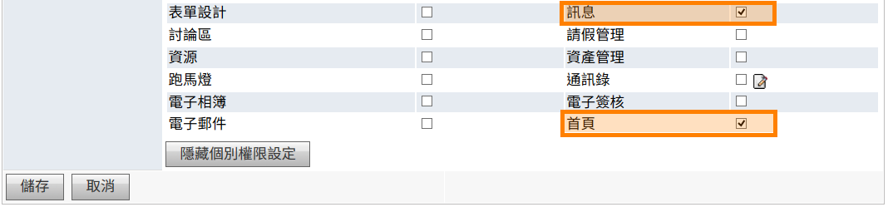
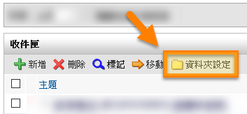
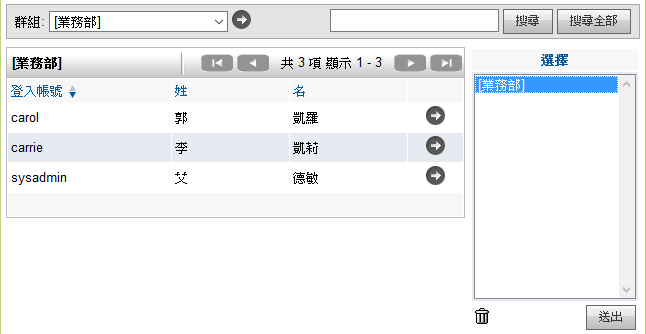
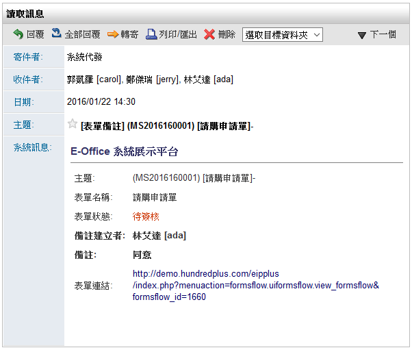

訊息收發
========================

規格說明
------------------------
 
* 可當成組織內部的郵件機制。
* 可以在編輯內容時插入圖片、檔案。 
* 訊息收件者可以是個人、部門或群組，並可同時寄送電子郵件。 
* 發送訊息後可以由粗體、細體檢視對方是否看過。
* 發送訊息後再對方還未檢視後，可以回收訊息。
* 可作為EIP Plus系統內等模組的通知機制。
* 訊息可以進行分類管理。

系統管理
------------------------

【使用者管理】或【群組管理】使用權限開放
^^^^^^^^^^^^^^^^^^^^^^^^

如要開放此模組給使用者，必須先至系統管理內 ``使用者管理`` 或 ``群組管理``，編輯某使用者或群組之權限控管，勾選 ``訊息`` 才可開放使用，此功能只有系統管理員可設定。（注意：首頁為必選項目）

    歸檔管理模組開放使用設定畫面

系統管理（訊息設定）
^^^^^^^^^^^^^^^^^^^^^^^^

管理者可設定系統代發訊息的保留期限。

#. 點選 ``訊息設定`` 進行設定。
#. 選擇系統自動刪除的區間，選擇完畢後點選 ``確認`` 即可。

    系統管理之訊息設定

    選擇系統代發訊息保留期間

個人化設定預設偏好設定
^^^^^^^^^^^^^^^^^^^^^^^^

從個人化設定進入，只有系統管理員才可查閱及編輯 ``預設偏好設定`` 頁籤，可預設所有使用者在使用此模組的查閱模式，``個人偏好設定`` 頁籤為使用者可針對個人需求再自行變更。

#. 點選 ``個人化設定``，再點選系統訊息的 ``個人化設定``。
#. 進行 ``預設偏好設定`` 設定，再按 ``儲存`` 完成設定。

.. figure:: images/image7.png
    :scale: 100%
    :alt: 個人化設定

    個人化設定

    系統訊息個人化設定

    預設偏好設定

* 預設勾選IM即時通為附加傳送：若有選購IM Plus（選購），則可設定寄送系統訊息時附加IM訊息給對應收件者。
* 預設勾選電子郵件為附加傳送：可設定寄送訊息時直接勾選寄送電子郵件。
* 預設隱藏系統代發訊息：可設定在訊息收發首頁直接隱藏系統代發之訊息。
* 預設點選右上角圖示，只顯示未讀訊息：可設定在首頁右上方的 ``未讀取訊息`` 圖示顯示未讀的系統訊息。

使用說明
------------------------

訊息收發主用使用在發送、接收系統訊息，操作方式有如收發電子郵件一般，包含以下幾點特色：

#. 系統訊息都僅針對內部系統使用者發送，避免了垃圾郵件問題。
#. 系統訊息寄件備份中，可查看收件者是否已開啟訊息閱讀。
#. 對方收件者未閱讀之系統訊息，可作訊息回收。*註：若勾選包含發送電子郵件，則系統訊息不可回收。
#. 系統首頁會協助顯示未讀取之系統訊息。

訊息收發首頁
^^^^^^^^^^^^^^^^^^^^^^^^

在此可進行系統訊息的寄送與收件，並做查詢。

.. figure:: images/image11.png
    :scale: 100%
    :alt: 訊息首頁

    訊息首頁

* 未讀取信件：首頁右上角此圖示，可協助顯示個人未讀取之系統訊息數量。
* 狀態：可篩選全部、未讀取等狀態之系統訊息。
* 隱藏系統代發訊息：勾選該選項，
* 進階搜尋：可依文字條件來篩選、過濾欲搜尋的系統訊息。
* 全文檢索：可依文字條件來過濾主題跟內文的系統訊息。
* 新增：點選該鈕以新增一份系統訊息。
* 刪除：勾選系統訊息並點選該鈕，以刪除所選擇之系統訊息。
* 標記：勾選系統訊息並點選該鈕，可將系統訊息設定為已閱讀或未閱讀。
* 移動：勾選系統訊息並點選該鈕，可將系統訊息移至自訂的資料夾。
* 資料夾設定：點選該鈕可進行訊息收件夾的自訂。
* 清空資料夾：點選該鈕以將該資料夾中的系統訊息全部清空。
* 所有寄件者：可選擇並篩選寄件者之系統訊息。

資料夾設定
^^^^^^^^^^^^^^^^^^^^^^^^

使用者可自訂屬於自己的系統訊息資料夾：

#. 點選 ``資料夾設定``。
#. 編輯欲增加的資料夾名稱後，點擊 ``儲存`` 即可完成。

    點選資料夾設定

    資料夾設定編輯頁面

* 新增/移除：點選該鈕以新增、移除自訂之系統訊息資料夾。註：若該資料夾中已有訊息，系統會跳出警示視窗。
* 資料夾名稱：可在此欄位中輸入自訂的資料夾名稱。
* 訊息總數：若該資料夾中有訊息，系統會自動計算出數量。
* 子分類(右箭頭)：點選該鈕以將此資料夾變更為上一行資料夾之子項目。
* 主分類(左箭頭)：點選該鈕以將此資料夾變更主要資料夾。*註：系統訊息目前最多僅能擁有一個次階層的子資料夾。

新增系統訊息
^^^^^^^^^^^^^^^^^^^^^^^^

可透過此模組對系統內之使者進行訊息發送，也可先除儲存成草稿，再做編輯後發出。

#. 點選 ``新增`` 鈕。
#. 選擇 ``收件者`` 或其他副本後，依序輸入相關資訊，點選 ``馬上寄送`` 即可新增完成。
#. 也可先 ``儲存成草稿``，爾後再做發送。

    系統訊息首頁

    新增、編輯系統訊息頁面

* 收件者：點選 ``搜尋使用者`` 人員鈕以新增系統訊息之主要收件者。
* 副本、密件副本：若啟用則新增收件者方式同上。
* 主題：可自訂系統訊息之主題。
* 重要性：可選擇該系統訊息之重要性。
* 附加傳送：可勾選電子郵件、IM即時通(*選購) 之傳送。
* 系統訊息：可在此文字編輯器中輸入相關內容。
* 附件：可新增附加檔案，檔案上傳大小限制依系統管理之系統環境設定而定。*註：目前IE10（含IE10、Edge）以上可支援拖曳檔案的方式附加檔案。
* 馬上寄送：當編輯完系統訊息，點選該鈕則會馬上寄出。
* 儲存成草稿：點選該鈕可將該訊息先儲存為草稿。

    選擇收件者、副本、密件副本頁面

* 群組：可篩選系統的相關群組，以便帶出群組底下之人員資料。
* 搜尋：輸入使用者的ID再點選該鈕，可進行該群組內的搜尋。
* 搜尋全部：輸入使用者的ID再點選該鈕，可進行全系統的搜尋。
* 加入選擇：點選該鈕已將特定人員、群組收件者加入選擇區塊。
* 選擇區塊：該區塊內會將所選擇的人員或群組帶入其中。
* 刪除：選擇特定人員或群組再點擊該鈕，已刪除選擇之項目。
* 送出：選好使用者，點選送出即可將收件者、副本、密件副本設定完成。

瀏覽收件匣訊息
^^^^^^^^^^^^^^^^^^^^^^^^

在收件匣中可檢閱所有收件訊息：

    系統訊息首頁之樹狀圖

* 所有訊息：此為主題，資料皆在以下分類中顯示。
* 草稿：收納自己建立且儲存成草稿的系統訊息。
* 收件匣：收到其他使用者或系統代發之訊息的收件資料夾。
* 寄件備份：當發送出的訊息，系統會在此自動建立一個訊息寄件備份。

    瀏覽之系統訊息內容

* 回覆：回覆訊息給寄件者。
* 全部回覆：全部回覆訊息給收件者、副本、密件副本人員。
* 列印／匯出：可直接列印成紙本或轉成PDF檔。
* 刪除：刪除此訊息。
* 選取目標資料夾：將此訊息移動到所選擇的資料夾。

寄件備份
^^^^^^^^^^^^^^^^^^^^^^^^

已發送的訊息，系統會自動備份在寄件備份，以供發訊者爾後查閱。

    訊息收發的寄件備份資料夾

    寄件備份的頁面

* 進階搜尋：可依文字條件來篩選、過濾欲搜尋的系統訊息。
* 全文檢索：可依文字條件來過濾主題跟內文的系統訊息。
* 新增：點選該鈕以新增一份系統訊息。
* 刪除：勾選系統訊息並點選該鈕，以刪除所選擇之系統訊息。
* 資料夾設定：點選該鈕可進行訊息寄件備份的自訂。
* 清空資料夾：點選該鈕以將該資料夾中的系統訊息全部清空。
* 所有收件者：可選擇並篩選收件者之系統訊息。
* 訊息回收：若該項寄件訊息收件人員名稱皆為粗體字，表示收件者尚未讀取此訊息內容，則可點選 ``訊息回收`` 訊息回收鈕將該訊息直接抽回刪除。*註：若有任一人員讀取訊息或連同電子郵件一同寄送，則不可回收。

轉寄系統訊息
^^^^^^^^^^^^^^^^^^^^^^^^

已發送的訊息，系統會自動備份在寄件備份，以供發訊者爾後查閱，也可點選寄件備份的特定訊息進行轉寄。

.. figure:: images/image38.png
    :scale: 100%
    :alt: 特定寄件備份郵件

    特定寄件備份郵件

* 轉寄：點選 ``轉寄`` 即可將此訊息轉送給其他使用者，如原始訊息有附件，也會一起附加在此轉寄訊息中。
* 刪除：可將此訊息刪除。
* 複製：點選 ``複製`` 即可複製一份一樣的訊息進行發送，如原始訊息有附件，也會一起附加在此轉寄訊息中。