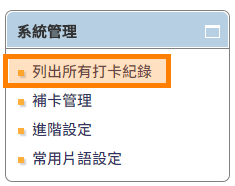
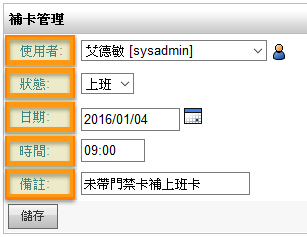

打卡鐘
========================

規格說明
------------------------
 
* 提供員工電子打卡。
* 可指定允許打卡的網段區域。
* 並可提供管理人員匯出檔案供查核。
* 可記錄每日出缺勤狀況以及查閱打卡記錄 (如未打卡、遲到等)。
* 可進階設定加班、外出及多組上、下班卡。

系統管理
------------------------

【使用者管理】或【群組管理】使用權限開放
^^^^^^^^^^^^^^^^^^^^^^^^

如要開放此模組給使用者，必須先至系統管理內 ``使用者管理`` 或 ``群組管理`` ，編輯某使用者或群組之權限控管，勾選 ``打卡鐘`` 才可開放使用，此功能只有系統管理員可設定。（注意：首頁為必選項目）

    模組開放使用設定畫面

列出所有打卡紀錄
^^^^^^^^^^^^^^^^^^^^^^^^

系統管理者（包含模組管理員）可在模組中的系統管理區塊，點選 ``列出所有打卡紀錄`` 進行設定。

管理者可透過此功能，來查閱各使用者的打卡狀況：

#. 點選主選單中的 ``打卡鐘``。
#. 點選系統管理欄位中的 ``列出所有打卡紀錄``。
#. 管理者即可依範圍、使用者群組來查閱、匯出打卡資料。

    系統管理

    搜尋後顯示打卡紀錄列表

* 範圍：可選擇篩選查看打卡紀錄的範圍。
* 使用者／群組：可選擇特定使用者或群組進行資料篩選。
* 搜尋：選擇好範圍後，請點擊該鈕以顯示打卡紀錄。
* 顯示打卡紀錄：設定範圍內的打卡紀錄都會顯示在該區塊中。並可顯示打卡位址。
* 匯出：依據範圍將所有帳號之已打卡及未打卡資料匯出。

補卡管理
^^^^^^^^^^^^^^^^^^^^^^^^

系統管理者（包含模組管理員）可在模組中的系統管理區塊，點選 ``補卡管理`` 進行補卡。

管理者可透過此功能，來協助使用者進行補登打卡作業：

#. 點選主選單中的 ``打卡鐘``。
#. 點選 ``補卡管理`` ，編輯欲補卡人員後點選 ``儲存`` 即可完成補卡。

.. figure:: images/image5.png
    :scale: 100%
    :alt: 系統管理

    系統管理

    補卡畫面

* 使用者：選擇一位欲補卡之EIP系統使用者。
* 狀態：選擇補卡的狀態。註：各狀態可從系統管理中的「進階設定」來做調整。
* 日期：選擇要補卡的指定日期。
* 時間：登打要補卡的指定時間 (24時制)，如09:00。
* 備註：可輸入該筆補卡的備註內容。

進階設定
^^^^^^^^^^^^^^^^^^^^^^^^

系統管理者（包含模組管理員）可在進階設定中來設定打卡鐘的相關重點功能：

#. 點選主選單中的 ``打卡鐘``。
#. 點選 ``進階設定`` ，編輯完內容後點選 ``儲存`` 即可完成設定。

    系統管理

    打卡鐘系統設定

* 標準上班時間：填寫公司上班時間，如09:00。
* 標準下班時間：填寫公司下班時間，如18:00。
* 允許加班上 / 下班卡：允許使用者打完下班卡後，接著打加班卡。
* 允許外出 / 回來卡：允許使用者在上班期間可打外出卡，回公司後再打回來卡。
* 允許一天有多組上 / 下班卡：允許使用者一天可打多組上、下班卡。需在打卡鐘首頁中執行。
* 在首頁打下班卡前先做提示：使用者在首頁打下班卡時會顯示一小視窗說明是否確定要打下班卡。
* 停用遲到圖示：遲到的時間會顯示紅字，停用則會顯示黑色。
* 新增IP位址：限定特定IP位址、範圍內的使用者才能進行打卡動作。
* 允許IP列表：列出限定的IP位址、範圍。

常用片語設定
^^^^^^^^^^^^^^^^^^^^^^^^

系統管理者（包含模組管理員）可在此功能來設定打卡鐘首頁的備註內容：

#. 點選主選單中的 ``打卡鐘``。
#. 點選 ``常用片語設定`` ，編輯完內容後點選 ``儲存`` 即可完成設定。
#. 使用者可使用下拉式選單選擇欲備註的說明。

    系統管理

    常用片語編輯頁面

* 新增：點選該鈕以新增一欄空白片語。
* 刪除：點選該鈕以刪除該項片語。

    打卡鐘首頁選擇常用片語示例

    首頁選擇常用片語示例

一般使用說明
------------------------

打卡方式
^^^^^^^^^^^^^^^^^^^^^^^^

使用者有兩種打卡方式，除可在EIP首頁的 ``打卡鐘`` 執行方便迅速的打卡作業，也可在主選單 ``打卡鐘`` 選擇各種狀態來進行打卡。

「EIP首頁」之【打卡鐘】
^^^^^^^^^^^^^^^^^^^^^^^^

若我們有開啟EIP首頁中的打卡鐘首頁區塊，則可利用該區塊進行快速打卡：

#. 在EIP首頁點擊 ``打卡鐘`` 的「打卡功能鈕」進行打卡。
#. 出現系統的提示訊息，即表示打卡成功。
#. 可執行的動作：上班卡（限當天一次）、下班卡（限當天一次）、外出卡、回來卡、加班上班卡、加班下班卡。
#. 如有選擇備註說明，將寫入主選單中 ``打卡鐘`` 的打卡紀錄中。

    點選打卡功能

    顯示時間之打卡鐘資訊

    打卡成功提示訊息頁面

「打卡鐘首頁」之【打卡紀錄】
^^^^^^^^^^^^^^^^^^^^^^^^

使用者亦可進到該 ``打卡紀錄`` 模組中進行打卡作業：

#. 點選主選單中的 ``打卡鐘``。
#. 點選打卡之狀態、備註，再點選 ``打卡`` 即可完成打卡作業。
#. 在此可執行的動作：上班卡（當天一次或多次）、下班卡（當天一次或多次）、外出卡、回來卡、加班上班卡、加班下班卡。
#. 管理者如有設定啟用遲到圖示，遲到的打卡時間則顯示紅色。
#. 如為系統管理員或模組管理員執行補卡動作，則會顯示補卡人員姓名及說明為補卡管理執行。

    打卡紀錄頁面

* 時鐘：系統會自動顯示12時制當時的時間。
* 狀態：請選擇欲打卡的實際狀態。
* 備註：請選擇打卡的備註內容。
* 打卡：選擇好打卡的狀態、備註後，請點擊該鈕以做打卡動作。
* 範圍：可選擇篩選查看打卡紀錄的範圍。
* 搜尋：選擇好範圍後，請點擊該鈕以顯示打卡紀錄。
* 顯示打卡紀錄：設定範圍內的打卡紀錄都會顯示在該區塊中。

    使用者自行打卡成功訊息頁面