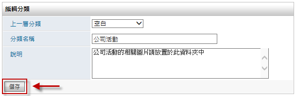
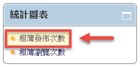

電子相簿
========================

規格說明
------------------------
 
* 提供樹狀圖進行分類與權限管理。
* 電子相簿適合大量圖片的上傳與檢視，使用者可以將大量圖片打包 Zip 檔，上傳時系統會自動解壓縮檔案並製作成相簿。
* 提供自動播放模式，縮圖檢視模式，使用者可輕鬆的瀏覽或下載圖片。
* 可以設定權限，選擇特定群組可以檢視的相簿內容。
* 以拖曳的方式匯入大量圖檔。(IE除外)
* 提供發佈次數及瀏覽次數統計報表

系統管理
------------------------

設定分類
^^^^^^^^^^^^^^^^^^^^^^^^

#. 管理者可在相簿頁面 系統管理區塊，點選 ``設定分類及權限`` 進行設定。
#. 點選 ``新增`` 來增加一個分類。
#. 在新增分類的頁面中，把資料填入相對應欄位，設定完成後點選 ``儲存``。
#. 點選 ``鎖頭圖示`` 針對分類做讀取、新增、編輯、刪除的權限進行設置。
#. 設定完成後點選 ``儲存``。

    設定分類及權限

    新增分類權限

    該示範圖片中，公司活動為第一層分類

    系統可對單一的分類做出獨立的權限控管

發佈設定
^^^^^^^^^^^^^^^^^^^^^^^^

#. 點選相簿首頁系統管理中的 ``發佈設定``。
#. 將自動發佈相簿切換成 ``必須經過核准`` 並儲存。
#. 擁有 編輯/發佈權限 者，即可進到待核准的相簿中進行發佈作業。

    相簿系統管理

    發佈設定頁面

    進入待審核相簿中進行發佈

使用說明
------------------------

一般使用設定分類
^^^^^^^^^^^^^^^^^^^^^^^^

使用者可以上傳自己想要分享的照片到電子相簿中，供有權限的使用者瀏覽。電子相簿模組除了提供方便的多檔批次上傳功能，更有容易使用的播放介面，可做照片快速的搜尋及自動播放。

新增電子相簿
^^^^^^^^^^^^^^^^^^^^^^^^

電子相簿模組提供方便的照片上傳功能，使用者除了可上傳單一的照片外，更可事先將多張照片壓縮成 zip 檔案，做一次多張的照片上傳的動作，節省時間，且點選新增後，系統變會切換到畫面協助使用者新增相簿。

#. 點選 ``新增`` 建立新的電子相簿。
#. 點選 ``瀏覽`` 選擇欲上傳的照片，再點選 ``更多照片`` 來增加更多項目，或是點選 ``儲存`` 來做存檔的動作。
#. 按下 ``更多照片`` 後，系統會自動上傳該檔案並在相片縮圖的欄位產生一個項目。系統會自動判斷使用者所上傳的檔案，若為 zip 壓縮檔案，則系統會自動解壓縮後，將該壓縮檔的所有圖片動態的產生縮圖並在相片縮圖的欄位中產生多個圖片項目。點選 ``儲存`` 後即完成相簿新增的動作。

    新增按鈕就在電子相簿的首頁上

    可一次上傳多個圖片檔案

    系統會自動將第一個順位的照片設定為相簿主題照片

瀏覽電子相簿
^^^^^^^^^^^^^^^^^^^^^^^^

#. 系統會依使用者所選定的分類或狀態將相簿列表出來。只要點選欲觀賞的相簿圖片或是主題名稱即可開始瀏覽相簿。
#. 瀏覽畫面有提供方便的圖片播放器，使用者可點選播放按鈕來觀賞圖片。

    相簿列表的顯示方式就非常的賞心悅目

    簡單易用的播放按鈕

編輯電子相簿
^^^^^^^^^^^^^^^^^^^^^^^^

使用者只要對相簿有編輯的權限，都可以點選該相簿列表右側的編輯圖示來做編輯的動作。編輯模式跟新增模式的操作方法一樣，依喜好做設定即可。

    只有使用者對該相簿有編輯權限時才會有此圖示

    編輯方法跟照片上傳方式相同

刪除電子相簿
^^^^^^^^^^^^^^^^^^^^^^^^

使用者只要對相簿有刪除的權限，就可以點選該相簿列表右側的刪除圖示來做刪除的動作；點選刪除圖示後，系統會再次確定使用者是真正想要刪除該相簿的。點選確定後即可將該相簿刪除。

    刪除確認視窗

統計圖表
------------------------

相簿發佈次數
^^^^^^^^^^^^^^^^^^^^^^^^

#. 管理者移至相簿首頁中的 ``統計圖表``。
#. 點選 ``相簿發佈次數``，即可依期間來查閱使用者的相簿發佈狀況。

    點選相簿發佈次數

    相簿發佈次數統計頁面

* 期間：可選擇時間篩選所需要的統計資料。
* 最多：設定統計資料顯示的最大筆數。
* 搜尋：點選該鈕以更新統計資料。
* 使用者：列出發佈相簿的使用者。
* 發佈次數：列出相簿的發佈次數。
* 匯出：點選該鈕以匯出該統計資料為Excel檔案。

相簿瀏覽次數
^^^^^^^^^^^^^^^^^^^^^^^^

#. 管理者移至相簿首頁中的 ``統計圖表``。
#. 點選 ``相簿瀏覽次數``，即可依期間來查閱使用者的相簿發佈狀況。

    點選相簿瀏覽次數

    相簿瀏覽次數統計頁面

* 期間：可選擇時間篩選所需要的統計資料。
* 最多：設定統計資料顯示的最大筆數。
* 搜尋：點選該鈕以更新統計資料。
* 電子相簿：列出目前統計所被瀏覽的電子相簿。
* 瀏覽次數：列出該相簿的被瀏覽次數。
* 匯出：點選該鈕以匯出該統計資料為Excel檔案。