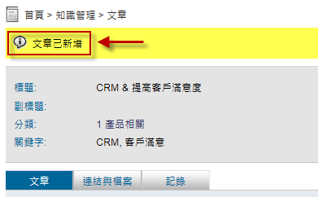

文章
========================

規格說明
------------------------
 
* 員工間知識累積與經驗傳承具有評分與備註功能，如企業內部知識家。
* 提供知識雲標籤功能，了解熱門知識。
* 提供進階搜尋，如內文、關鍵字等，加快搜尋速度。
* 提供樹狀圖進行分類與權限管理。
* 提供文章的新增、發佈、評分以及評論。
* 能夠連結其他知識庫文章或是外部網站，並且附加檔案。
* 所使用者有的操作有詳實的紀錄保留。
* 可將不同的知識領域定義分類。
* 提供知識的快速搜尋以及檢索。
* 可以設定權限，選擇特定群組可以檢視的知識庫內容。

系統管理
------------------------

設定分類
^^^^^^^^^^^^^^^^^^^^^^^^

#. 管理者可在文章頁面左方有系統管理區塊，點選 ``設定分類及權限`` 進行設定。
#. 點選 ``新增`` 按鈕，產生新的分類。
#. 在新增分類的頁面中，把資料填入相對應欄位，設定完成後點選 ``儲存``。
#. 點選 ``鎖頭圖示`` 針對分類做讀取、新增、編輯、刪除的權限進行設置。
#. 設定完成後點選 ``儲存``。

    設定分類及權限

    新增權限之分類

發佈設定
^^^^^^^^^^^^^^^^^^^^^^^^

#. 管理者可在文章頁面左方有系統管理區塊，點選 ``發佈設定`` 進行設定。
#. 在設定的頁面中，把資料選入相對應欄位，設定完成後點選 ``儲存``。

    系統管理

    發佈設定

使用說明
------------------------

一般使用
^^^^^^^^^^^^^^^^^^^^^^^^

知識庫可以集合各類文章及經驗作為參考的依據，當使用者對知識庫文章有疑問時，可以在知識庫中提出，經由管理人員回答後可以加入知識庫中，供別人參閱。

新增知識文章
^^^^^^^^^^^^^^^^^^^^^^^^

#. 點選 ``新增`` 來建立一個知識文章。
#. 建立一個知識文章必須填寫類別及標題，然後依序輸入相關資訊。
#. 當點選儲存後，該文章就已經建立。
#. 此時可以透過連結與檔案上傳相關資料，可分為新增 ``附加檔案`` 或者選擇 ``新增連結``。並可在紀錄中看到此文章的編輯或修改等動作紀錄。

    新增文章

    新增知識文章主題及內文

    新增知識文章主題及內文

    新增知識文章連結與檔案

    文章編輯紀錄

瀏覽知識文章
^^^^^^^^^^^^^^^^^^^^^^^^

#. 透過知識庫首頁點選樹狀圖分類，來進行瀏覽。
#. 未核准針對需要管理者審核的知識庫文章皆放於此。

    樹狀圖分類

新增知識文章備註
^^^^^^^^^^^^^^^^^^^^^^^^

使用者可以對有疑問的文章進行提出備註或評分。

    新增知識文章備註及評分

發佈知識文章
^^^^^^^^^^^^^^^^^^^^^^^^

#. 管理者可以在未核准分類中找到待核准才能發佈的文章，並進行發佈。
#. 或者點選單一未發佈文章來進行發佈。

    文章發佈審核頁面

    單一發佈文章

搜尋知識文章
^^^^^^^^^^^^^^^^^^^^^^^^

#. 可使用一般搜尋及進階搜尋來找尋所需求的文章。
#. 進階搜尋可以輸入相關篩選條件來搜尋文章。

    搜尋知識文章

    進階搜尋畫面

統計圖表
------------------------

文章發佈次數
^^^^^^^^^^^^^^^^^^^^^^^^

#. 管理者移至知識庫首頁中的 ``統計圖表``。
#. 點選 ``文章發佈次數``，即可依期間來查閱使用者的文章發佈狀況。

    點選文章發佈次數

    文章發佈次數統計頁面

* 期間：可選擇時間篩選所需要的統計資料。
* 最多：設定統計資料顯示的最大筆數。
* 搜尋：點選該鈕以更新統計資料。
* 使用者：列出發佈文章的使用者。
* 發佈次數：列出文章的發佈次數。
* 匯出：點選該鈕以匯出該統計資料為Excel檔案。

文章瀏覽次數
^^^^^^^^^^^^^^^^^^^^^^^^

#. 管理者移至知識庫首頁中的 ``統計圖表``。
#. 點選 ``文章瀏覽次數``，即可依期間來查閱使用者的文章發佈狀況。

    點選文章瀏覽次數

    點選文章瀏覽次數

* 期間：可選擇時間篩選所需要的統計資料。
* 最多：設定統計資料顯示的最大筆數。
* 搜尋：點選該鈕以更新統計資料。
* 文章：列出目前統計所被瀏覽的文章。
* 瀏覽次數：列出該文章的被瀏覽次數。
* 匯出：點選該鈕以匯出該統計資料為Excel檔案。

文章回應次數
^^^^^^^^^^^^^^^^^^^^^^^^

#. 管理者移至知識庫首頁中的 ``統計圖表``。
#. 點選 ``文章回應次數``，即可依期間來查閱使用者的文章回應狀況。

    點選文章回應次數

    文章回應次數統計頁面

* 期間：可選擇時間篩選所需要的統計資料。
* 最多：設定統計資料顯示的最大筆數。
* 搜尋：點選該鈕以更新統計資料。
* 使用者：列出目前各使用者回應文章的次數。
* 回應次數：列出該文章的回應次數。
* 匯出：點選該鈕以匯出該統計資料為Excel檔案。