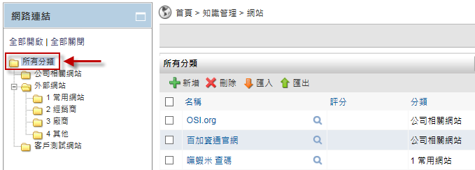
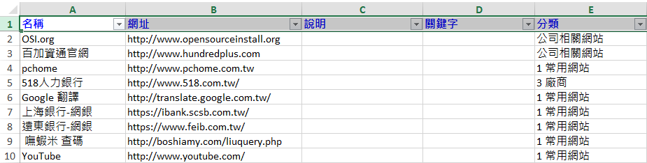

網站連結
========================

規格說明
------------------------
 
* 可以管理屬於企業內部專用的網站連結。
* 可以根據不同權限，設置不同成即可以使用的連結。
* 提供樹狀圖進行分類與權限管理。
* 企業可以把重要的網站連結依照不同的分類放入平台，讓員工可以快速搜尋、連結以及評分。

系統管理
------------------------

設定分類
^^^^^^^^^^^^^^^^^^^^^^^^

#. 管理者可在系統管理區塊，點選 ``設定分類及權限`` 進行設定。
#. 點選 ``新增`` 來增加一個分類。
#. 在新增分類的頁面中，把資料填入相對應欄位，設定完成後點選 ``儲存``。
#. 點選 ``鎖頭圖示`` 針對分類做讀取、新增、編輯、刪除的權限進行設置。
#. 設定完成後點選 ``儲存``。

    設定分類及權限

    新增分類

    新增公司相關網站

    全區分類頁面

使用說明
------------------------

一般使用
^^^^^^^^^^^^^^^^^^^^^^^^

使用者可以建立自己常用的網站連結，加入關鍵字和評分。在預設的情況下，網站連結會透過分類權限，分享給其它的使用者，另外也可以在個人化設定中設定存取權限開放，主動開放給其它的使用者。

新增網路連結
^^^^^^^^^^^^^^^^^^^^^^^^

#. 點選 ``新增`` 網路連結，並依序填入資料。
#. ``儲存`` 後即可完成新增網路連結。

    新增網站連結頁面

    新增網站連結頁面

瀏覽連結
^^^^^^^^^^^^^^^^^^^^^^^^

瀏覽連結主要分為兩種方式，可以 ``網站連結首頁`` 及 ``網站連結導覽`` 來進行瀏覽。點選 ``網站連結``，系統會以樹狀圖方式來顯示分類，並可列出連結以供使用者查閱。

    網站連結首頁

發佈至首頁
^^^^^^^^^^^^^^^^^^^^^^^^

在新增/編輯時，如果有系統管理權限，使用者可以利用將連結置於首頁的選項，將經常使用到的網站，放置於首頁網站連結的區塊，並可直接點選連結至該網站。

#. 新增網路連結時，將連結置於首頁選項打勾。
#. ``儲存`` 後即可在首頁顯示該網路連結。

    新增網站連結

    首頁顯示網路連結

匯入/匯出
^^^^^^^^^^^^^^^^^^^^^^^^

使用匯入/匯出，可增加使用者新增連結的效率。

匯出

#. 點選 ``匯出`` 網站連結，即可完成。

匯入

#. 點選 ``匯入`` 網站連結，選取匯出的檔案並依格式匯入網站連結即可。
#. 可以透過 Excel 工具編輯匯出的範例，然後再進行匯入動作。

    匯出網站連結頁面

    匯入網站連結頁面

    Excel工具頁面