檔案管理
========================

規格說明
------------------------
 
* 提供員工網路硬碟空間。
* 提供樹狀圖進行分類與權限管理．
* 建立部門資料夾，可以依據部門來設定，只有在權限允許的情況下例如該部門人員，才可以使用該檔案夾。
* 可將個人檔案在限定的時間內分享給他人。
* 檔案文件版本控管，不同版本文件可以追蹤留存。

系統設定
------------------------

資料夾權限設定
^^^^^^^^^^^^^^^^^^^^^^^^

#. 使用者在檔案管理頁面上方有新增動作列，點選 ``新增資料夾`` 進行設定。
#. 填入資料夾名稱後儲存即可完成。
#. 點選 ``資料夾權限設定`` 進入權限設置頁面。
#. 點選 ``設定`` 按鈕後，再點選需要建立權限的資料夾，勾選顯示權限按下 ``設定`` 完成操作。

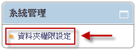

    權限設定頁面

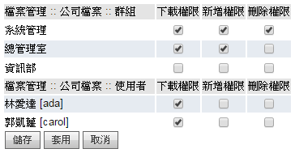

    選取權限頁面

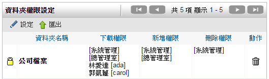

    權限設定完成頁面

資料夾變更設定
^^^^^^^^^^^^^^^^^^^^^^^^

#. 點選 ``變更資料夾名稱``，進行資料夾名稱變更。
#. 點選 ``複製``，進行資料或資料夾複製到指定目的地。

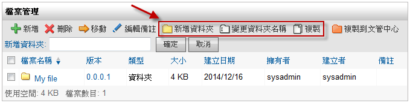
    
    資料夾新增系統頁面

設定使用者空間限制
^^^^^^^^^^^^^^^^^^^^^^^^

#. 依序點選 ``系統管理``> 檔案管理中 ``使用者可用空間設定``。
#. 勾選您要設定的人員，點選 ``編輯上限`` 即可進行後續設定。

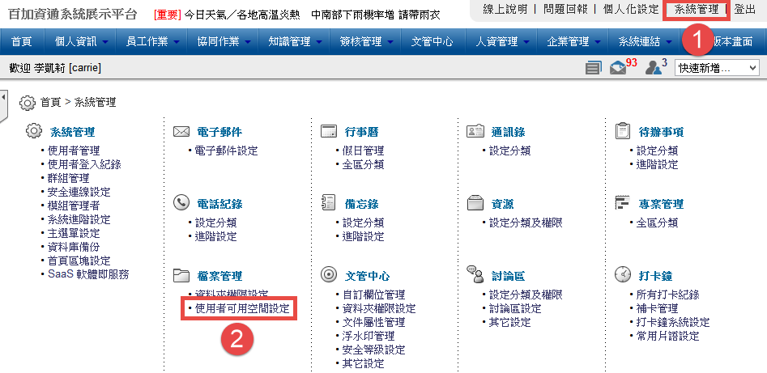
    
    點選使用者可用空間設定

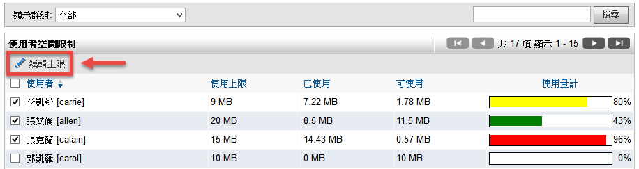
    
    點選編輯上限進行設定

使用說明
------------------------

一般使用
^^^^^^^^^^^^^^^^^^^^^^^^

檔案管理可以放置各類檔案、圖檔，同時擁有版本管理，當使用者想找尋相關檔案時也能使用搜尋功能。亦可直接由管理者來進行檔案管理。

個人資料夾
^^^^^^^^^^^^^^^^^^^^^^^^

預設的情況下，擁有檔案管理使用權限的使用者都擁有個人資料夾，讓使用者放置個人資料，讓使用者對該資料夾擁有所有的權限。

要開始使用個人資料夾，只須在左側樹狀資料夾結構圖中點選 ``我的文件`` 後，即進入個人資料夾區域。

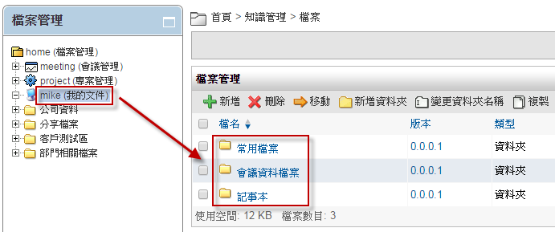
    
    檔案管理個人資料夾頁面

建立資料夾
^^^^^^^^^^^^^^^^^^^^^^^^

要建立一個資料夾，只需要點選檔案列表上方的 ``新增資料夾`` 按鈕後，填入一個名稱後點選 ``確定`` 即完成資料夾建立的動作。

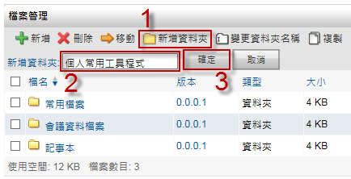
    
    資料夾建立步驟

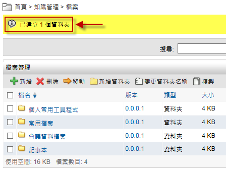
    
    資料夾建立完成畫面

檔案上傳
^^^^^^^^^^^^^^^^^^^^^^^^

#. 要上傳一個檔案，請點選檔案列表上方的 ``新增`` 按鈕。
#. 您可以框線中的圖示來上傳檔案，或將多個檔案直接拖拉至該區塊中。

* 註1：單一檔案上傳大小之限制預設為20MB，該限制可由管理者再依照公司實際需求進行增減。
* 註2：支援Firefox、Chrome、以及IE9以上瀏覽器，其他瀏覽器(如IE8)為舊版上傳檔案。

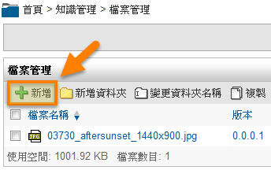
    
    上傳檔案請點選新增按鈕

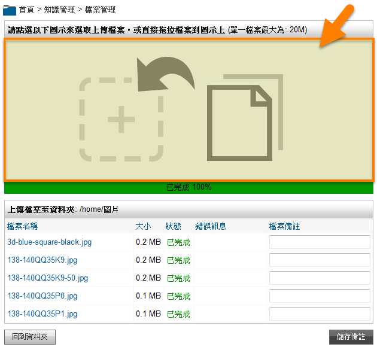
    
    點選框線內之圖示或直接拖拉檔案進行上傳

移動/複製檔案
^^^^^^^^^^^^^^^^^^^^^^^^

在檔案管理模組中，移動跟複製檔案在操作上的動作是一樣的。檔案複製後，會在新的位置產生一個一模一樣的檔案。而檔案移動後，會在目標位置產生一個一模一樣的檔案，而原本存在的檔案會被刪除。

#. 要移動或複製檔案，請先選取一個或多個檔案後點選 ``移動`` 或 ``複製``。
#. 系統會動態產生一個空白欄位，請點選黃色資料夾圖示來選擇目標目錄。
#. 系統會接著開啟資料夾選擇視窗，請直接選取移動或複製的目標資料夾。
#. 接著點選 ``移動`` 或 ``複製`` 按鈕即完成動作。

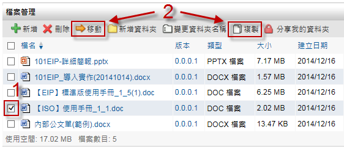
    
    可一次選取一個或多個檔案做搬移或移動的動作

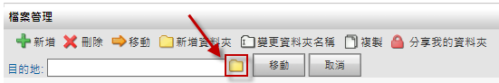
    
    點選黃色資料夾圖示可快速選取目錄

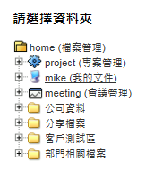
    
    方便的資料夾選擇功能

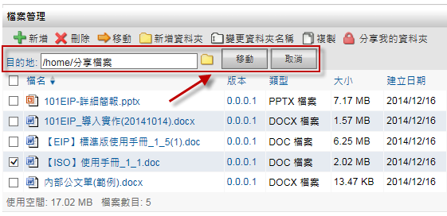
    
    移動或複製檔案頁面

刪除檔案
^^^^^^^^^^^^^^^^^^^^^^^^

檔案管理模組可以讓有權限的使用者一次刪除一個或多個檔案及目錄，請勾選欲刪除的檔案或目錄後，點選上方工具列的 ``刪除`` 按鈕。

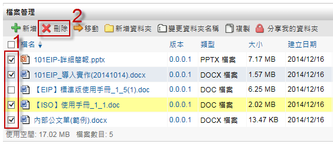
    
    刪除的動作只需要兩個步驟

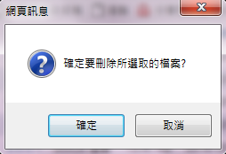
    
    檔案管理模組會對刪除的動作再次確認

檔案版本記錄
^^^^^^^^^^^^^^^^^^^^^^^^

檔案管理模組對檔案的變更都有完整的記錄，這份記錄會一直保留到檔案被刪除為止。檔案版本記錄除了對檔案的變更有記錄外，還可讓使用者下載不同板本的檔案。舊版本的檔案不會被新板本的檔案覆蓋而不見。

在檔案列表中可以看到一個 ``版本`` 的欄位。檔案版本只有在使用者上傳了較新的檔案版本，並覆蓋了原本的檔案時才會更新。檔案的移動並不會變更版本號碼，要看到該檔案的變更記錄，可直接點選該檔案的版本號碼。

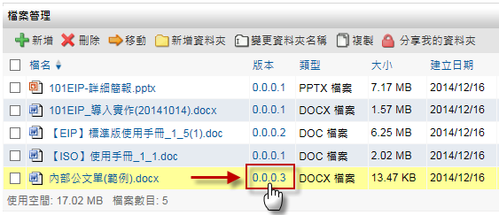
    
    每一個檔案都有它自己的版本記錄

點選一個檔案的版本號碼後即可看到該檔案的所有變更記錄。我們還可以點選舊的版本號，可下載舊版本的檔案。需特別注意的是，圖片中的刪除圖示所刪除的是舊的版本檔案，而不是刪除檔案的變更記錄。

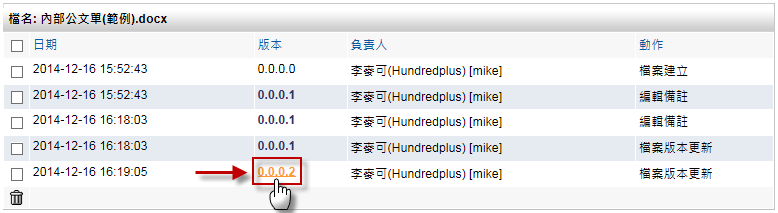
    
    完整的檔案變更記錄

個人資料夾分享 (網路芳鄰)
^^^^^^^^^^^^^^^^^^^^^^^^

每一個使用者都有自己的個人資料夾來存放自己的檔案。在一些情況下使用者會想要把他們自己的檔案分享給不同的使用者。檔案管理模組是以資料夾為單位來分享資料的。分享資料夾時還可指定開始及結束時間，並可指定分享的群組或是使用者。

請先進入到欲分享的個人資料夾中，點選 ``分享我的資料夾``，開始資料夾的分享設定。

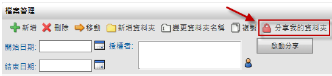
    
    檔案管理模組有分享資料夾功能

設定分享時間
^^^^^^^^^^^^^^^^^^^^^^^^

使用者可以指定資料夾分享給別人的時間，若不設定這一個部份的時間，則系統會永遠分享這個資料夾直接您解除設定為止。可直接點選日期欄位旁的小日曆圖示來開啟日期選擇器。直接選取一個日期後，程式會自動將日期欄位填上選定的日期。

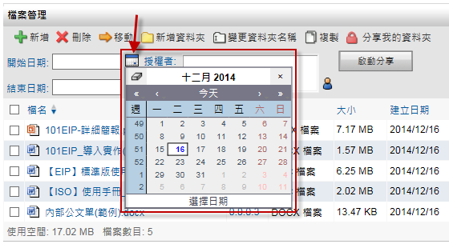
    
    方便易用的日期選擇器

設定分享群組/使用者
^^^^^^^^^^^^^^^^^^^^^^^^

分享資料夾還可指定只分享給特定的使用者或群組。若不指定，則系統預設為分享給每一位使用者。

#. 點選圖中小圖示，系統會開啟一個使用者選擇器以方便快速的選取。
#. 最後再點選 ``啟動分享`` 即完成設定。

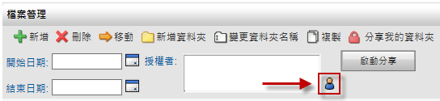
    
    方便易用的使用者選擇器

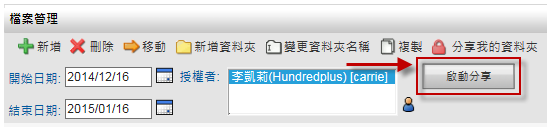
    
    分享資料夾設定完成

停止分享資料夾
^^^^^^^^^^^^^^^^^^^^^^^^

要停止資料夾的分享只需要再次點選 ``分享我的資料夾``，並點選 ``取消分享`` 即可，其他的使用者可以在左側資料夾樹狀結構圖中的 ``網路芳鄰`` 看到分享者的名稱及所分享的資料夾。點選分享的資料夾後即可瀏覽這些分享的檔案。

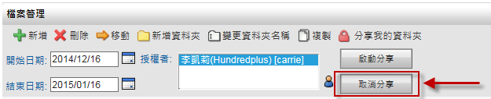
    
    資料夾分享取消步驟

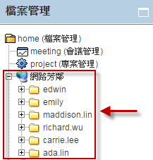
    
    分享資料夾瀏覽畫面

檔案搜尋
^^^^^^^^^^^^^^^^^^^^^^^^

在使用者不斷上傳檔案到檔案管理模組後，還是可以使用模組的搜尋功能，快速的找到指定的檔案。搜尋的時候可以指定只搜尋當前的資料夾，或是搜尋所有的資料夾。只需要在檔案列表上方的搜尋列中，填入欲搜尋的檔案名稱，再點選 ``搜索本資料夾`` 或 ``搜尋所有資料夾`` 即可做搜尋的動作。

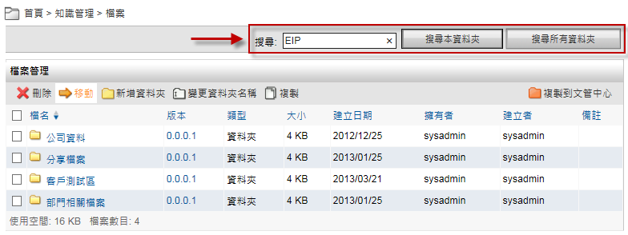
    
    可針對單一或所有資料夾做搜尋的動作

搜索本資料夾
^^^^^^^^^^^^^^^^^^^^^^^^

搜尋本資料夾的時候，會搜尋使用者當前的所在資料夾以下，包括子資料夾內的所有檔案。

搜尋所有資料夾
^^^^^^^^^^^^^^^^^^^^^^^^

搜尋所有資料夾的時候，系統會搜尋整個檔案管理模組中，您有下載權限的檔案，包括別人分享給您的檔案及所有的子資料夾。

個人化設定
------------------------

檔案管理模組有提供個人化設定供使用者變更。

#. 要變更檔案管理的個人化設定，可點選右上角的 ``個人化設定`` 分頁，並在檔案管理的類別中點選個人化設定。
#. 依個人喜好設定完成後，點選 ``儲存`` 即可。

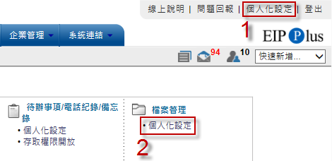
    
    個人化設定

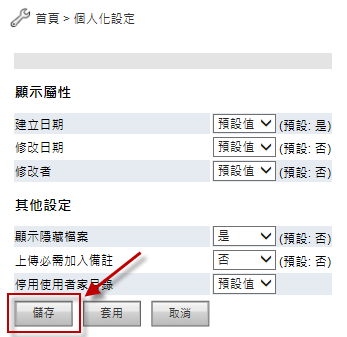
    
    檔案管理個人化設定

顯示屬性
^^^^^^^^^^^^^^^^^^^^^^^^

* 建立日期：在檔案列表中顯示檔案或資料夾的建立時間。
* 修改日期：在檔案列表中顯示檔案或資料夾的修改時間。
* 修改者：在檔案列表中顯示最後修改過此檔案或資料夾的使用者。

其他設定
^^^^^^^^^^^^^^^^^^^^^^^^

* 顯示：在檔案列表的第一個欄位顯示一個 “..” 的符號，使用者可以點選這一個符號直接變更到上一層資料夾。
* 上傳必需加入備註：設定使用者在上傳一個檔案時，是否要強制要求使用者填寫備註文字。
* 停用使用者家目錄：設定是否要停用個人資料夾的功能。