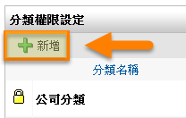

影音庫
========================

規格說明
------------------------
 
* 上傳影片視訊串流，隨點隨播。
* 作為員工教育影片或產品展示與教學。
* 提供樹狀圖進行分類與權限管理。
* 可以設定權限，選擇特定群組可以檢視的影片內容。
* 影片播放提供影音串流Streaming機制。
* 上傳影音的方式除了可以用檔案上傳之外，還可以利用YouTube、VIMEO、騰訊視頻等影音網站做連結。
* 提供發佈次數及瀏覽次數統計圖表。

系統管理
------------------------

【使用者管理】或【群組管理】使用權限開放
^^^^^^^^^^^^^^^^^^^^^^^^

如要開放此模組給使用者，必須先至系統管理內 ``使用者管理`` 或 ``群組管理``，編輯某使用者或群組之權限控管，勾選 ``影音庫`` 才可開放使用，此功能只有系統管理員可設定。（注意：首頁為必選項目）

    影音庫模組開放使用設定畫面

設定分類及權限
^^^^^^^^^^^^^^^^^^^^^^^^

系統管理者（包含模組管理員）可在模組中的系統管理區塊，點選 ``設定分類及權限`` 進行設定。

新增分類
^^^^^^^^^^^^^^^^^^^^^^^^

#. 點選 ``新增``，產生新的分類。
#. 在新增分類頁面中，把資料填入相對應欄位，設定完成後點選 ``儲存``。

    設定分類及權限

    新增分類

    編輯分類頁面

設定權限
^^^^^^^^^^^^^^^^^^^^^^^^

點選 ``權限`` 鎖頭圖示，針對該分類 ``讀取``、``新增``、``編輯``、``刪除`` 進行設定，設定完成後請點選 ``儲存``。

    分類權限設定頁面

* 群組：可依照系統的組織架構來篩選部門人員資料。
* 包含顯示停用帳號：預設不包含，被停用的帳號不顯示。
* 搜尋：可輸入使用者名稱、帳號或群組名稱來搜尋人員。
* 讀取權限： ``讀取`` 此分類的所有影音資料。
* 新增權限：在此分類，建立者可 ``新增`` 及 ``編輯`` 自己新增的的影音資料。
* 編輯權限：可 ``新增`` 及 ``編輯`` 自己與其他使用者新增的影音資料。
* 刪除權限：可 ``新增``、``編輯`` 及 ``刪除`` 自己與其他使用者的影音資料。

    權限設定之相關運用請參考圖

完成設定分類權限設定權限
^^^^^^^^^^^^^^^^^^^^^^^^

    分類權限顯示畫面

* 灰色子分類：如新增子分類，其權限會依照母分類權限帶入，顏色顯示灰色。
* 黑色子分類：特定子分類須設定與母分類不同權限規則，編輯完成後，顏色顯示為黑色。

發佈設定
^^^^^^^^^^^^^^^^^^^^^^^^

系統管理者（包含模組管理員）可在模組中的系統管理區塊，點選 ``發佈設定`` 進行設定。

    發佈設定

    發佈設定項目

* 自動發佈影音：可設定 ``是`` 或 ``必須經過核准`` 。如必須經過核准，則開放給有這個分類的編輯權限者核准。
* 審核者通知方法：分為 ``電子郵件和訊息``、``電子郵件`` 或 ``訊息``。

統計圖表-影片發佈次數
^^^^^^^^^^^^^^^^^^^^^^^^

系統管理者（包含模組管理員）可在模組中的統計圖表區塊，點選 ``影片發佈次數`` 進行設定。

#. 系統管理者至影音庫首頁中的 ``統計圖表``。
#. 點選 ``影片發佈次數``，即可依期間來查閱使用者的發佈影片次數。

    統計圖表區塊

.. figure:: images/image12.png
    :scale: 100%
    :alt: 影片發佈次數統計頁面

    影片發佈次數統計頁面

* 期間：可選擇時間篩選所需要的統計資料。
* 最多：設定統計資料顯示的最大筆數。
* 搜尋：可搜尋影音主題欄位內文字，點選該鈕以更新統計資料。
* 使用者：列出期間內發佈影片的使用者。
* 發佈次數：列出影片的發佈次數。
* 匯出：點選該鈕以匯出該統計資料。

統計圖表-影片瀏覽次數
^^^^^^^^^^^^^^^^^^^^^^^^

系統管理者（包含模組管理員）可在模組中的統計圖表區塊，點選 ``影片瀏覽次數`` 進行設定。

#. 系統管理者至影音庫首頁中的 ``統計圖表``。
#. 點選 ``影片瀏覽次數``，即可依期間來查閱使用者的影片瀏覽次數。

    統計圖表區塊

    影片瀏覽次數統計頁面

* 期間：可選擇時間篩選所需要的統計資料。
* 最多：設定統計資料顯示的最大筆數。
* 搜尋：可搜尋影音主題欄位內文字，點選該鈕以更新統計資料。
* 影音庫：列出目前統計所被瀏覽的影片。
* 瀏覽次數：列出該影片的被瀏覽次數。
* 匯出：點選該鈕以匯出該統計資料。

個人化設定預設偏好設定
^^^^^^^^^^^^^^^^^^^^^^^^

從個人化設定進入，只有系統管理員才可查閱及編輯 ``預設偏好設定`` 頁籤，可預設所有使用者在使用此模組的查閱模式，``個人偏好設定`` 頁籤為使用者可針對個人需求再自行變更。

.. figure:: images/image15.png
    :scale: 100%
    :alt: 個人化設定

    個人化設定

    影音庫個人化設定

    預設偏好設定

* 在主要畫面顯示影音數量：已發佈的影音資料在首頁顯示的數量。

使用說明
------------------------

使用者可以上傳自己想要分享的影片檔，提供其他使用者瀏覽。影音庫除了可上傳影像檔案，另外也可轉貼來自影音網站影片直接內嵌到此模組中，透過簡潔便利的播放介面，執行影像快速的搜尋及自動播放。

新增影音庫
^^^^^^^^^^^^^^^^^^^^^^^^

影音庫提供方便的檔案上傳及連結功能，使用者可上傳單一的影像檔案，或轉貼來自影音網站的資料。

上傳檔案
^^^^^^^^^^^^^^^^^^^^^^^^

#. 點選 ``新增`` 來建立一個新的影音檔案。
#. 點選 ``瀏覽`` 來選擇欲上傳的影像檔案。
#. 點選 ``儲存`` 後即完成影音新增的動作。

    新增影音資料

    上傳影音檔案

* 影音主題：新增使用者自訂影音名稱。
* 影音描述：此影音資料之說明。
* 影音分類：顯示擁有新增權限的分類。
* 發佈狀態：分為 ``已發佈``、``草稿``，已發佈狀態需搭配是否需要被核准，如為草稿狀態，只有新增此影音資料的使用者才可以看到。
* 通知審核者：需搭配是否需要被核准，如需要被核准，才會顯示此功能。
* 上架時間：如有設定上架時間但時間未到時，狀態顯示為未發佈。如上架時間時間已到且已核准發佈，狀態為已發佈。
* 下架時間：此為必填，下架時間到期後顯示狀態變更為已下架。
* 上傳影音：目前提供四種模式 ``上傳檔案``、``YouTube連結``、``Vimeo連結``、``騰訊視頻連結``。
* 提供原始檔下載：使用上傳檔案方式，此功能才會顯示。

YouTube連結
^^^^^^^^^^^^^^^^^^^^^^^^

針對上傳影音欄位功能使用YouTube連結來說明，其他欄位說明與上傳檔案說明相同。

    貼上以上區塊

    完成新增影音資料

    完成新增影音資料

Vimeo連結
^^^^^^^^^^^^^^^^^^^^^^^^

針對上傳影音欄位功能使用Vimeo連結來說明，其他欄位說明與上傳檔案說明相同。

.. figure:: images/image23.png
    :scale: 100%
    :alt: 至Vimeo網站找到欲連結的資料，複製網址中區塊

    至Vimeo網站找到欲連結的資料，複製網址中區塊

    貼上以上區塊

    完成新增影音資料

騰訊視頻連結
^^^^^^^^^^^^^^^^^^^^^^^^

針對上傳影音欄位功能使用騰訊視頻連結來說明，其他欄位說明與上傳檔案說明相同。

    至騰訊視頻複製以上區塊

    新增時貼上步驟1區塊，系統自動轉成步驟2資料

    完成新增影音資料

瀏覽影音庫
^^^^^^^^^^^^^^^^^^^^^^^^

下圖的畫面為影音庫首頁，系統會依使用者所選定的分類或狀態將影音列表出來。只要點選欲觀賞的影音圖片或是主題名稱即可開始瀏覽影音；瀏覽畫面有提供一個方便的影像播放器，使用者可透過介面提供的按鈕進行播放、停止、重新播放、全螢幕、音量調整功能。

    影音庫首頁列表

    影音播放介面

更新影音
^^^^^^^^^^^^^^^^^^^^^^^^

自己新增或擁有編輯權限的使用者，都可以點選該影音的編輯圖示來做編輯。

編輯模式跟新增模式的操作方法一樣，並可更新影音來源；點選使用新的影片來源方式，即可重新上傳影音或者透過新的影音網站連結來更新影音資料。

.. figure:: images/image31.png
    :scale: 100%
    :alt: 影音庫首頁

    影音庫首頁

    編輯影音頁面

刪除影音
^^^^^^^^^^^^^^^^^^^^^^^^

擁有此分類的刪除權限才可執行刪除動作。

    依照需求選擇批次刪除或單筆刪除

核准影音
^^^^^^^^^^^^^^^^^^^^^^^^

如新增的影音資料是需要被核准才可發佈的，擁有此分類編輯權限者，即可審核欲發佈的影音資料。

    待核准影音資料列表

    核准者查看後按發佈即可公開影音資料

個人化設定
------------------------

此設定方式與系統管理之 ``個人化設定預設偏好設定`` 相同。

.. figure:: images/image15.png
    :scale: 100%
    :alt: 系統登入首頁

    系統登入首頁

    個人化設定頁面

    設定顯示數量

    設定完成後的顯示畫面