討論區
========================

規格說明
------------------------
 
* 企業內部的討論區，可以針對企業內部不同的議題進行討論。
* 權限控管彈性，讓管理者可以輕鬆管理討論機制。
* 可匿名討論。
* 提供發佈次數及回應次數統計報表。

系統管理
------------------------

設定分類
^^^^^^^^^^^^^^^^^^^^^^^^

#. 管理者可在系統管理區塊，點選 ``設定分類及權限`` 進行設定。
#. 點選 ``新增``來增加一個分類。
#. 在新增分類的頁面中，把資料填入相對應欄位，設定完成後點選 ``儲存``。
#. 點選 ``鎖頭圖示`` 針對分類做讀取、新增、編輯、刪除的權限進行設置。
#. 設定完成後點選 ``儲存``。

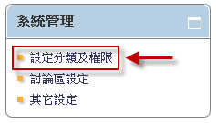

    網站連結首頁

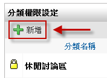

    新增討論區分類

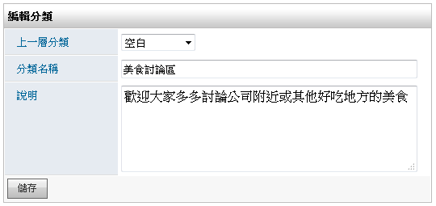

    新增 美食討論區 作為範例

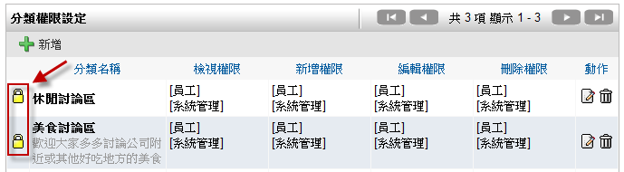

    新增分類後之權限設定系統頁面

討論區設定
^^^^^^^^^^^^^^^^^^^^^^^^

#. 管理者可在系統管理區塊，點選 ``討論區設定`` 進行設定。
#. 點選 ``新增討論區`` 來增加一個分類。
#. 在新增討論區頁面中，把資料填入相對應欄位，設定完成後點選 ``儲存``。

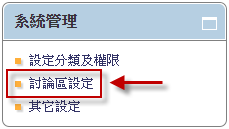

    討論區設定系統管理頁面

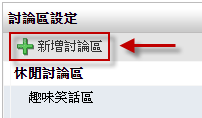

    新增討論區設定頁面

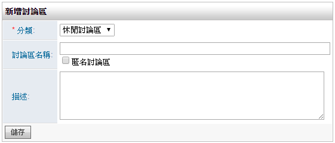

    新增頁面

其他設定
^^^^^^^^^^^^^^^^^^^^^^^^

#. 管理者可在系統管理區塊，點選 ``其他設定`` 進行設定。
#. 把資料填入相對應欄位，設定完成後點選 ``儲存``。

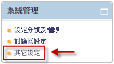

    系統其他設定管理頁面

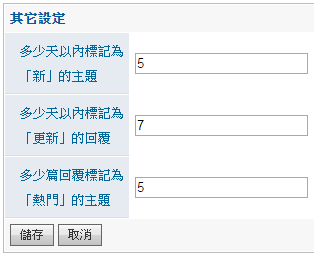

    其他設定頁面

使用說明
------------------------

新增主題
^^^^^^^^^^^^^^^^^^^^^^^^

#. 點選想建立主題的討論版。
#. 點選新增建立主題，和填入相關資訊。
#. 按下 ``儲存``，完成主題建立。

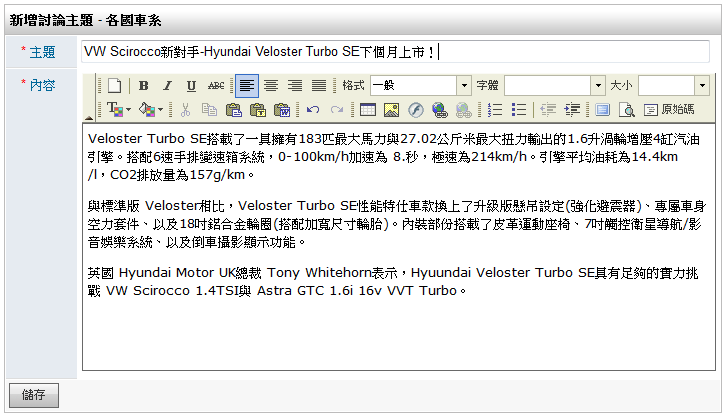

    新增主題，可以增加討論版的熱度

檢視/新增/編輯/刪除權限運用
^^^^^^^^^^^^^^^^^^^^^^^^

系統管理者可以針對特定使用者給予權限，而擁有檢視/新增/編輯/刪除權限者可以進行以下操作，反之則無法使用：

* 檢視 可以查看相關內容。
* 新增 可以新增相關主題。
* 編輯 可以修改主題或回應內容，或引言其他人的回應。
* 刪除 則可以刪掉相關主題或回應。

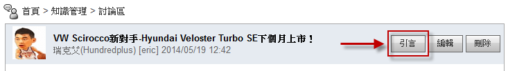

    新增回覆可以使用引言，讓其他使用者知道是在回應哪一則留言

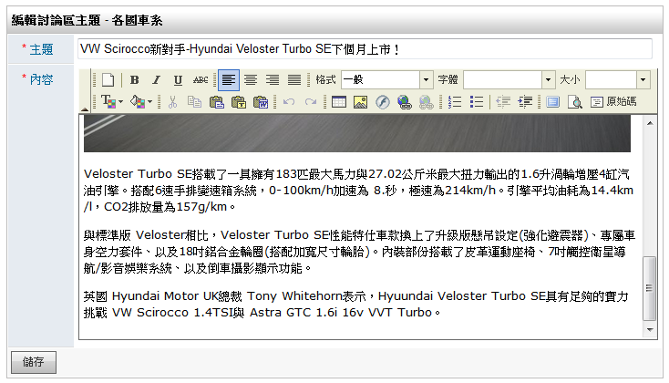

    編輯主題或回應內容

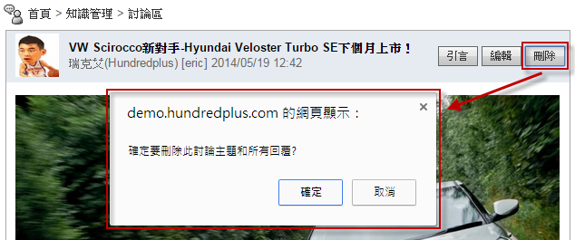

    刪除主題或留言畫面

統計圖表
------------------------

主題發佈次數
^^^^^^^^^^^^^^^^^^^^^^^^

#. 管理者移至討論區首頁中的 ``統計圖表``。
#. 點選 ``主題發佈次數``，即可依期間來查閱使用者的討論區主題發佈狀況。

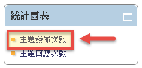

    點選主題發佈次數

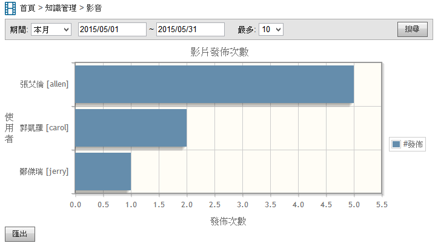

    主題發佈次數統計頁面

* 期間：可選擇時間篩選所需要的統計資料。
* 最多：設定統計資料顯示的最大筆數。
* 搜尋：點選該鈕以更新統計資料。
* 使用者：列出發佈主題的使用者。
* 發佈次數：列出主題的發佈次數。
* 匯出：點選該鈕以匯出該統計資料為Excel檔案。

主題回應次數
^^^^^^^^^^^^^^^^^^^^^^^^

#. 管理者移至討論區首頁中的 ``統計圖表``。
#. 點選 ``主題回應次數``，即可依期間來查閱使用者的主題回應狀況。

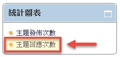

    點選主題回應次數

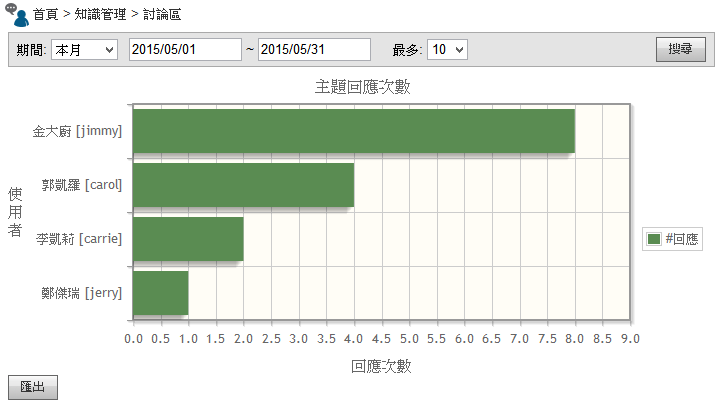

    主題回應次數統計頁面

* 期間：可選擇時間篩選所需要的統計資料。
* 最多：設定統計資料顯示的最大筆數。
* 搜尋：點選該鈕以更新統計資料。
* 使用者：列出目前主題回應的人員。
* 回應次數：列出該影片的主題回應次數。
* 匯出：點選該鈕以匯出該統計資料為Excel檔案。